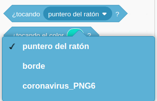
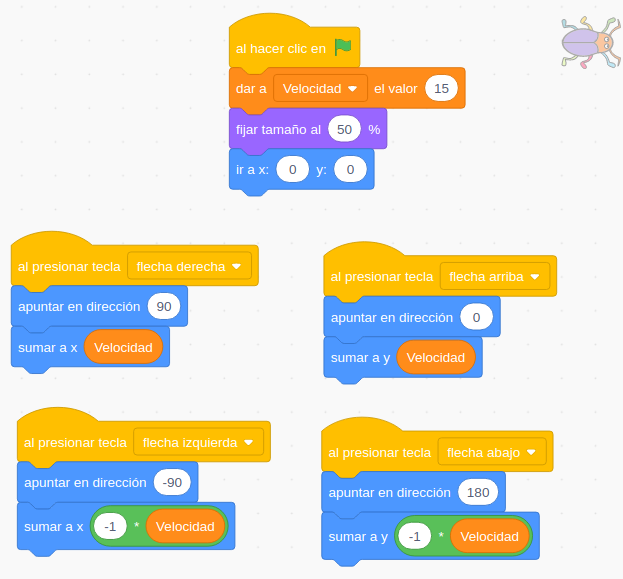
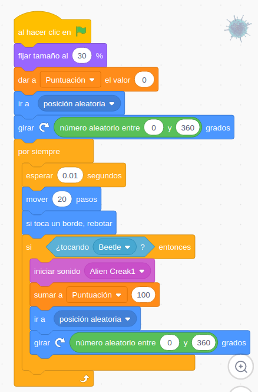

## Interacción entre objetos

### Escarabajo caza a coronavirus

Vamos a mezclar 2 proyectos en los que hemos trabajado: Uno en el movíamos nuestro escarabajo con las teclas y el que cazábamos al coranavirus con el ratón.

Tomaremos como base el primer, haciendo una copia y copiaremos todo lo relacionado con el movimiento del coronavirus del segundo. Podíamos usar la mochila para ello, pero vamos a hacerlo de otra forma...

Vamos a ver que podemos exportar todo lo relacionado con un personaje: Disfraces, sonidos y bloques de programa  usando la opción "Exportar" sobre el personaje y descargará un fichero *.sprite3 que luego podremos improtar desde el botón de añadir objeto y "Subir objeto"

Luego lo vamos a importar en el otro programa

Para detectar cuando se están tocando los personajes vamos a usar el bloque **"¿Tocando ...?"** que nos dice si nuestro personaje está tocando con el ratón, o con el bórde o o con otro personaje (Tenemos que tener al menos 2 personajes)

Como es un bloque lógico (o es verdadero o es falso) tendremos que trabajar con una sentencia condicional **"Si...entonces"** que comprobaremos desde dentro del bucle "Por siempre" del coronavirus.

Mostraremos la variable puntuación y el nobmre de usuario en pantalla.

Podíamos detectar también la colisión desde el otro personaje y el funcionamiento sería el mismo. Eso sí, tendríamos que añadir un bucle "Por siempre" a nuestro Escarabajo para que se comprobara constantemente si hay colisión.

[Proyecto](https://scratch.mit.edu/projects/398091853/)

[Vídeo: Colisiones entre objetos](https://youtu.be/5Nj3QNhqB94)