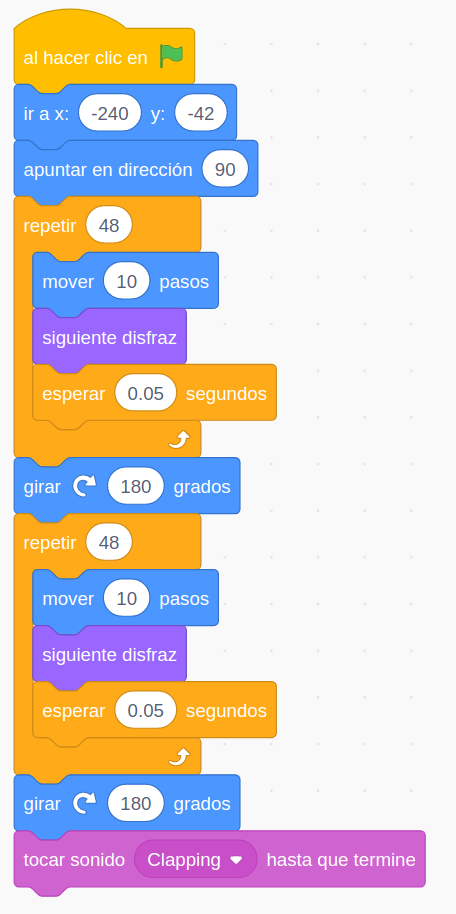

## Conversaciones y narrando Historias

Vamos a aprender a darle un aspecto más realista a nuestro programas haciendo que el personaje se integre.

Vamos a seguir trabajando con recursos, 
* Imágenes
* Sonidos
* Textos
* Narraciones

Pero esta vez formarán parte de una historia que queremos contar

Conviene recordar que debemos citar las fuentes con el reconocimiento oportuno a sus licencias .

## Movimientos menos geométricos y en un escenario

Vamos a aprender a integrar un pesonaje por un escenario movíendolo, cambiando su tamaño, girándolo y haciendo que nos hable y produzca sonidos

Aprendemos ...:
* Ocultar al personaje con el bloque **Esconder**
* A reproducir sonidos y como podemos grabarlos
* Qué es un evento y el más utilizado: la bandera verde
* A movernos de modo relativo con **Mover X pasos**
* A movernos de manera absoluta con **Ir a x y**
* A **Girar X grados**
* A hacer que mire en una dirección determinada con **Apuntar en dirección X**
* Repetir acciones con los bucles de control
* A introducir esperas 
* A animar un objeto cambiando de disfraz con **Siguiente disfraz**
* A seleccionar el tipo de giro de nuestro personaje

* Añadimos un fondo al escenario y ajustamos la coordenada **y**  para que Gatito se integre bien con el fondo

[Proyecto](https://scratch.mit.edu/projects/348617555/)

### Conversaciones e historias

Añadir personajes/objetos
* Disfraces
Añadir audios
* Editarlos
Fondos: Añadir imágenes
* Editarlas

Cambio de apariencia: 
* Disfraces
* Cambio tamaño

Varios personajes

Varias voces 
Extensiones: Text2Speech

Cambiamos tamaño de personajes

Modificaciones sencillas disfraces

Diálogo entre personajes

Sincronización con **mensajes**

Ejemplo 3: Conversacion entre personajes

eventos

Usamos la extensión **Texto a Vox** con distintas voces

¿Cómo vamos a sincronizarlo?

## Temporización 

## Mensajes 

### Tarea X

Crear un diálogo/historia entre personajes apropiado a tu contexto

Ejemplo: [diálogos](https://scratch.mit.edu/projects/373453276/)

