## Conversaciones. Narrando Historias

En esta sesión vamos a hablar, a narrar, a contar historias, a presenciar conversaciones entre nuestros personajes.

Vamos a aprender a darle un aspecto más realista a nuestro programas haciendo que el personaje se integre en el escenario.

Vamos a seguir trabajando con recursos:
* Imágenes
* Sonidos
* Textos
* Narraciones

Pero esta vez formarán parte de una historia que queremos contar.

Conviene recordar que debemos citar las fuentes con el reconocimiento oportuno a sus licencias.

**¿Qué contamos?**
* Narraciones.
* Fragmentos de la Historia.
* Explicaciones de conceptos narradas.
* Escenas de libros.
* Series.
* Películas.

**¿Quién lo cuenta?**
* Personajes históricos.
* Científic@s.
* Escritor@s.
* Protagonistas de libros.
* Protagonistas de series o películas.
* Superhéroes.

Se trata de contar buenas historias pero modernizando las herramientas:

> **Hamlet:** Ser, o no ser, ésa es la cuestión...
> **Ofelia:** ¿Cómo os habéis sentido, señor, en todos estos días?
> **Hamlet:** Muchas gracias. Bien.
> **Ofelia:** Conservo en mi poder algunas expresiones vuestras, que deseo restituiros mucho tiempo ha, y os pido que ahora las toméis.
> **Hamlet:** No, yo nunca te di nada.

¿y si lo adaptamos a estos tiempos?

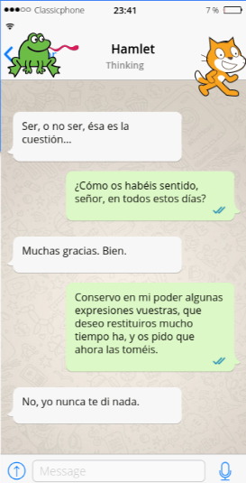

### Movimientos, sonidos, animaciones, texto...

Vamos a usar todas las herramientas que tenemos y algunos trucos

* Elegir el personaje: tenemos una variedad enorme en las librerías y podemos además crear nuevos.
    * Adaptar su tamaño y posición al escenario.
* Movimientos.
    * Moviéndose por el escenario.
    * Pero dentro del escenario: caminos, escaleras, ...
* Usando distintos disfraces.
* Sonidos adecuados.
* Música de fondo.
* Interacción.
* Truco: Ajustar tamaño con la perspectiva.

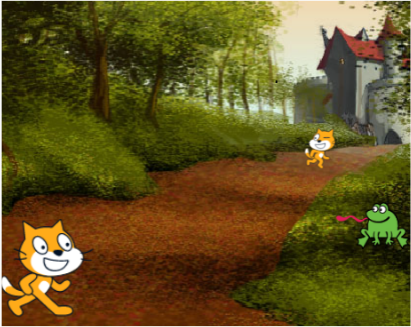

[Vídeo: Conversación e historias con Scratch](https://youtu.be/odpeEe3whkE)

## Movimientos menos geométricos y en un escenario

Vamos a aprender a integrar un personaje por un escenario moviéndolo, cambiando su tamaño, girándolo y haciendo que nos hable y produzca sonidos.

Aprenderemos:
* A adaptar la posición y el tamaño del personaje dentro del escenario.
* A mover el personaje dentro del escenario.
* Repetir acciones con los bucles de control.
* A introducir esperas.
* A animar un objeto cambiando de disfraz con **Siguiente disfraz**.
* A animar el personaje seleccionando distintos disfraces.
* A añadir pequeños "guiños" en el movimiento.
* A duplicar un disfraz y modificarlo.

### Reutilizando un proyecto

Vamos a mejorar nuestro primer programa en el que Gato decía "Hola" y hacía "Miau" para dotarlo de movimiento y animación. Haremos que camine a lo ancho del escenario intentando que tenga una animación realista.

Para ello:
* Entramos en el programa que hicimos.
* Creamos una copia para así dejar intacto el original.
* Colocamos a Gato a la izquierda del escenario.
* Ajustamos la coordenada **y**  para que Gatito se integre bien con el fondo.
* Le damos un tamaño adecuado al escenario utilizado.
* Añadimos los bloques "Fijar Tamaño" e "Ir a" tras el evento "Al Pulsar Bandera Verde."
* Probamos a moverlo con deslizar, pero vemos que el movimiento es poco realista.
* Para introducir la animación entre los disfraces de Gato vamos a introducir un bucle **"Repetir"**, y pequeños pasos a la vez que cambiamos de disfraz.
* Vemos que hay que introducir pequeñas esperas entre los distintos disfraces para que se vea bien la animación.
* Añadiremos un pequeño "Guiño" a midad del camino para hacerlo más divertido.
* Probamos y ajustamos varias veces el movimiento.

(Para no hacerlo muy largo no se muestra la 2ª parte del movimiento)

[Proyecto](https://scratch.mit.edu/projects/395279635/)

[Vídeo: Haciendo animaciones sencillas  y moviendo personajes](https://youtu.be/20wgZI8WCgA)

### Creamos nuestros bloques

Tras terminar la animación de Gato, vemos que hay una gran parte del programa que se repite. Es cómodo duplicar (o copiar/pegar) pero ocupa mucho y sobre todo, si tenemos que cambiar algo, hay que hacerlo en varias partes y se complica el programa.

Por eso, dentro de Scratch existe la opción de crear nuestros propios bloques. Así, podemos crear un bloque que nos otra cosa que un "atajo" para usar muchos otros bloques. 

(Si habéis programa o trabajado con macros/lenguajes veréis que ésto es la definición de función o procedimiento o subrutina)

Los bloques que creemos que se guardarán en la paleta **"Mis Bloques"**

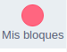

Ahí tendremos nuestros bloques:

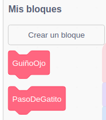

Que podremos utilizar dentro de nuestro programa.

Para crear un bloque pulsaremos en el botón **"Crear un bloque"** dentro de la paleta "Mis bloques" y aparecerá una pantalla donde daremos nombre a nuesro bloque. Puedes usar espacios, mayúculas, acentos en el nombre y te recomiendo que le des un nombre descriptivo y claro. 

(Personalmente, como suelo programar con código y ahí los espacios suelen dar problemas uso las distintas palabras unidas, con la primera letra de cada una mayúscula para facilitar la lectura, pero es cuestión de costumbre)

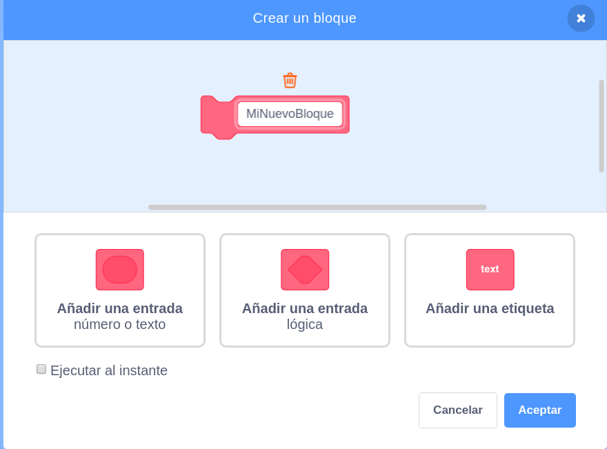

En este momento nos vamos a olvidar de las opciones de "Añadir entrada" que veremos un poco más adelante.

Al pulsar "Aceptar" aparecerá un bloque especial llamado **"Definir"** que será donde nosotros añadamos todos los bloques que se ejecutarán al usar nuestro bloque.

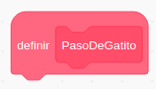

En el ejemplo de "PasoDeGatito" estos serán los bloques que lo formen.

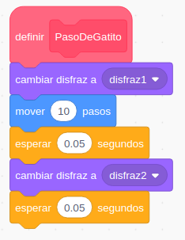

Ahora ya podemos sustituir todos los bloques que se necesitan para dar un paso por el bloque "PasoDeGatito", quedando nuestro programa mucho más claro  sencillo.

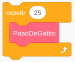

Vamos a crear bloques que serán distintos gestos. Del mismo modo podemos hacer el bloque **GuiñoOjo**

El proyecto queda así:

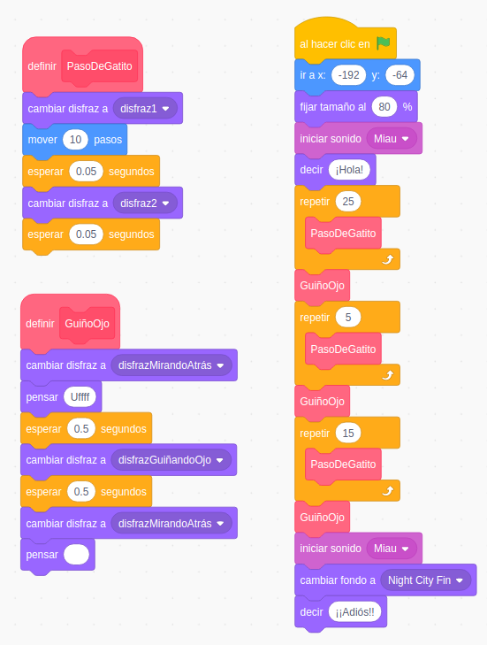

[Proyecto: Creación de bloques](https://scratch.mit.edu/projects/395284849/)

**Resumiendo**:
* **Creamos** un nuevo bloque.
* **Definimos** los bloques que lo forman.
* **Usamos** nuestro propio bloque donde necesitemos.

[Vídeo: Creando nuestro propios bloques en Scratch](https://youtu.be/B4cgAY9lT98)

### Uso de bloques. Reutilización.

Una vez que tenemos creados nuestros programas podemos reutilizar muchas partes de los mismos, haciendo así mucho más eficiente nuestro trabajo.

En este caso vamos a ver como podemos reutilizar disfraces, que exportaremos desde la pestaña "Disdraces", pulsando sobre cada uno de ellos con el botón derecho sobre la opción Exportar. Así se descargará y guardará cada una de las imágenes en nuestro ordenador.

Desde el proyecto donde queramos usarlo sólo tendremos que usar la opción de importar de disfraces para recuperarlos en nuestro proyecto actual.

De forma similar, guardando los bloques que hemos creado en la mochila podremos recuperarlos también en otros proyectos.

[Vídeo:  Uso de nuestro bloques. Reutilización](https://youtu.be/WvigBag8CDY)

### Creando bloques propios con argumentos

Aprovechando que hemos visto las ventajas de crear nuestro bloques, vamos a hacer más reutilizable el ejemplo de cómo dibujar un polígono que guardamos en la mochila.

Para ello vamos a recuperarlo de la mochila y crear un nuevo bloque. 

Pero para dibujar un polígono sí que necesitamos decir cuántos lados va a tener o cuál va a ser la longitud de cada uno.

Ahora cuando creemos el bloque vamos a usar la opción de **"Añadir una entrada"** de tipo **número** para añadir "Cuantos Lados" y otra llamada "Longitud" también de tipo **número**. Estas entradas (también llamadas argumentos o parámetros) nos permitirán que cuando usemos este bloque digamos el número de lados y la longitud de estos.

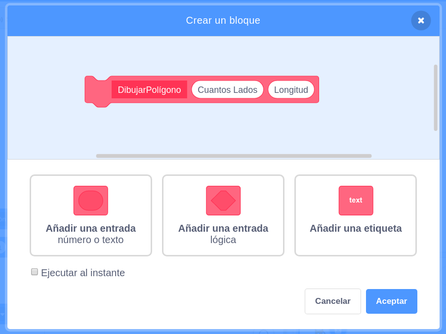

(Más adelante veremos los otros tipos de entradas)

En la definición del bloque pondremos los bloques que usábamos para dibujar el polígono, sustituyendo el valor que dábamos a la variable "NumeroLados" por la entrada "Cuantos Lados" y el valor de longitud por la entrada "Longitud". Para ello las arrastramos en los lugares donde se usa su valor:

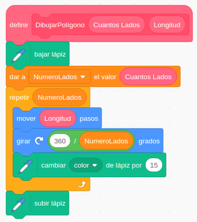

Realmente tanto "Cuantos Lados" como "Longitud" son variables que se usan dentro del bloque (no las podemos usar fuera de la definición de este bloque) y no sería necesaria la variable "NumeroLados" que podíamos sustituir por la otra.

Cuando lo vayamos a usar veremos que nuestro bloque tiene 2 "huecos" donde tendremos que poner el número de lados y la longitud de éstos.

No podemos usar este bloque sin indicar los valores de las entradas/argumentos que necesita para que funcione.

Por lo que para usarlo, tendremos que incluir el nuevo bloque y los dos valores de las entradas numéricas.

El proyecto completo queda así:

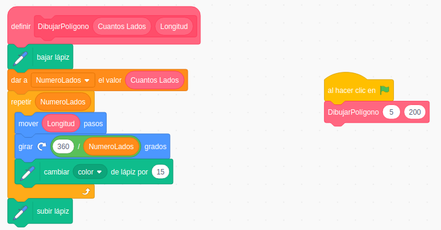

[Proyecto](https://scratch.mit.edu/projects/395289179/)

[Vídeo: Creando bloques propios con argumentos](https://youtu.be/GLU7nc_mZpk)

### Conversaciones e historias

Vamos a empezar a trabajar la creación de historias, con una sencilla e intrascendente conversación entre 2 personajes: Gato y Rana, que se encontrarán junto a un sendero en un bosque y se saludarán.

### Movimientos de los personajes en el escenario

* Añadimos los personajes que van a participar.
* Seleccionamos el fondo donde ocurrirá la conversación.

Comenzaremos integrando a los personajes en el escenario, para ello, incluiremos toda esta configuración inicial tras su evento "Al hacer clic en Bandera" respectivo (recordar que cada personaje tiene su propio programa)
* Les daremos el tamaño adecuado.
* Los colocaremos en sus posiciones.
* Si alguno de ellos no aparece inicialmente lo ocultaremos con el bloque **"Esconder"**
* Haremos los movimientos con **"Deslizar"** para darles tiempo
* Recuperamos disfraces que hemos creado en otros proyectos
* Haremos cambios entre los distintos disfraces de los personajes
* Vamos cambiando el tamaño para hacer más realista el efecto de la perspectiva del fondo.

Nos queda ver cómo sincronizar los movimientos de los distintos personajes. Veremos que hay varias formas de hacerlo

[Vídeo: Movimientos de los personajes en el escenario](https://youtu.be/1YyyDZ9H7Q8)

## Sincronización entre personajes

Vamos a ver dos formas distintas de sincronizar los movimientos de los personajes durante nuestro programa: por tiempo y por mensajes

### Sincronización por tiempo

Los personajes esperan un (tiempo que tenemos que calcular) hasta que les toca hablar.

Es una especie de coreografía

**Ventaja:** Es más sencillo de entender

**Inconveniente:**  Hay que probar mucho hasta ajustar los tiempos. Cualquier cambio da lugar a reajustar todo.

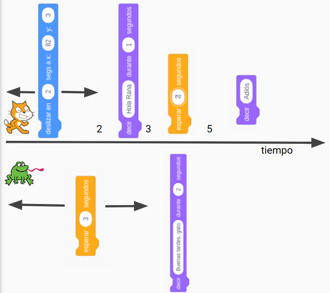

Cuantos más pasos tenga nuestra historia más tiempos a calcular y ajustar.

[Vídeo: Sincronización entre personajes por tiempo en Scratch](https://youtu.be/QBXIXJLXhMA)

### Ejemplo de sincronización por tiempo: Conversación Gato-Rana

Añadimos distintos bloques a cada personaje para que tenga lugar la conversación.
Vamos sumando los tiempos para que todo ocurra de manera sincronizada.s

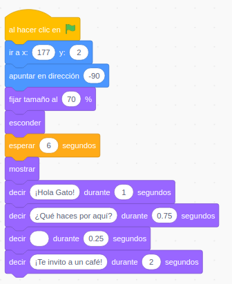

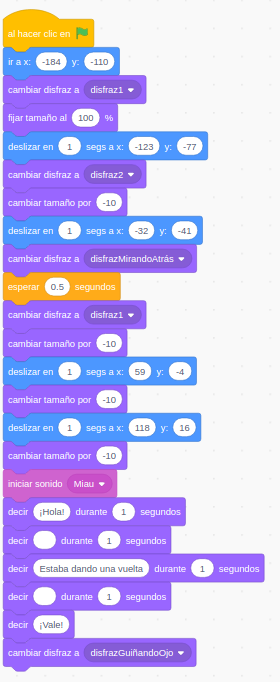

Vamos a incluir el escenario como un personaje más, añadiendo un sencillo programa que espere el tiempo adecuado para cambiarse. 

A partir del fondo actual, lo duplicamos, y añadimos un texto "The End"  para mostrar que nuestra conversación termina. Seleccionamos un tipo de letra, un color, tamaño y posición para texto.

Podemos seleccionar cualquier color del texto usando el "CuentaGotas" de la "Herramienta de selección de color".

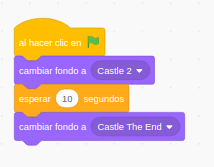

Para hacer que los mensajes de los personajes no se solapen haremos que pasada un tiempo vayan desapareciendo con el bloque "Decir ... durante un tiempo" sin indicarle ningún texto.

Para conseguir que la sincronización sea perfecta tendremos que probar bastantes veces e ir ajustando los diferentes tiempos.

[Proyecto](https://scratch.mit.edu/projects/395313539/)

[Vídeo: Ejemplo de sincronización por tiempo entre personajes: Gato-Rana](https://youtu.be/XfA7yp_PAQw)

## Mensajes 

Vamos a ver otra manera de sincronizar a los personajes. Para ello usaremos **Mensajes**, que no son otra cosa que eventos personalizados que podemos crear nosotros.

Además de los eventos que tenemos, asociados a la bandera verde, las teclas, el ratón,...

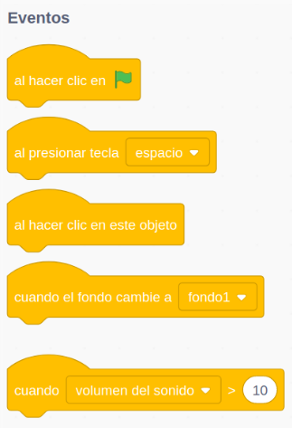

Nosotros podemos generar eventos propios que llamaremos **Mensajes**.
Tenemos un bloque que los envía **"Enviar Mensaje"** y otro que los recibe/detecta **"Al recibir Mensaje"**

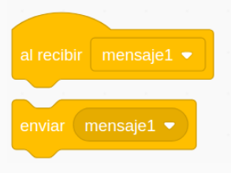

Podemos crear tantos tipos de mensajes como queramos sin más que crear uno nuevo con un nombre distinto a los existentes al pulsar **"Nuevo Mensaje"**.

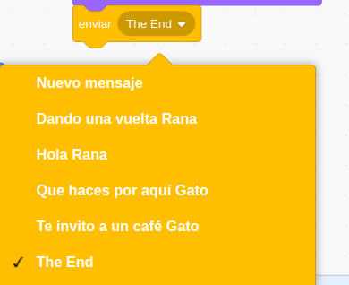

Siempre que queramos podemos enviar un mensaje, sin más que incluir en bloque **"enviar Mensaje"**

Los mensajes los reciben todos los personajes (y el fondo) de nuestro programa. Donde queramos que se detecte/reciba ese mensaje tendremos que incluir el bloque **"Al recibir Mensaje"** donde habremos seleccionado el correspondiente mensaje. 

Tras este bloque incluiremos todos los bloques/acciones que queremos que se realicen al recibirlo.

### Conversación

Usando esta técnica, una conversación se hará cuando determinados mensajes se vayan enviando y recibiendo sucesivamente por los distintos personajes/participantes.

Para no liarnos es mejor hacer un pequeño esquema de la conversación y de los distintos mensajes, de quien y cuando los va a lanzar recibir.

Los personajes se envían mensajes entre sí, que van activando distintas partes de la conversación

**Ventaja:** facilitan mucho la sincronización y sobre todo los cambios

Como hemos dichos los mensajes llegan a todos los personajes, aunque estos no hagan nada al recibirlos.

Podemos usar esta característica para hacer que muchos personajes reaccionen a un mismo mensaje

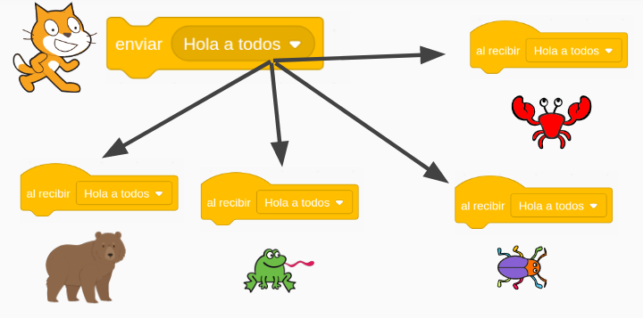

[Vídeo: Sincronización entre personajes usando mensajes](https://youtu.be/DNjDcjSwqMk)

### Ejemplo sencillo de sincronización usando mensajes

Vamos a hacer una sencilla conversación entre Gato y Rana. El esquema sería algo así:

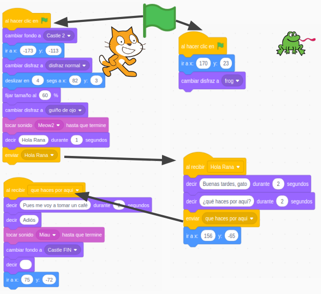

Vamos a incluir algunos detalles:
* Gato va a moverse por el sendero
* Cambiará de tamaño al alejarse
* Rana estar oculta y aparecerá cuando le hable Gato
* Reusamos disfraces que ya habíamos creado antes
* Hacemos pequeñas animaciones

Cada personaje tiene su propio programa que ahora vemos que está dividido en partes, una por cada mensaje además de la inicial del evento Bandera Verde.

Bloques de Gato

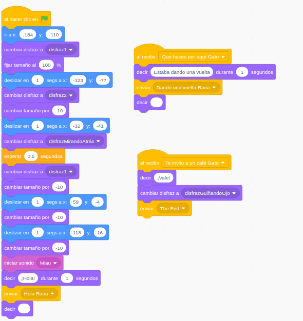

Bloques de Rana

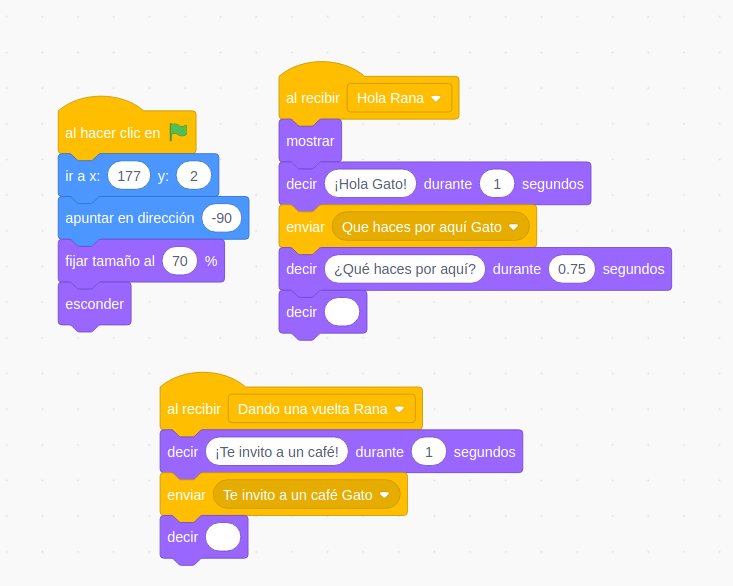

Hemos añadido una pequeña programación al Escenario/fondo 

[Proyecto](https://scratch.mit.edu/projects/395314257)

[Vídeo: Ejemplo sencillo de sincronización entre presonajes usando mensajes](https://youtu.be/ce3LPBiMFVQ)

#### Mejoras:
* Añadir distintas músicas de fondo, para los distintos momentos
* Mejorar la conversación

### Ejemplo Colón

Fuentes: 

https://es.wikipedia.org/wiki/Capitulaciones_de_Santa_Fe

https://historia.nationalgeographic.com.es/a/cristobal-colon-y-capitulaciones-santa-fe_14075

Decorado: castillo y escaleras

Personajes:
* **Narradora**: Singer
* **Colón**: buscar imagen
* **Reyes Católicos**: buscar imagen
* **Teléfono**: buscar imagen

Podemos quitar el fondo de una imagen usando la web https://www.remove.bg/

Buscamos una música para el final [Biblioteca youtube](https://www.youtube.com/audiolibrary/music?ar=1589372029059&nv=1)

Sonido de teléfono

**Narradora**: Hola, estamos en España en 1492.

**Narradora**: Los Reyes Católicos acaban de conquistar Granada.

**Narradora**: Colón era un reputado marino.

Colón baja las escaleras pensando:

**Colón**: He leído que la Tierra es redonda

**Colón**: Si navego en la otra dirección...

**Colón**: Puede haber un camino más corto hacía las Indias

**Narradora**: Colón pensó cómo podía financiar su viaje

**Colón**: Iré a Santa Fe en Granada, para hablar con los Reyes Católicos

Fondo con Reyes Católicos

**Colón**: Majestades...

Fondo Carabelas

Suena el teléfono

Colón se acerca 

**Colón**: ¿Dígame?

**Teléfono**: Sr Colón...

**Teléfono**: Sólo llamo para felicitarle

Suena la música final

### Tarea X

Crear un diálogo/historia entre personajes apropiado a tu contexto

Ejemplo: [diálogos](https://scratch.mit.edu/projects/373453276/)

## Ideas

* Generador de poemas
* Generador de frases "Mr. Wonderfull"  https://projects.raspberrypi.org/en/projects/poetry-generator/4