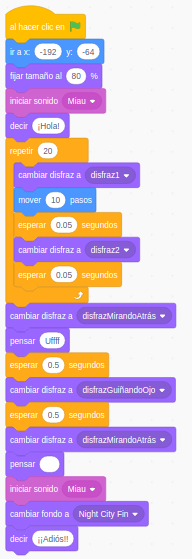
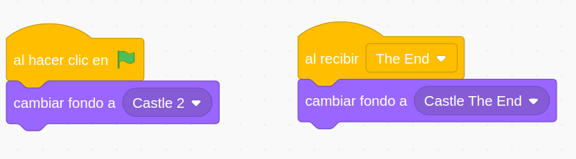

## Conversaciones y narrando Historias

Vamos a aprender a darle un aspecto más realista a nuestro programas haciendo que el personaje se integre en el escenario

Vamos a seguir trabajando con recursos, 
* Imágenes
* Sonidos
* Textos
* Narraciones

Pero esta vez formarán parte de una historia que queremos contar

Conviene recordar que debemos citar las fuentes con el reconocimiento oportuno a sus licencias .

## Movimientos menos geométricos y en un escenario

Vamos a aprender a integrar un personaje por un escenario moviéndolo, cambiando su tamaño, girándolo y haciendo que nos hable y produzca sonidos.

Aprenderemos:
* Mostrar/Ocultar al personaje con el bloque **Esconder**
* A reproducir sonidos y como podemos grabarlos
* Qué es un evento y el más utilizado: la bandera verde
* A movernos de modo relativo con **Mover X pasos**
* A movernos de manera absoluta con **Ir a x y**
* A **Girar X grados**
* A hacer que mire en una dirección determinada con **Apuntar en dirección X**
* Repetir acciones con los bucles de control
* A introducir esperas 
* A animar un objeto cambiando de disfraz con **Siguiente disfraz**
* A seleccionar el tipo de giro de nuestro personaje

* Añadimos un fondo al escenario y ajustamos la coordenada **y**  para que Gatito se integre bien con el fondo

[Proyecto](https://scratch.mit.edu/projects/395279635/)

### Creamos nuestros bloques

Vamos a crear bloques que serán distintos gestos

[Proyecto: Creación de bloques](https://scratch.mit.edu/projects/395284849/)

### Bloques con Argumentos

https://scratch.mit.edu/projects/395289179/

### Conversaciones e historias

#### Ejemplos

* Momentos históricos
* Fragmentos de películas/series: Harry Potter, La casa de papel

Añadir personajes/objetos
* Disfraces
Añadir audios
* Editarlos
Fondos: Añadir imágenes
* Editarlas

Cambio de apariencia: 
* Disfraces
* Cambio tamaño

Varios personajes

Varias voces 
Extensiones: Text2Speech

Cambiamos tamaño de personajes

Modificaciones sencillas disfraces

Diálogo entre personajes

Sincronización con **mensajes**

Ejemplo 3: Conversacion entre personajes

eventos

Usamos la extensión **Texto a Vox** con distintas voces

¿Cómo vamos a sincronizarlo?

## Temporización 

https://scratch.mit.edu/projects/395313539/

También podemos sincronizar el fondo

## Mensajes 

### Ejemplo Colón

Fuentes: 

https://es.wikipedia.org/wiki/Capitulaciones_de_Santa_Fe

https://historia.nationalgeographic.com.es/a/cristobal-colon-y-capitulaciones-santa-fe_14075

Decorado: castillo y escaleras

Personajes:
* **Narradora**: Singer
* **Colón**: buscar imagen
* **Reyes Católicos**: buscar imagen
* **Teléfono**: buscar imagen

Podemos quitar el fondo de una imagen usando la web https://www.remove.bg/

Buscamos una música para el final [Biblioteca youtube](https://www.youtube.com/audiolibrary/music?ar=1589372029059&nv=1)

Sonido de teléfono

**Narradora**: Hola, estamos en España en 1492.

**Narradora**: Los Reyes Católicos acaban de conquistar Granada.

**Narradora**: Colón era un reputado marino.

Colón baja las escaleras pensando:

**Colón**: He leído que la Tierra es redonda

**Colón**: Si navego en la otra dirección...

**Colón**: Puede haber un camino más corto hacía las Indias

**Narradora**: Colón pensó cómo podía financiar su viaje

**Colón**: Iré a Santa Fe en Granada, para hablar con los Reyes Católicos

Fondo con Reyes Católicos

**Colón**: Majestades...

Fondo Carabelas

Suena el teléfono

Colón se acerca 

**Colón**: ¿Dígame?

**Teléfono**: Sr Colón...

**Teléfono**: Sólo llamo para felicitarle

Suena la música final

### Tarea X

Crear un diálogo/historia entre personajes apropiado a tu contexto

Ejemplo: [diálogos](https://scratch.mit.edu/projects/373453276/)

## Ideas

* Generador de poemas
* Generador de frases "Mr. Wonderfull"  https://projects.raspberrypi.org/en/projects/poetry-generator/4