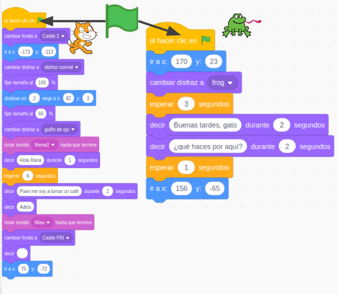

## Conversaciones y narrando Historias

Vamos a aprender a darle un aspecto más realista a nuestro programas haciendo que el personaje se integre en el escenario

Vamos a seguir trabajando con recursos, 
* Imágenes
* Sonidos
* Textos
* Narraciones

Pero esta vez formarán parte de una historia que queremos contar

Conviene recordar que debemos citar las fuentes con el reconocimiento oportuno a sus licencias .

**¿Qué contamos?**
* Narraciones
* Fragmentos de la Historia
* Explicaciones de conceptos narradas
* Escenas de libros
* Series
* Películas

**¿Quién lo cuenta?**
* Personajes históricos
* Científic@s
* Escritor@s
* Protagonistas de libros
* Protagonistas de series o películas
* Superhéroes

Se trata de contar buenas historias pero modernizando las herramientas

**Hamlet:** Ser, o no ser, ésa es la cuestión...

**Ofelia:**
¿Cómo os habéis sentido, señor, en todos estos días?

**Hamlet:**
Muchas gracias. Bien.

**Ofelia:**
Conservo en mi poder algunas expresiones vuestras, que deseo restituiros mucho tiempo ha, y os pido que ahora las toméis.

**Hamlet:**
No, yo nunca te di nada.

### Movimientos, sonidos, animaciones, texto...

Vamos a usar todas las herramientas que tenemos y algunos trucos

* Elegir el personaje
    * Adaptar el tamaño y la posición al escenario
* Movimientos
    * Moviéndose por el escenario
    * Pero dentro del escenario: caminos, escaleras, ...
* Usando distintos disfraces
* Sonidos adecuados
* Música de fondo
* Interacción
* Truco: Ajustar tamaño con la perspectiva

## Movimientos menos geométricos y en un escenario

Vamos a aprender a integrar un personaje por un escenario moviéndolo, cambiando su tamaño, girándolo y haciendo que nos hable y produzca sonidos.

Aprenderemos:

* A adaptar la posición y el tamaño del personaje dentro del escenario
* A mover el personaje dentro del escenario
* Repetir acciones con los bucles de control
* A introducir esperas 
* A animar un objeto cambiando de disfraz con **Siguiente disfraz**
* A animar el personaje seleccionando distintos disfraces
* A añadir pequeños "guiños" en el movimiento
* A duplicar un disfraz y modificarlo 

* Añadimos un fondo al escenario y ajustamos la coordenada **y**  para que Gatito se integre bien con el fondo

[Proyecto](https://scratch.mit.edu/projects/395279635/)

[Vídeo: Haciendo animaciones sencillas  y moviendo personajes](https://youtu.be/20wgZI8WCgA)

### Creamos nuestros bloques

Vamos a crear bloques que serán distintos gestos

[Proyecto: Creación de bloques](https://scratch.mit.edu/projects/395284849/)

### Bloques con Argumentos

https://scratch.mit.edu/projects/395289179/

### Conversaciones e historias

#### Ejemplos

* Momentos históricos
* Fragmentos de películas/series: Harry Potter, La casa de papel

Añadir personajes/objetos
* Disfraces
Añadir audios
* Editarlos
Fondos: Añadir imágenes
* Editarlas

Cambio de apariencia: 
* Disfraces
* Cambio tamaño

Varios personajes

Varias voces 
Extensiones: Text2Speech

Cambiamos tamaño de personajes

Modificaciones sencillas disfraces

Diálogo entre personajes

Sincronización con **mensajes**

Ejemplo 3: Conversacion entre personajes

eventos

Usamos la extensión **Texto a Vox** con distintas voces

¿Cómo vamos a sincronizarlo?

## Sincronización por tiempo

Los personajes esperan un (tiempo que tenemos que calcular) hasta que les toca hablar.

Es una especie de coreografía

**Ventaja:** Es más sencillo de entender

**Inconveniente:**  Hay que probar mucho hasta ajustar los tiempos. Cualquier cambio da lugar a reajustar todo.

Cuantos más pasos tengra nuestra historia más tiempos a calcular y ajustar.

También podemos sincronizar el programa del fondo.

[Proyecto](https://scratch.mit.edu/projects/395313539/)

## Mensajes 

También podemos usar **mensajes** que no son otra cosa que eventos que personalizados que podemos crear nosotros.

Además de los eventos que tenemos, asociados a la bandera verde, las teclas, el ratón,...

Nosotros podemos generar eventos propios que llamaremos **Mensajes**.
Tenemos un bloque que los envía **"Enviar Mensaje"** y otro que los recibe/detecta **"Al recibir Mensaje"**

Podemos crear tantos tipos de mensajes como queramos sin más que crear uno nuevo con un nombre distinto a los existentes al pulsar **"Nuevo Mensaje"**.

Siempre que queramos podemos enviar un mensaje, sin más que incluir en bloque **"enviar Mensaje"**

Los mensajes los reciben todos los personajes (y el fondo) de nuestro programa. Donde queramos que se detecte/reciba ese mensaje tendremos que incluir el bloque **"Al recibir Mensaje"** donde habremos seleccionado el correspondiente mensaje. 

Tras este bloque incluiremos todos los bloques/acciones que queremos que se realicen al recibirlo.

### Conversación

Usando esta técnica, una conversación se hará cuando determinados mensajes se vayan enviando y recibiendo sucesivamente por los distintos personajes/participantes.

Para no liarnos es mejor hacer un pequeño esquema de la conversación y de los distintos mensajes, de quien y cuando los va a lanzar recibir.

Los personajes se envían mensajes entre sí, que van activando distintas partes de la conversación

**Ventaja:** facilitan mucho la sincronización y sobre todo los cambios

Como hemos dichos los mensajes llegan a todos los personajes, aunque estos no hagan nada al recibirlos.

Podemos usar esta característica para hacer que muchos personajes reaccionen a un mismo mensaje

### Ejemplo conversación sencilla

Vamos a hacer una sencilla conversación entre Gato y Rana. El esquema sería algo así:

Vamos a incluir algunos detalles:
* Gato va a moverse por el sendero
* Cambiará de tamaño al alejarse
* Rana estar oculta y aparecerá cuando le hable Gato
* Reusamos disfraces que ya habíamos creado antes
* Hacemos pequeñas animaciones

Cada personaje tiene su propio programa que ahora vemos que está dividido en partes, una por cada mensaje además de la inicial del evento Bandera Verde.

Bloques de Gato

Bloques de Rana

Hemos añadido una pequeña programación al Escenario/fondo 

[Proyecto](https://scratch.mit.edu/projects/395314257)

#### Mejoras:
* Añadir distintas músicas de fondo, para los distintos momentos
* Mejorar la conversación

### Ejemplo Colón

Fuentes: 

https://es.wikipedia.org/wiki/Capitulaciones_de_Santa_Fe

https://historia.nationalgeographic.com.es/a/cristobal-colon-y-capitulaciones-santa-fe_14075

Decorado: castillo y escaleras

Personajes:
* **Narradora**: Singer
* **Colón**: buscar imagen
* **Reyes Católicos**: buscar imagen
* **Teléfono**: buscar imagen

Podemos quitar el fondo de una imagen usando la web https://www.remove.bg/

Buscamos una música para el final [Biblioteca youtube](https://www.youtube.com/audiolibrary/music?ar=1589372029059&nv=1)

Sonido de teléfono

**Narradora**: Hola, estamos en España en 1492.

**Narradora**: Los Reyes Católicos acaban de conquistar Granada.

**Narradora**: Colón era un reputado marino.

Colón baja las escaleras pensando:

**Colón**: He leído que la Tierra es redonda

**Colón**: Si navego en la otra dirección...

**Colón**: Puede haber un camino más corto hacía las Indias

**Narradora**: Colón pensó cómo podía financiar su viaje

**Colón**: Iré a Santa Fe en Granada, para hablar con los Reyes Católicos

Fondo con Reyes Católicos

**Colón**: Majestades...

Fondo Carabelas

Suena el teléfono

Colón se acerca 

**Colón**: ¿Dígame?

**Teléfono**: Sr Colón...

**Teléfono**: Sólo llamo para felicitarle

Suena la música final

### Tarea X

Crear un diálogo/historia entre personajes apropiado a tu contexto

Ejemplo: [diálogos](https://scratch.mit.edu/projects/373453276/)

## Ideas

* Generador de poemas
* Generador de frases "Mr. Wonderfull"  https://projects.raspberrypi.org/en/projects/poetry-generator/4