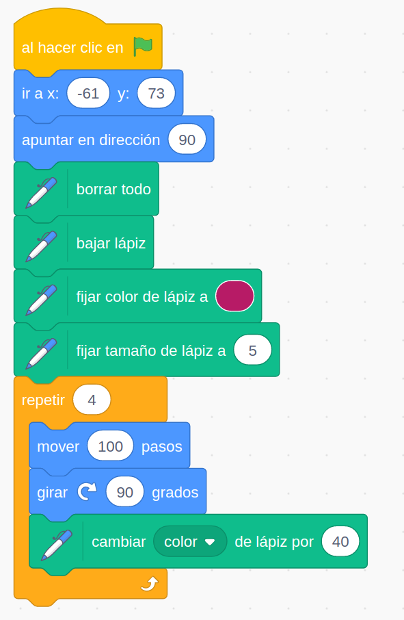
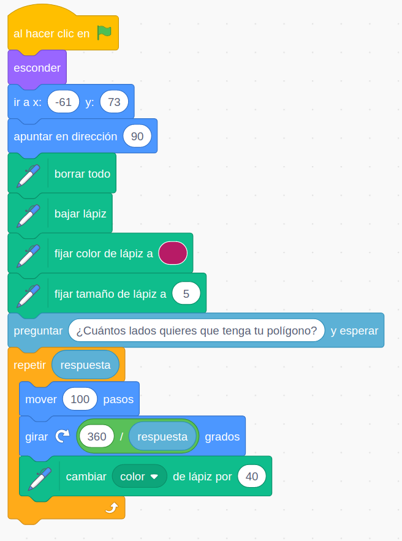

# Ejemplos

Todos los ejemplos están en [este estudio](https://scratch.mit.edu/studios/25477130)

## Movimientos básicos y ¡¡sonidos!!

Aprendemos ...:

* A reproducir sonidos y como podemos grabarlos
* Qué es un evento y el más utilizado: la bandera verde
* A movernos de modo relativo con **Mover X pasos**
* A movernos de manera absoluta con **Ir a x y**
* A **Girar X grados**
* A hacer que mire en una dirección determinada con **Apuntar en dirección X**
* Repetir acciones con los bucles de control
* A introducir esperas 
* A animar un objeto cambiando de disfraz con **Siguiente disfraz**
* A seleccionar el tipo de giro de nuestro personaje

* Añadimos un fondo al escenario y ajustamos la coordenada **y**  para que Gatito se integre bien con el fondo

[Proyecto](https://scratch.mit.edu/projects/348617555/)

## Dibujando un cuadrado

Aprendemos ...:

* A incluir más bloques con una extensión
* A usar la extensión **Lápiz** para dibujar
* A que hay que bajar el lápiz para dejar rastro
* A borrar
* A seleccionar color y groso del lápiz
* A modificar el color del lápiz

[Proyecto](https://scratch.mit.edu/projects/348618592/)

## Dibujando polígonos

Aprendemos ...:

* Ocultar al personaje con el bloque **Esconder**
* Pedir información al usuario con **Preguntar** y usar el de **Respuesta**
* Concepto de variable que usamos en varios lugares
* Vemos un ejemplo de **algoritmo**
* A calcular usando los operadores algebráicos

[Proyecto](https://scratch.mit.edu/projects/348625727/)