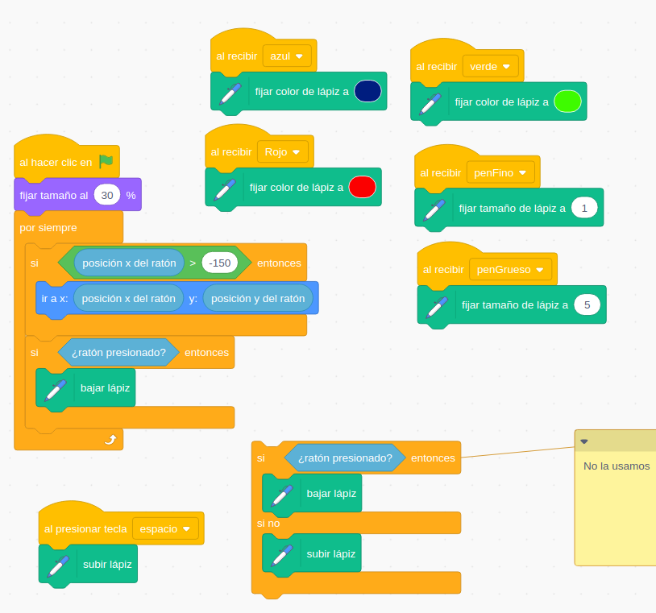
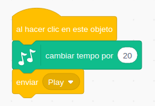
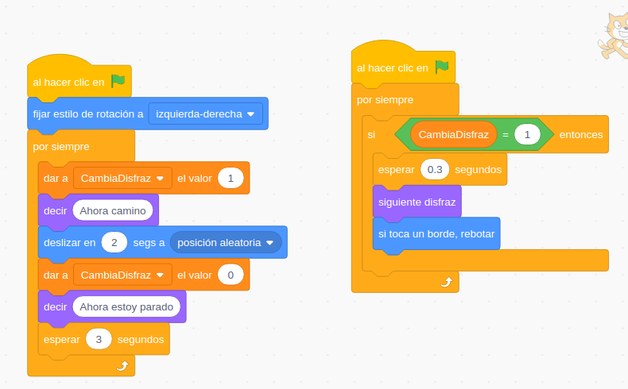

Para secundaria o más allá

[Siguelíneas](https://www.youtube.com/watch?v=kHzqFQ0EMos&list=PLzqyAKVt4MgOV6brvY33MkhIFqxtatr81&index=9)

[Resolver laberintos]

[Búsqueda de objetos en espiral](youtube.com/watch?v=uIOuDJPx8BU&list=PLzqyAKVt4MgOV6brvY33MkhIFqxtatr81&index=12

[Inteligencia artificial y machine learning](https://programamos.es/aprende-machine-learning-con-learningml/)

[Machine Learning for Kids](https://machinelearningforkids.co.uk/#!/worksheets)

[Simulador Epidemia by Mitchael Resnick](https://scratch.mit.edu/projects/376750743/)

[Simulador gravitación](https://scratch.mit.edu/projects/394638878/)

## Jugando en la nube

https://scratch.mit.edu/projects/392811906/

## Pacman

https://scratch.mit.edu/projects/390606679/

Truco:
* solo se mueve si el fondo es negro
* usa 2 objetos para el comecocos: 1 para lo normal y otro cuando se lo comen. Se puede hacer un "mover a: objeto"

Algoritmo de los fantasmas https://www.101computing.net/pacman-ghost-algorithm/

## Clones

Ejemplo: RevientaBurbujas

Click sobre una burbuja hace pop

[Pompitas](https://scratch.mit.edu/projects/394798516/)

[Colocar Ladrillos](https://scratch.mit.edu/projects/164028072)

## Disparos

Ejemplos: Escarabajo dispara a coronavirus

Usamos unas variables x, y y dirección globales para que el disparo sepa de donde salir y a donde ir, mantedrá la dirección hasta que toque el borde donde desaparecerá.
Se puede hacer un "mover a: objeto"

## Colisiones más detalladas

Colisiones usando colores: el siguelineas

## Dibujando con el ratón

Editor gráfico

Mensajes de cambios de colores y de tipos de línea

Si estamos en la zona de dibujar, compiamos la coordenada del raton al personaje

Usamos la extensión

Cada herramienta manda un mensaje y hace que Gato cambie

[Proyecto](https://scratch.mit.edu/projects/397315506/)

Vamos a ampliarlo añadiendo un "botón" borrar, algunos colores más y algún grosor nuevo.

[Solución](https://scratch.mit.edu/projects/397334049/)

## Vídeo

También podemos trabajar la detección de colores usando lo que ve la cámara.

Usar dirección y movimiento

Usar detección del movimiento en todo el escenario

## Reproductor con seguimiento de partituras

Vamos a darlo un valor más didáctico, mostrando la nota que está sonando

Añadimos un fondo con la partitura y vamos a crear un objeto Cursor que nos vaya marcando la nota que está sonando

Cada instrumento enviará un mensaje para cambiar el instrumento que suene.

Usamos el efecto "Desvanecer"

[Proyecto](https://scratch.mit.edu/projects/397468964)

### Mejoras/Ideas

* Añade distintas melodías.
* Incluir más intrumentos.
* Controla la velocidad de reproducción.

## Makey-Makey

Encender luces y motoress

## Truco para animar mientras se desliza

El truco es tener 2 bloques de código asociados al mismo evento (la bandera verde) que se ejecutan a la vez y usar una variable  que permite sincronizarlos.

No lo veo muy sencillo y por eso lo hice de la otra forma, a mi juego más fácil de entender. Pero a estas alturas del curso creo que ya es hora de desvelar mi secreto.

[Programa](https://scratch.mit.edu/projects/401193071/)

## Pasapalabra avanzado

Lista de preguntas y Lista de respuestas

Todas las letras son duplicados de la A con otros disfraces:
1. Pendiente de respuesta
1. Han dicho "pasapalabra"
1. Error

Variable local para el estado

ó 

1 único objeto con 26 disfraces y con transformaciones de color
Listas: 
* preguntas 
* respuestas
* estado

