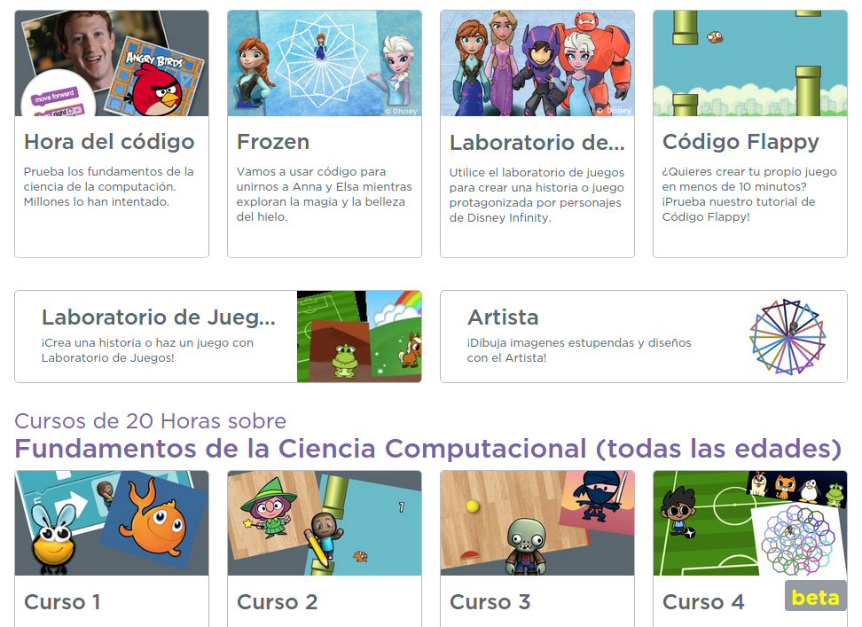
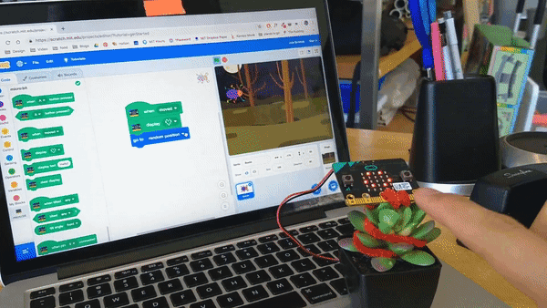
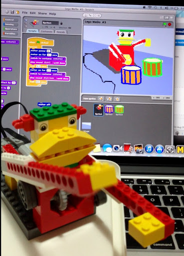
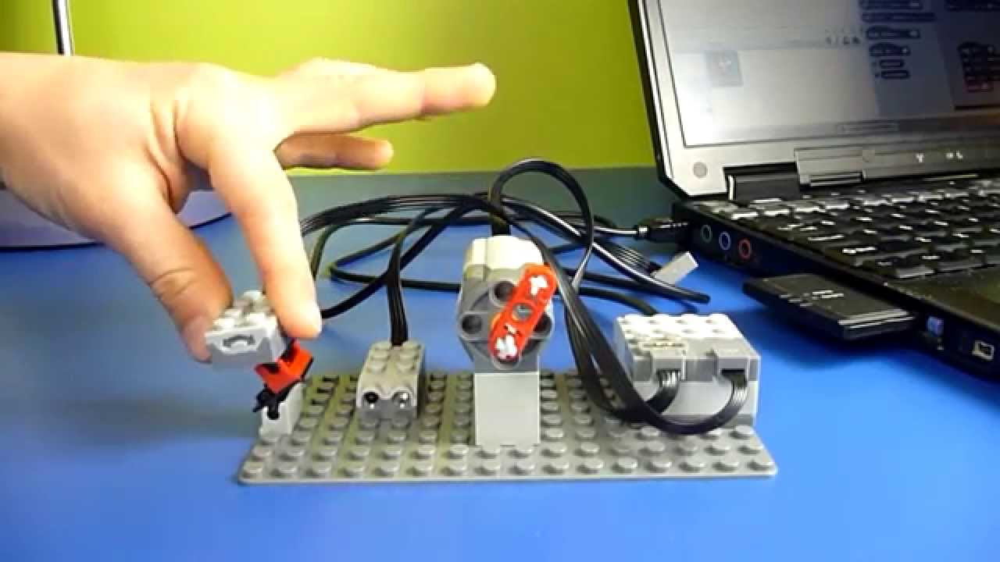
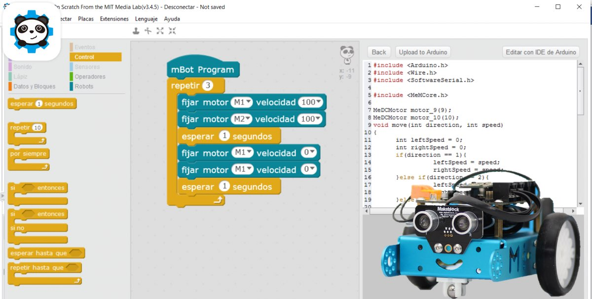
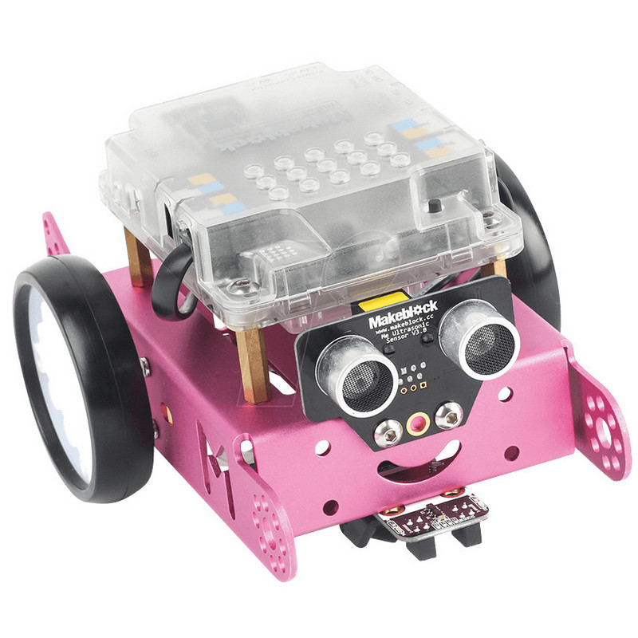
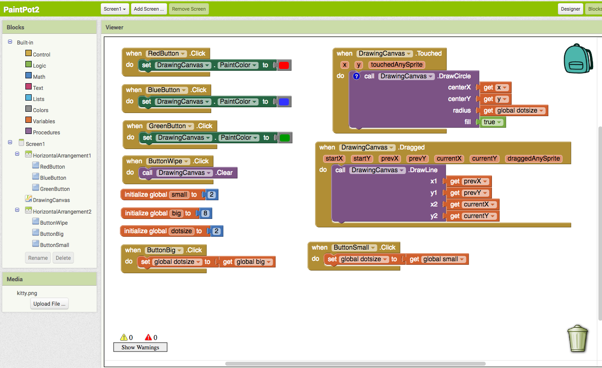
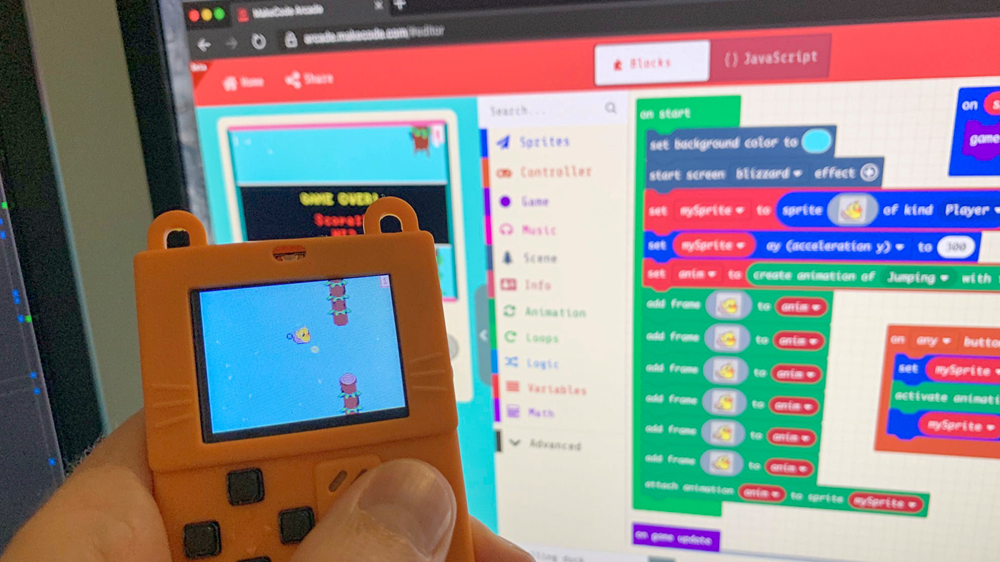

# Actividad - Iniciación a la programación

## Duración: 1 hora

Code.org

* Multinivel
* Pensado para que el alumno pueda avanzar autonomamente
* El profesor puede hacer seguimiento del progreso de los alumnos

1. Pre-reader (Nivel 1)
1. Primeros pasos (Nivel 4)
1. Programación de rutas (Nivel 7)
1. Programación artística (Nivel 11)
1. Programación de eventos (Nivel 13)

## Recurso
## Code.org

#### ¿no son todos .com?

#### ¿quién está detrás?

### Vamos a hacer pequeños programas para ayudar a nuestros amigos

### ¿Frozen? ¿Angry birds? ¿Flappy bird?

[nivel 1](https://studio.code.org/hoc/1/	)

## [Blockly](https://developers.google.com/blockly/)

## [Light Bot App](https://play.google.com/store/apps/details?id=com.lightbot.lightbothoc&hl=es)

## [Pocket Code](https://play.google.com/store/apps/details?id=org.catrobat.catroid&hl=es)

## [Scratch Jr](https://play.google.com/store/apps/details?id=org.scratchjr.android&hl=es)

## [Scratch](./Scratch.md)

## [Scratch con micro:bit](./Microbit.md)

## Scratch y Lego

## [mBlock](./mBlocks.md)

## [AppInventor](./AppInventor.md)

## [Videojuegos](https://arcade.makecode.com/)

