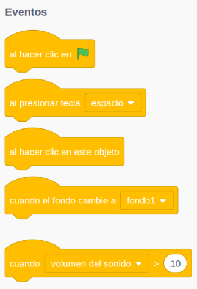
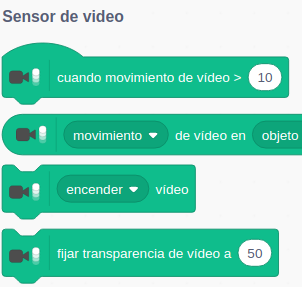

## Interacción

¿Qué es la interacción?

Comunicarnos con el usuario

Interacción: Preguntar/responder

Con el Usuario
* Hacerlo protagonista
* Comunicarnos con él:
    * Preguntar
    * Responder
    * Dirigirnos a él
* Despertar sus sentidos:
    * Imágenes
    * Música
    * Sonido
    * Hablarle
* Detectar sus movimientos
    * Teclado
    * Ratón
    * Vídeo
    * Sonido

Entre los personajes
* Dándoles movimiento
* Haciendo que interacciones entre ellos
    * Moviéndose
    * Chocando
* Usando
    * Imágenes
    * Música
    * Sonido
* Detectar sus movimientos
    * Teclado
    * Ratón
    * Vídeo

Para hacer esta interacción utilizaremos los **Eventos** que ya hemos utilizado antes (y alguno nuevo):

Los bloques de la paleta "**Sensores**"

Además de algunas extensiones que nos van a permitir:

* Detectar los movimientos usando una cámara web "**Sensor de Vídeo**".

* Crear "**Música**" con la extensión del mismo nombre.

* Escuchar textos hablados con la extensión "**Texto a Voz**", veremos que podemos usarla para trabajar los idiomas.

Como ejemplo de interacción con Hardware veremos la conocida placa Makey-Makey que nos va a permitir sacar nuestros proyectos del ordenador, es decir poder usarlos sin tener que usar teclado o ratón.

[Vídeo: Interacción en Scratch 3.0](https://youtu.be/V_joIGGFx-k)

## [Preguntas/Respuestas](./Preguntas.md)

## [Teclas](./Teclado.md)

## [Ratón](./Raton.md)

## [Colisiones](./Colisiones.md)

## [Sonido](./Sonido.md)

## [Vídeo](./Video.md)

## MakeyMakey

