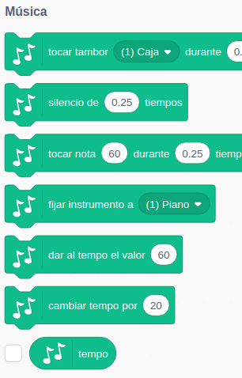
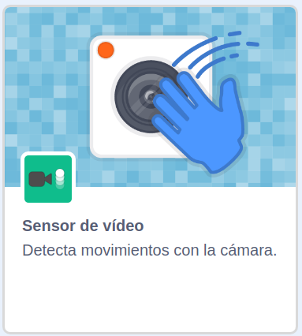
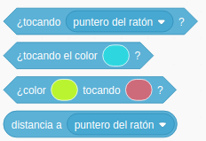

## Interacción

¿Qué es la interacción?

Comunicarnos con el usuario

Interacción: Preguntar/responder

Con el Usuario
* Hacerlo protagonista
* Comunicarnos con él:
    * Preguntar
    * Responder
    * Dirigirnos a él
* Despertar sus sentidos:
    * Imágenes
    * Música
    * Sonido
    * Hablarle
* Detectar sus movimientos
    * Teclado
    * Ratón
    * Vídeo
    * Sonido

Entre los personajes
* Dándoles movimiento
* Haciendo que interacciones entre ellos
    * Moviéndose
    * Chocando
* Usando
    * Imágenes
    * Música
    * Sonido
* Detectar sus movimientos
    * Teclado
    * Ratón
    * Vídeo

Paleta: Sensores

### Preguntar

Pedir información al usuario con **Preguntar** y usar el de **Respuesta**

Ejemplo: Adaptar el del poligono para que pida el número de lados

Ejemplo: Adaptar la ruta por Andalucía para preguntar el nombre

## [Teclas](./Teclado.md)

## [Ratón](./Raton.md)

## [Sonido](./Sonido.md)

Trabajar los idiomas

## [Vídeo](./Video.md)

## Interacción entre objetos

Detectar:
* choques
* superposiones
* detectar los bordes

## MakeyMakey

