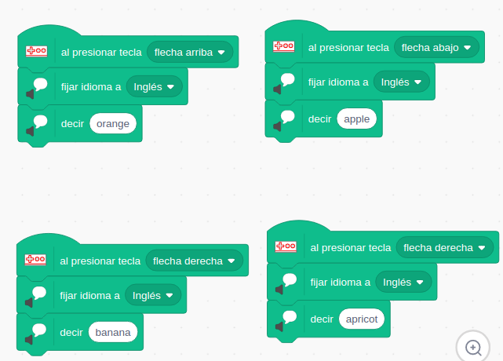
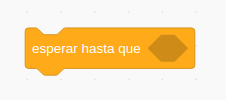
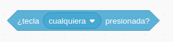
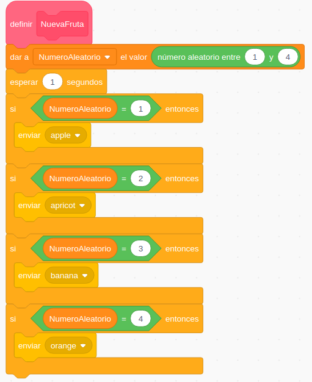
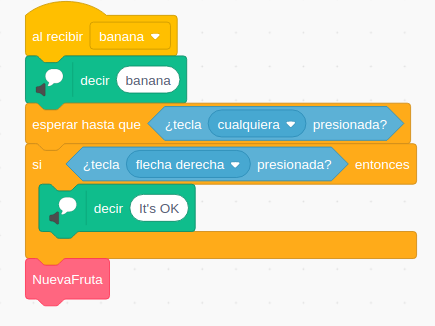

## Las frutas y Makey-Makey

Vamos a hacer un clásico: conectar frutas a MakeyMakey. Haremos un par de versiones del clásico programa.

## Ejemplo: Frutas que dicen su nombre

Vamos a hacer que nuestro programa diga en voz alta el nombre de una fruta cuando la toquemos. 

Vamos a hacer un programa que no necesite pantalla: sólo las frutas conectadas a MakeyMakey y un altavoz para oir sus nombre en un idioma dado.

Para ello usaremos la extensión "MakeyMakey" y la de "Texto a Voz"

Tras cada evento asociado a las teclas del cursor, selecionaremos el idioma que vamos a usar y diremos su nombre.

El programa es muy sencillo:

[Proyecto](https://scratch.mit.edu/projects/400294804)

[Vídeo: Frutas que dicen su nombre con MakeyMakey y Scratch](https://youtu.be/faxOAZ9DdMo)

## Ejemplo: ¿Qué fruta soy?  

Vamos a seguir trabajando sin pantalla. 
Al pulsar la tecla espacio el juego empezará y nos dirá el nombre de una fruta en un idioma y tendremos que tocarla.

El orden de las frutas será aleatorio.

Usaremos el sensor de teclado

la condición hasta que se pulse cualqier tecla

Tras pulsarse cualquier tecla, comprobaremos si es la correcta. Si es así decimos "It's OK" y en cualquier caso pasamos a otra fruta. 

Duplicamos estos bloques cambiando el nombre de la fruta y la tecla asociada.

Creamos una mensajes que lanzarán cada una de las frutas.

Si queremos hacerlas de manera consecutiva, solo tenemos que encadenar los mensajes (como hacíamos en Pasapalabra)

Si queremos hacerlo en forma aleatoria haremos  

Cada fruta será:

[Proyecto](https://scratch.mit.edu/projects/400296729/)

[Vídeo: Adivina qué fruta es con MakeyMakey y Scratch](https://youtu.be/E_lAOyG6Nps)
