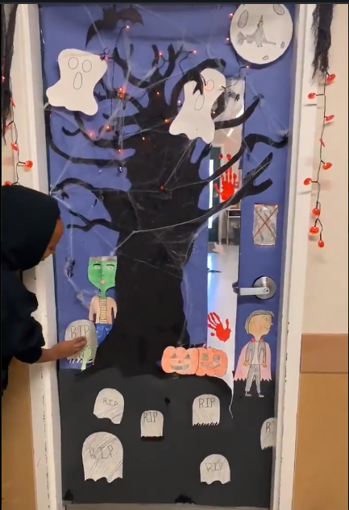
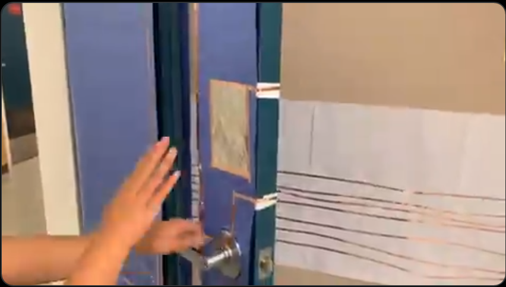
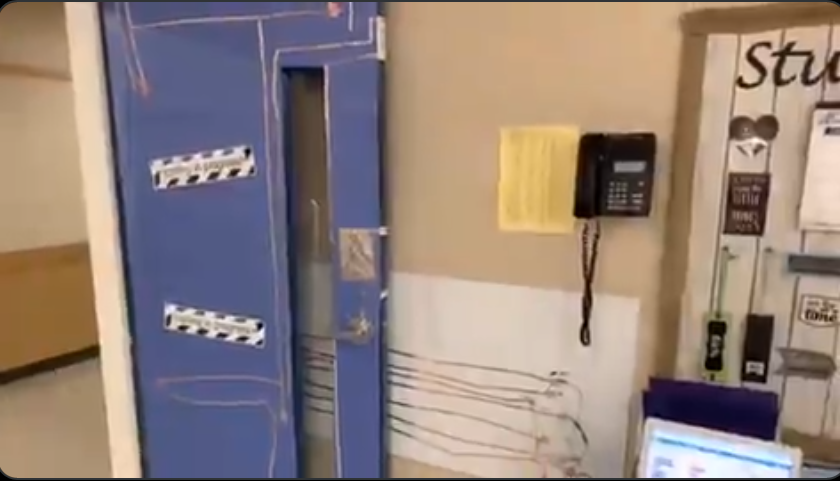

## Montajes

[Robot movil](https://twitter.com/ryanejenkins/status/1135603263229845510)

@ScrappyCircuits
 
 
[Circuito con clips](https://twitter.com/SimonFittockEDU/status/1136109679984095233)

[Circuitos sencillos](https://twitter.com/MrReuland/status/1121403726953091073)

[Clasificando ciencia](https://makeymakey.com/blogs/how-to-instructions/math-science-classify-and-sort)

[Piano más grande](https://www.instructables.com/id/Educational-Makey-Makey-Piano/)

[Macro Piano](https://makeymakey.com/blogs/how-to-instructions/oversized-and-portable-floor-piano)

[Piano pintado](https://www.instructables.com/id/Graphite-Piano-Keyboard-with-MaKey-MaKey-and-Scrat/)

[Instrumento musical pintado](https://makeymakey.com/blogs/how-to-instructions/lesson-four-draw-a-playable-instrument)

[Música con agua](https://makeymakey.com/blogs/how-to-instructions/musical-water-with-soundplant)

[Silla-piano](https://makeymakey.com/blogs/how-to-instructions/piano-chair)

[Salta-salta](https://makeymakey.com/blogs/how-to-instructions/makey-makey-run-and-jump-game-pad)

[Guitarra musical](https://makeymakey.com/blogs/how-to-instructions/creating-a-guitar-in-scratch-or-soundplant)

[Montaje complejo](https://twitter.com/mandeepR41/status/1191764116131598336)

## Ideas

* ScapeRoom
* Medida de salto de altura
* Tiempo de reflejos
