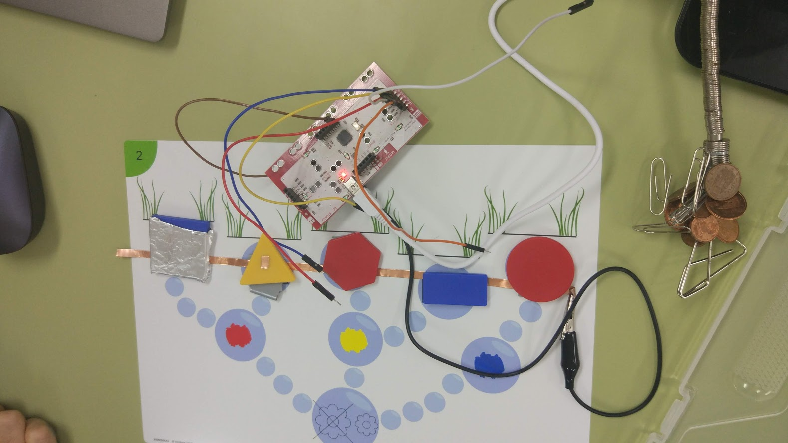
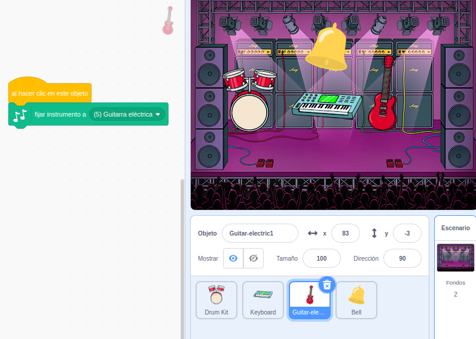
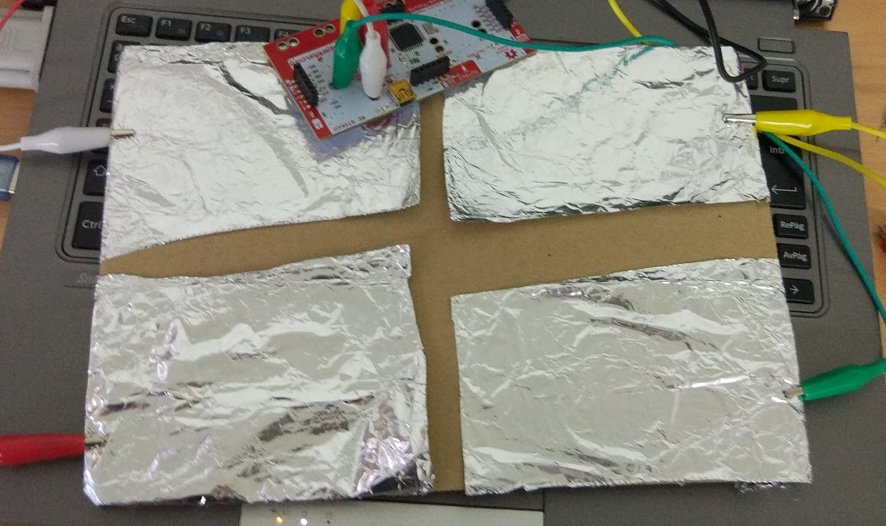
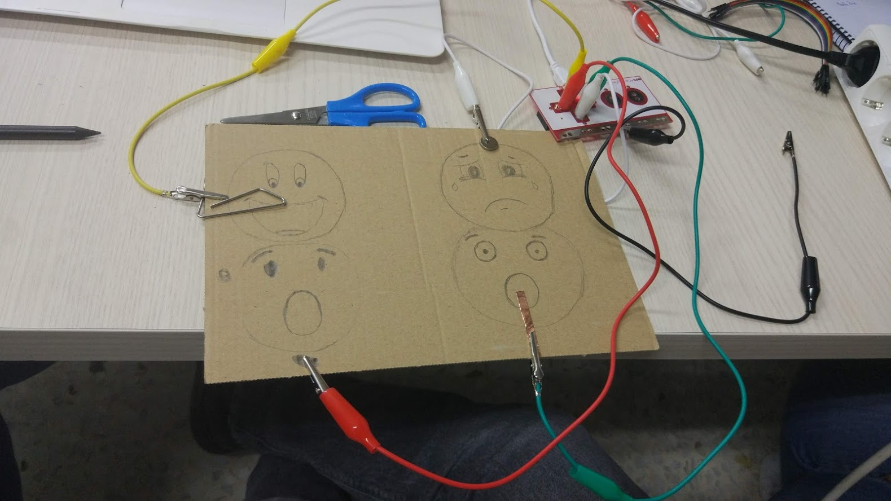
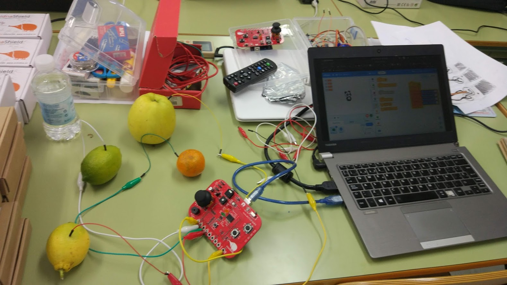
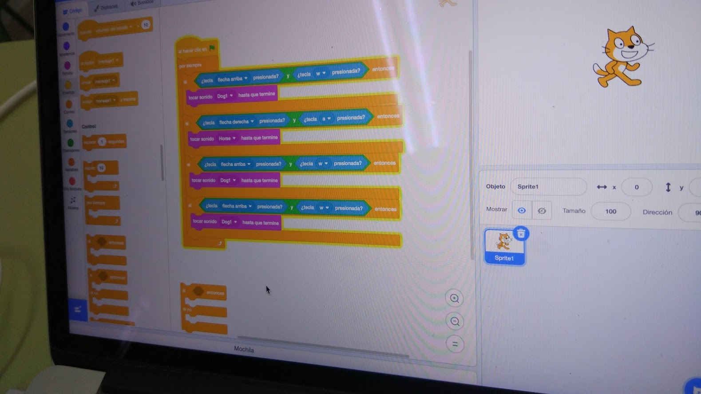
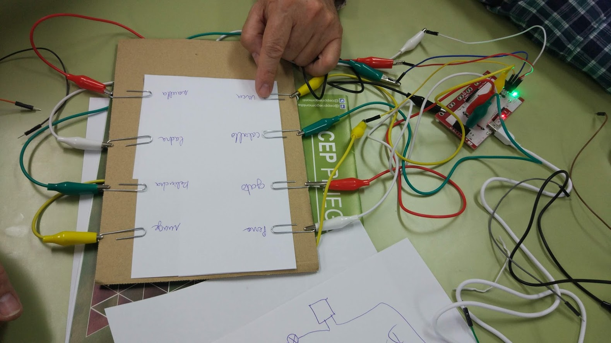

# Proyectos sencillos

# Pedagogía y técnicas de aula

* Normalmente trabajaremos en grupos de 3-4 alumnos por robot
    * Trabajo en equipo
    * Revisión del código por pares
        
* Podemos hacer que programen por separado y que envíen el programa (vía correo o pendrive o similar) para que se programe alguno de los robots disponibles
    * Fomentamos la paciencia y la cooperación
    * Revisión del código antes de enviarlo
    * Se discuten mejoras y variantes
    
## Estudio de conceptos VS Trabajo de proyectos

Aprender Conceptos -> Aplicarlos

### Fases de un Proyecto

Estudio -> Diseño -> Prototipo -> Producción

### Entregables:

Bocetos, prototipos, documentación, tests...

##Ejemplo: Vamos a definir un proyecto, sus fases, versiones,....
    
### Fases para construir  un robot

Son 4 las fases para construir un Robot

1. Mecánica: diseño de la estructura
  * Plantilla
  * Diseño
  * ¡¡ Improvisación !!
  * Materiales
  * Reciclado
2. Eléctrica: motores, alimentación,...
  * Pilas, baterías
  * Motores
3. Electrónica: necesitamos un control fino de los elementos
  * CPU (usamos un tipo especial llamado microncontroladores - Arduino)
  * Interruptores
  * Sensores
4. Informatica: crearemos un programa capaz de controlar los elementos y hacer cumplir al robot las funciones que necesitamos	    

## Organización del material

* Inventariar
* Utilizar cajas o similar
* Inculcar el concepto de "orden del taller" en los asistentes
* Responsabilizarlos

batería

instrumentos

Ejemplo de Quiz 1 pregunta

Ejemplo Unir preguntas y respuestas

## Quiz I: Pregunta y respuestas

## Trabajando con formas

Una Makey-Makey nos permite detectar cuál forma estamos tocando

## Batería & Instrumentos

Usamos una placa Makey-makey para reproducir distintos sonidos

[Proyecto](https://scratch.mit.edu/projects/340880761/)

## Kahoot físico

Sistema para hacer votaciones similar a KaHoot

[Proyecto](https://scratch.mit.edu/projects/340884761/)

## Emociones

## Reconocedor de frutas

Conectamos las diferentes frutas a cada cable

Utilizamos la extensión Text to Speech para oir los resultados en diferentes idiomas

## Quiz II:  Preguntas y respuestas

Usamos una make-makey para que el usuario encuentre las correspondencias. Un sencillo programa tiene las respuestas correctas. Cada una de las preguntas/respuestas están conectadas a makey-makey y el usuario conectado a tierra tiene que tocar las parejas

Usamos

[Proyecto](https://scratch.mit.edu/projects/341130424/)

