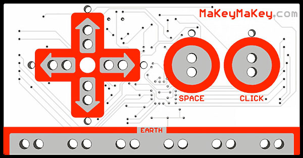
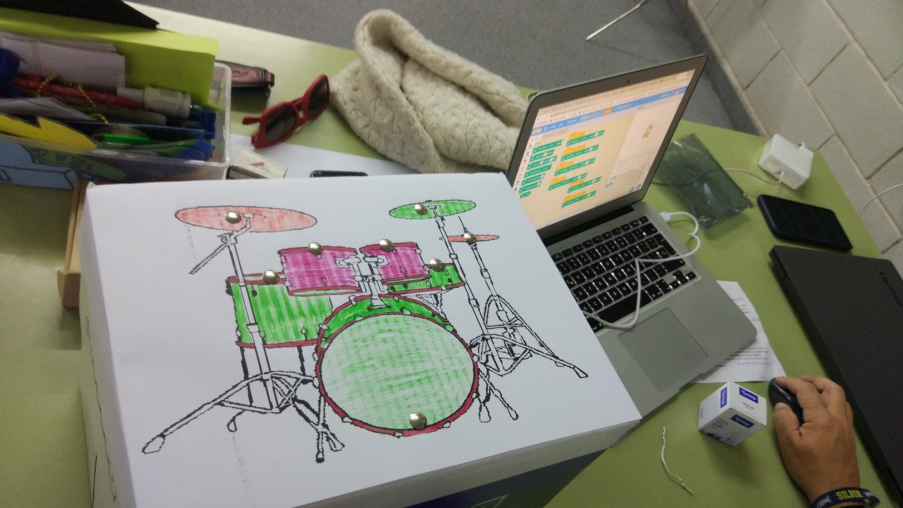
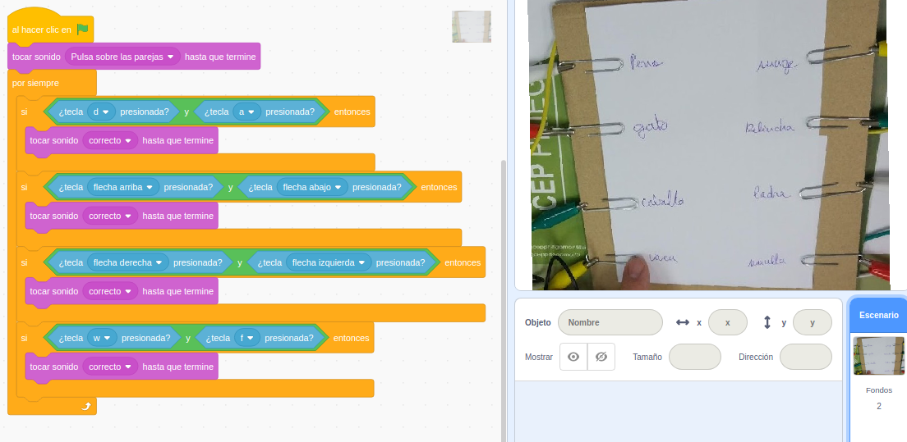
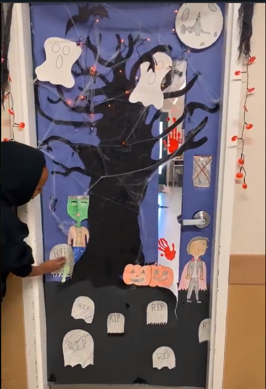
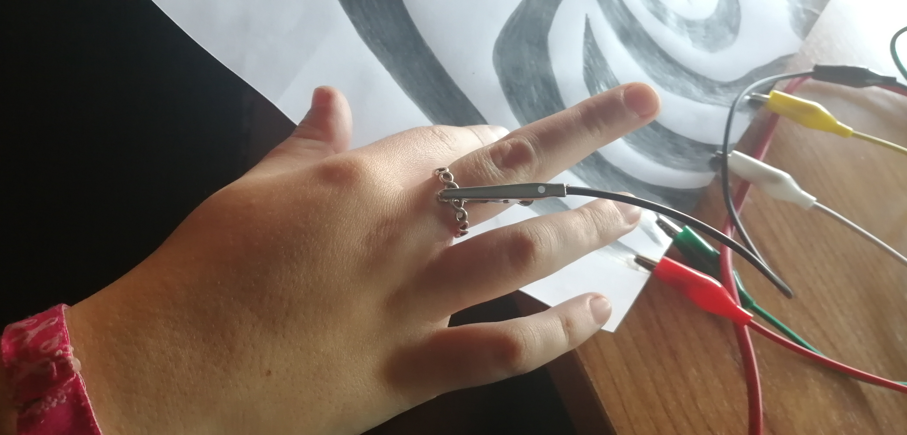
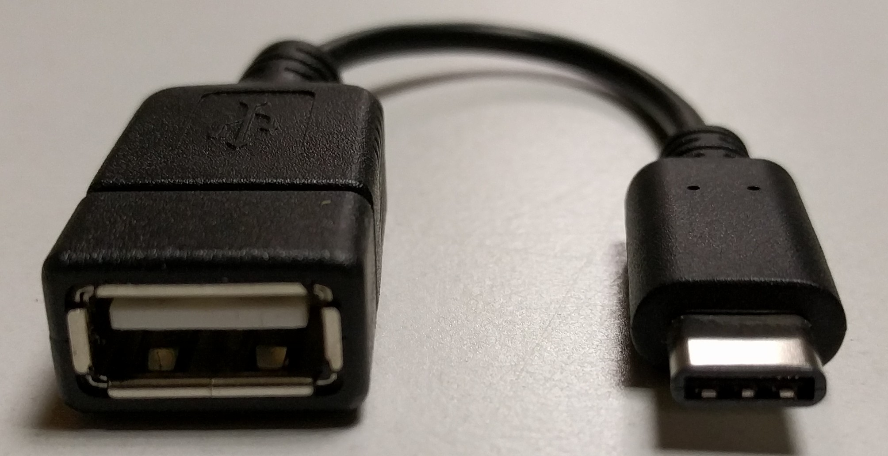

# ¿Qué es Makey-Makey?

## Y cómo empezar a utilizarlo

Sólo mirar la placa MakeyMakey y vemos que tiene "pinta" de mando de consola. Lo mismo ve nuestros alumnos lo que los anima a probarlo.

La placa nos permite:

* Interacción con Hardware.
* Sacar nuestros proyectos del ordenador
* Poder usarlos sin teclado,  ratón o monitor  
* Simula un teclado y ratón

Con esto vemos que será fácil convertir unas pocas frutas en un piano, uno de los clásicos proyectos.

O un piano de diseño sofisticado

O una batería

O un mando para jugar

O un juego de preguntas y respuestas sobre tiempos verbales

O sobre significado de palabras

O sobre sintagmas

O combinado con sonidos grabados o imágenes, una forma sencilla de aprender la emociones

O para identificar los nombres con los colores

O montar un EscapeRoom o animar tu Halloween

[Presentación: ¿Qué es MakeyMakey?](https://docs.google.com/presentation/d/1VPMIUyigIx8NufRw1sIC-4nzrLnbFGXjXMV_So_jYVo/edit?usp=sharing)

## ¿Qué nos permite hacer?

* Simula un teclado
* Simula un ratón
* Sin instalación (como un teclado o ratón)
* No necesita driver (casi nunca)
* Funciona en todo los sistemas operativos
* Con solo conectar al USB
* Mejora la accesibilidad

## La placa MakeyMakey

Por delante

Por detrás

Es compatible con Arduino, basada en el modelo Arduino Leonardo. Más detalles en [MakeyMakey.com](https://MakeyMakey.com)

## El kit básico

* Placa Makey-Makey
* Cable miniUSB (cuanto más largo mejor)
* Cables cocodrilo (al menos 10)
* Cables dupont finos (al menos 12)

## ¿Dónde y qué comprar?

* Tienda original makeymakey.com - 50€
* Tienda España micro-log.com - 30€
* Amazon - 15€
* Aliexpress  -  9€

Obviamente a medida que bajamos en precio también lo hace la calidad y la duración...

[Vídeo: ¿Qué es Makey-Makey?](https://youtu.be/g_C3AI79kUA)

## ¿Cómo se usa?

Tenemos que cerrar  un circuito eléctrico: entre Tierra (Earth o Ground) y otro contacto:

Como se ve en la imagen, los cables y la persona cierran el circuito entre Tierra y el contacto de la fecha Arriba.

Para hacer buen contacto tenemos que tocar la parte metálica:

Podemos cerrar el circuito con el dedo:

O con un cable:

(Imágenes tomadas de la guía de MakeyMakey)

## ¿Cuántos cables  podemos conectar?

Usando los conectores laterales (con los cables finos) podemos conectar hasta 18 cables:
* W, A, S, D, F, G
* Ratón: movimientos ↑ ↓ ← → botón Izq y Drcha
* Teclado: teclas de flechas ↑ ↓ ← → Espacio, botón Izq

## Drivers

No debería pasar, pero ... Si no se detecta como teclado, tendremos que instalar el driver de https://cdn.sparkfun.com/tutorialimages/MaKey_MaKey_QuickStart/MaKeyMaKey-Driver-14-8-12.zip

1. En windows instala el [driver](https://cdn.sparkfun.com/tutorialimages/MaKey_MaKey_QuickStart/MaKeyMaKey-Driver-14-8-12.zip)
1. Comprueba que está instalado

1. Indica el path

1. Valida el driver

## Primeras pruebas

Vamos a comenzar a hacer pruebas, empezando por las más básicas:

### Prueba 1ª

* Conecta USB ->  Luz roja
* Tocamos Earth
* Tocamos flechas -> Luz Verde

### Prueba 2ª

Con este sencillo [programa](https://scratch.mit.edu/projects/400292949/)

 

Gato debe maullar cuando toquemos espacio

### Prueba 3ª

* Conectamos cable Negro a Earth (Tierra)
* Conectamos cable de color a Space
* Conectamos cable USB

Al tocar el cable negro y el de color Gato maúlla

## Trucos para el cable de tierra

Recuerda que siempre hay que hacer contacto con el cable de tierra. Para ello podemos usar algunos trucos:

* Podemos usar cualquier anillo o pulsera o reloj siempre que sea metálico para que haga contacto con nuestro cuerpo. Cuidado que las pinzas cocodrilo se pueden comer tu pulserita de plata.
* Sujetar la pinza a una pulsera o reloj aunque no sean metálicos pero que hagan buen contacto con nuestra piel.
* Hacer una pulsera de papel de aluminio.
* Envolver con aluminio algún componente que cojamos con la mano.

## Añade componentes

¿Qué podemos conectar?
* Cables
* Papel de aluminio
* Cinta de cobre
* Lápiz blando (grafito)
* Encuadernadores
* Clips
* Grapas
* Monedas
* Imanes

[Presentación: ¿Qué es MakeyMakey?](https://docs.google.com/presentation/d/1VPMIUyigIx8NufRw1sIC-4nzrLnbFGXjXMV_So_jYVo/edit?usp=sharing)

[Vídeo: ¿Cómo usar Makey-Makey?](https://youtu.be/yEZgaEV5FMM)

## MakeyMakey con tabletas

### Tabletas y móviles Android

Puesto que MakeyMakey simula un teclado y ratón, podemos conectarlo y utilizarlo sin más que encontrando el cable adecuado para nuestra trableta/móvil.

Este cable se llama OTG, y debe tener un conector hembra USB tipo B (conde conectamos el MakeyMakey) y un conector micro de tipo macho que conectaremos a nuestro móvil. 

Puede ser simulares a estos

### iPAd

Para conectar MakeyMakey a un iPAd necesitaremos un adaptador.
En la [página de makeymakey.com](https://makeymakey.com/blogs/blog/connect-a-makey-makey-to-your-ipad-to-build-a-mouse-or-trackpad-code-your-key-presses) nos indican algunos modelos que han probado y funcionan

