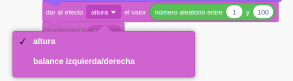
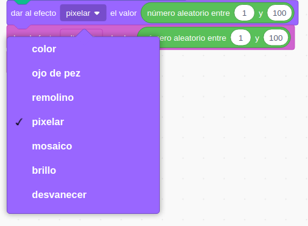
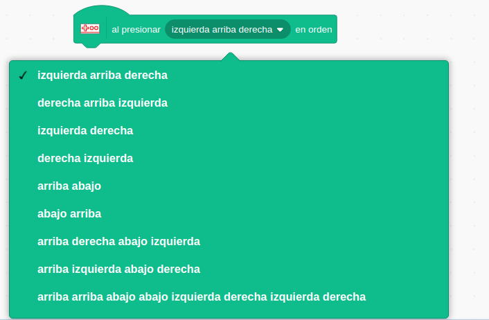

## Música y MakeyMakey

Los programas para hacer música son unos de los ejemplos más típicos que se hacen con MakeMakey.

Vamos a ver algunos ejemplos.

## Batería

Vamos a usar la extensión "Música" para sonar como una batería.

No vamos a necesitar la pantalla, con lo que tampoco tendremos ningún objeto/personaje. Pondremos el programa en la parte del escenario.

Usaremos los eventos de teclado para reproducir los sonidos de las distintas partes de la batería:

[Proyecto Batería](https://scratch.mit.edu/projects/401021028/)

Hemos usado una imagen de batería que hemos impreso y hemos usado encuadernadores para que hagan contacto.

Hemos envuelto la baqueta (un bolígrafo) en papel de aluminio, al que hemos conectado la pinza negra de Tierra. De esta forma al tenerlo sujeto con la mano estoy haciendo contacto y también puedo tocar con la otra mano.

Una ampliación sencilla será añadir un pedal (hacemos contacto con 2 láminas de aluminio o con el pie).

[Vídeo: Tocando la batería con MakeyMakey y Scratch](https://youtu.be/WHG7o5EjoTY)

## Piano

Para montar un piano hemos usado una imagen de teclado que hemos impreso.

Dado que son muc

[Proyecto](https://scratch.mit.edu/projects/401028271/)

## Ejemplo Piano psicodélico

Si hay algo que queremos fomentar con el uso de MakeyMakey y Scratch es el uso de la creatividad e imaginación. Por eso debemos dejar que la utilicen para diseñar sus propios instrumentos, como este piano que me ha dibujado mi hija Rosa:

La idea es que suene diferente y se toque de manera diferente.

Para conseguir ese sonido y aspecto diferente hemos usado los **"Efectos"**, tanto de sonido como de apariencia, que no son otra cosa que una modificación del aspecto o del modo en el que se reproduce el sonido para hacerlo diferente.

Podemos usarlos para hacer transiciones o para dar efectos más (o menos) realistas a nuestros programas.

Cada efecto se aplica con una intensidad desde 0 a 100 (100 es máximo y 0 nada). Nosotros hemos usado este valor de intensidad de manera aleatoria, para hacerlo aún más creativo.

La extensión Makey-Makey, además de los eventos de pulsación de teclas tiene también eventos de **"Secuencias de teclas en orden"** que saltan cuando pulsamos determinadas teclas en un orden concreto:

¿Para qué podemos usar este bloque? Para detectar deteminadas secuencias (muchos videojuegos los usan para movimientos complejos) o como una clave secreta que sólo el usuario sabe (la última secuencia de ↑  ↑  ↓  ↓  ←  →  ← → era un código que un empresa de videojuegos usaba para activar un modo especial de juego, a modo de Huevo de Pascua)

El programa queda así:

[Proyecto](https://scratch.mit.edu/projects/400209476)

[Vídeo: Piano clásico y psicodélico con Scratch y MakeyMakey](https://youtu.be/5UY0iAJ3UWY)

## Otros montajes

Son muchísimos los montajes que podemos encontrar en internet de instrumentos, os enlazo aquí unos cuantos:

[Piano más grande, con teclas móviles](https://www.instructables.com/id/Educational-Makey-Makey-Piano/). Ha ganado varios premios y hasta lo tocó un conocido pianista.

[Macro Piano](https://makeymakey.com/blogs/how-to-instructions/oversized-and-portable-floor-piano) pensado para tocarlo con los pies descalzos: hacemos contacto entre las teclas y las líneas perpendiculares. Muy vistoso pero el uso con los pies lo hace poco duradero.

[Tecla de 2 capas o Salta-salta](https://makeymakey.com/blogs/how-to-instructions/makey-makey-run-and-jump-game-pad) Hacemos un sandwitch con 2 cartones forrados de papel de aluminio y con un separador de cartón en medio. Al pisarlo hacen contacto. Es laborioso de hacer pero muy duradero. En la imagen se ve que están usando los hilos de los cables de red.

[Piano pintado](https://www.instructables.com/id/Graphite-Piano-Keyboard-with-MaKey-MaKey-and-Scrat/)

[Instrumento musical pintado](https://makeymakey.com/blogs/how-to-instructions/lesson-four-draw-a-playable-instrument)

[Música con agua](https://makeymakey.com/blogs/how-to-instructions/musical-water-with-soundplant) Una versión con vasos de agua del piano.

[Silla-piano](https://makeymakey.com/blogs/how-to-instructions/piano-chair). Sin duda el instrumento más orginal para no tener que moverte del asiento.

[Guitarra musical](https://makeymakey.com/blogs/how-to-instructions/creating-a-guitar-in-scratch-or-soundplant) Se han usado imanes para hacer el contacto en los trastes. El cable de tierra está en la zona de las cuerdas y al tocarlo hacemos contacto.

