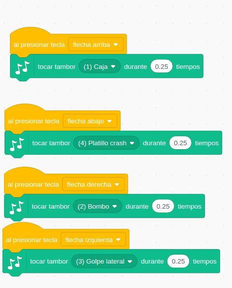
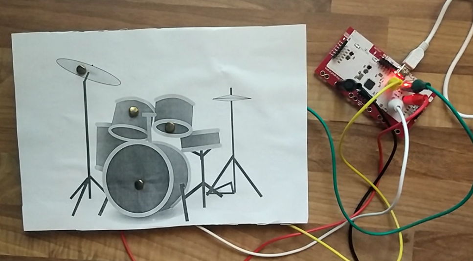
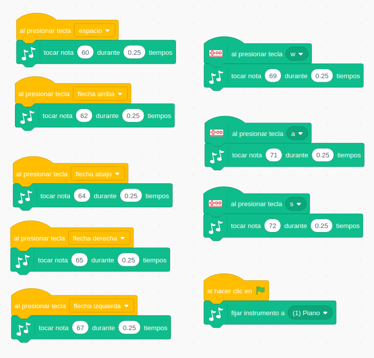
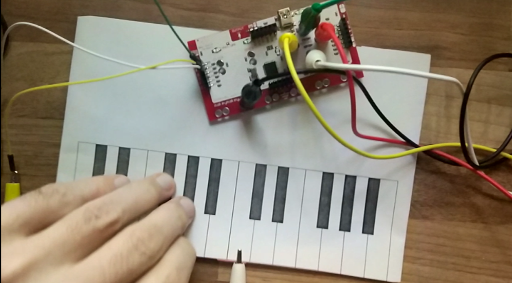
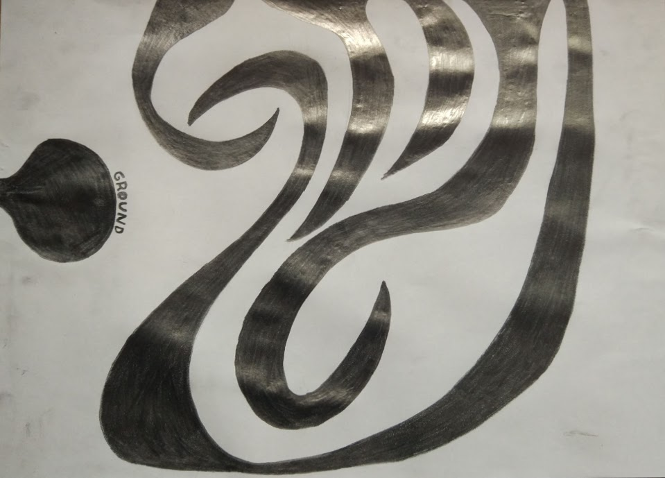
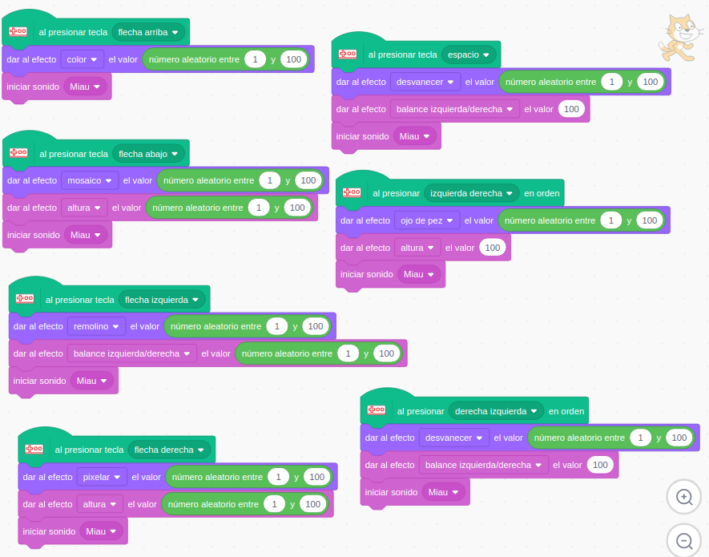

## Música y MakeyMakey

Los programas para hacer música son unos de los ejemplos más típicos que se hacen con MakeMakey.

Vamos a ver algunos ejemplos.

## Batería

Vamos a usar la extensión "Música" para sonar como una batería.

No vamos a necesitar la pantalla, con lo que tampoco tendremos ningún objeto/personaje. Pondremos el programa en la parte del escenario.

Usaremos los eventos de teclado para reproducir los sonidos de las distintas partes de la batería:

[Proyecto Batería](https://scratch.mit.edu/projects/401021028/)

Hemos usado una imagen de batería que hemos impreso y hemos usado encuadernadores para que hagan contacto.

Hemos envuelto la baqueta (un bolígrafo) en papel de aluminio, al que hemos conectado la pinza negra de Tierra.

## Piano

Para montar un piano hemos usado una imagen de teclado que hemos impreso.

Dado que son muc

[Proyecto](https://scratch.mit.edu/projects/401028271/)

Si hay algo que queremos fomentar con el uso de MakeyMakey y Scratch es el uso de la creatividad e imaginación. Por eso en 

[Proyecto](https://scratch.mit.edu/projects/400209476)