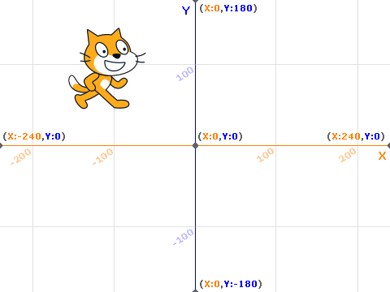
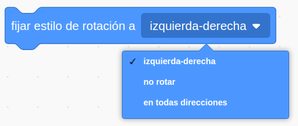
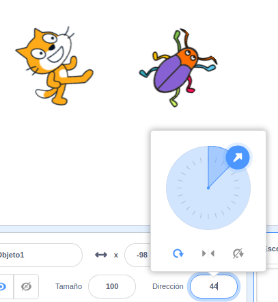
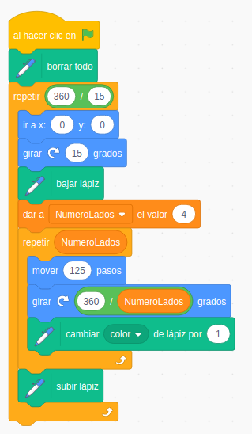

## Movimientos de personajes

Vamos a aprender a mover nuestros personajes por el escenario.
Veremos que podemos hacer con movimientos absolutos (usando las coordenadas x,y) y también con movimientos relativos (dando n pasos desde la posición actual).

También veremos que podemos hacer que nuestro personaje apunte a distintas direcciones.

Veremos distintos ejemplos de ello

### Coordenadas

Las coordenadas del escenario de Scratch son las siguientes:

* X entre -240 y 240
* Y entre -180 y 180
* (0,0) es el centro

### Movimientos

Vamos a ver las distintas formas de mover nuestro personaje.

#### Movimientos absolutos

Decimos que el movimiento es absoluto porque se indican las coordanas x, y que tendrá el personaje.

* Ir a (x,y) es instántaneo, como un teletransporte.
* Deslizar va moviendo poco a poco desde la posición inicial hasta la coordenada indicada en el tiempo que le hemos dicho.

#### Direcciones/Orientación (en grados)

Además de movernos podemos hacer que el personaje apunte en una dirección dada.

#### Movimiento relativos

Los movimientos relativos se hacen a partir de la posición actual, y se indica cuantos grados gira a partir de la orientación actual o cuantos pasos avanza en la dirección en la que está actualmente

#### Tipos de rotaciones

Existen diferentes tipos de rotaciones, unas más indicadas para cada tipo de disfraz

El tipo de rotación **giro** rota el disfraz actual de nuestro personaje los grados indicados:

El tipo de rotación **horizontal** solo tiene en cuenta el signo de los grados indicados, haciendo que el disfraz "mire" hacia la izquierda cuando el signo es negativo y para la derecha cuando es positivo:

Si no queremos que el disfraz se modifique con las rotaciones usaremos **Sin rotación**.

Podemos fijar este tipo de rotación con este bloque

¡¡Cuidado!! ¡Los giros no afectan igual a todos los personajes!

[Vídeo: Movimiento de personajes](https://youtu.be/4O_lxBaApnY)

### Ejemplo: movámonos alrededor del escenario

Vamos a mover nuestro personaje formando un rectángulo alrededor de toda la pantalla.

Usa si quieres el [fondo de coordenadas](./images/CoordenadasScratch_sinGato.png)

3.1 Movimientos absolutos

En este primer ejemplo utilizaremos bloques con movimientos absolutos.

Para encontrar los valores adecuados de las coordenadas vamos moviendo con el ratón nuestro personaje.

El programa queda muy sencillo:

[Programa: Movimientos Absolutos](https://scratch.mit.edu/projects/394209879/)

[Vídeo: Movimientos absolutos del personajes por el escenario](https://youtu.be/dEVWnlP5EGk)

3.2 movimientos relativos

Vamos a hacer ahora el mismo recorrido pero usando movimientos relativos. Iremos girando y moviéndonos un cierto número de pasos.

Hemos intercalado unas esperas entre los movimientos para poder apreciarlo más fácilmente.

[Programa: Movimientos Relativos](https://scratch.mit.edu/projects/394215273/)

[Vídeo: Movimientos relativos](https://youtu.be/qC9IGAoevLw)

3.3 Bucles repetición

Si en lugar de movernos con forma de rectángulo nos movemos haciendo un cuadrado, veremos que los movimientos son muy repetitivos.

Es algo muy frecuente tener que repetir un grupo de bloques varias veces. Por eso existen en la paleta de control los bloques "Repetir". 

Vemos que muchos de estos bloques tiene forma de "C". El hueco central es donde pondremos todos aquellos bloques que queremos repetir.

Uno de los más utilizados es el bloque "Repetir N veces", que será el adecuado para nuestro caso usando 4 repeticiones

El programa queda así de sencillo:

[Programa: Dibujando Cuadrados](https://scratch.mit.edu/projects/394066829/)

[Vídeo: Bucle repetición](https://youtu.be/_QsXbvNzuzE)

3.4 Pintando cuadrados

Usando la extensión **Dibujar**

[Pintamos un cuadrado](https://scratch.mit.edu/projects/394212879/)

Usando la extensión "Dibujar" vamos a pintar cuadrados
Aprendemos a cambiar el grosor y el color del lápiz y a bajar y subir el lápiz cuando queremos que nuestro personaje deje rastro al moverse

Aprendemos ...:

* A incluir más bloques con una extensión
* A usar la extensión **Lápiz** para dibujar
* A que hay que bajar el lápiz para dejar rastro
* A borrar
* A seleccionar color y groso del lápiz
* A modificar el color del lápiz

3.5 Pintando poligonos

Conceptos: 
* **Comentario**
* **Variable**
* **Algoritmo**

Vamos a generalizar el programa de dibujar cuadrados para que nos permita dibujar polígonos.
Creamos una variable NumeroLados.
Calculamos el ángulo que tenemos que girar que será 360/NumeroLados.

* A calcular usando los operadores algebráicos

[Programa Pintado Poligónos](https://scratch.mit.edu/projects/39420307)

Vemos la potencia para trabajar la geometría

###  3.6 La mochila

Usar **mochila**

3.7 Spirograph

Cómo descargar un programar
copiar bloques entre objetos
recuperar objetos borrado
Bucles anidados

Usamos la mochila para recuperar unos bloques de código que creamos en otro proyecto y que nos permitían dibujar polígonos
Añadimos un giro y un bucle que repite todo el proceso
Guardamos en nuestro disco duro el programa
Vemos cómo copiar los bloques de un objeto a otro

recuperar objetos borrado

[Programa Spirograph](https://scratch.mit.edu/projects/394219217)

### Tareaa 4.1: Dibujar una estrella

**No dar demasiadas explicaciones de cómo hacerlo**
