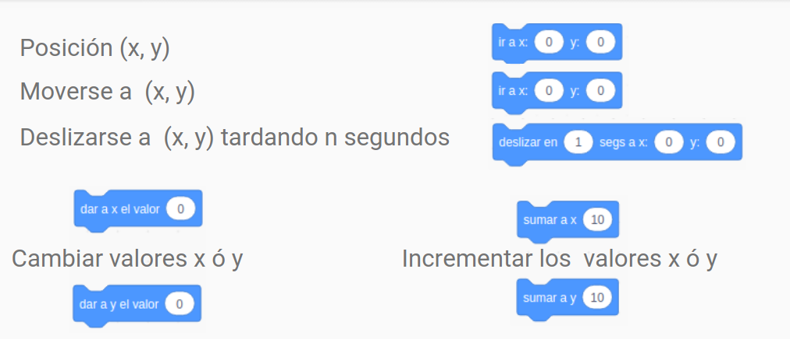
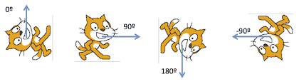
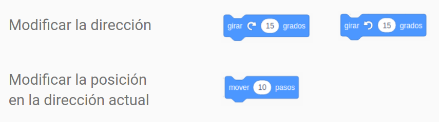
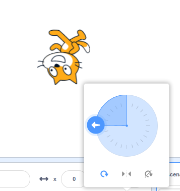
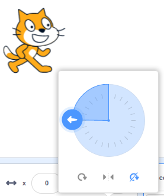
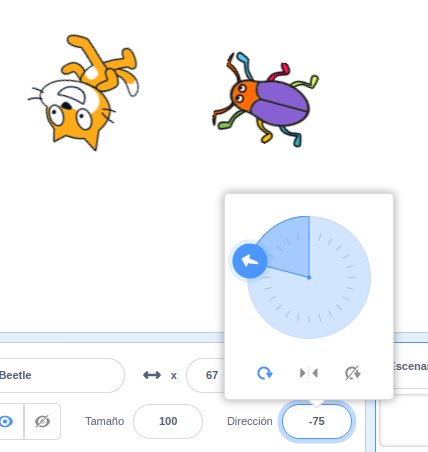
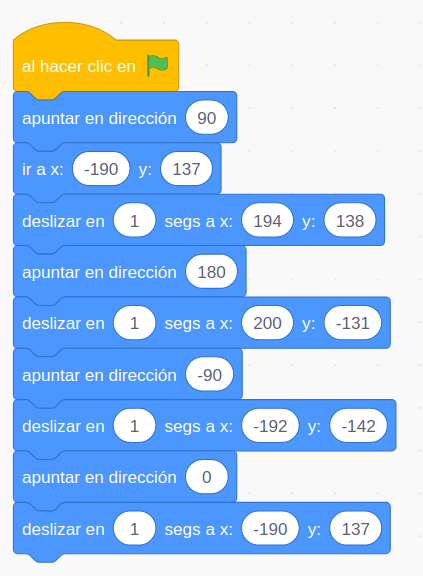
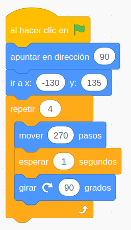
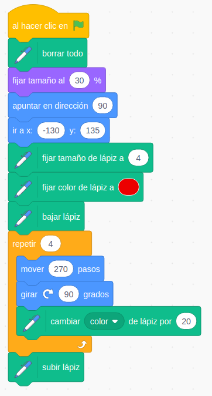

## Movimientos de personajes

### Coordenadas

X entre -240 y 240

Y entre -180 y 180

(0,0) en el centro

### Movimientos

#### Movimientos absolutos

Ir a (x,y) es instántaneo, como un teletransporte

Deslizar se va moviendo en el tiempo que le hemos indicado.

#### Direcciones/Orientación (en grados)

#### Movimiento relativos

#### Tipos de rotaciones

Podemos fijar este tipo de rotación con este bloque

¡¡Cuidado!! ¡Los giros no afectan igual a todos los personajes!

3.0 Movimientos

### Ejemplo: móvamonos en un cuadrado
Vamos a mover nuestro personaje formando un rectángulo alrededor de toda la pantalla.
Utilizaremos bloques con movimientos absolutos.
Utilizamos un fondo para ayudarnos con las coordenadas.

3.1 Movimientos absolutos

Usa si quieres el [fondo de coordenadas](./images/CoordenadasScratch_sinGato.png)

[Programar Movimientos Absolutos](https://scratch.mit.edu/projects/394209879/)

3.2 movimientos relativos

[Programa Movimientos Relativos](https://scratch.mit.edu/projects/394215273/)

3.3 Bucles repetición

Ventaja de los 

Conceptos: 
*  **bucle repetir**

[Programa Dibujando Cuadrados](https://scratch.mit.edu/projects/394066829/)

3.4 Pintando cuadrados

Usando la extensión **Dibujar**

[Pintamos un cuadrado](https://scratch.mit.edu/projects/394212879/)

Usando la extensión "Dibujar" vamos a pintar cuadrados
Aprendemos a cambiar el grosor y el color del lápiz y a bajar y subir el lápiz cuando queremos que nuestro personaje deje rastro al moverse

3.5 Pintando poligonos

Conceptos: 
* **Comentario**
* **Variable**
* **Algoritmo**

Vamos a generalizar el programa de dibujar cuadrados para que nos permita dibujar polígonos.
Creamos una variable NumeroLados.
Calculamos el ángulo que tenemos que girar que será 360/NumeroLados.

[Programa Pintado Poligónos](https://scratch.mit.edu/projects/39420307)

Vemos la potencia para trabajar la geometría

###  3.6 La mochila

Usar **mochila**

3.7 Spirograph

Cómo descargar un programar
copiar bloques entre objetos
recuperar objetos borrado
Bucles anidados

Usamos la mochila para recuperar unos bloques de código que creamos en otro proyecto y que nos permitían dibujar polígonos
Añadimos un giro y un bucle que repite todo el proceso
Guardamos en nuestro disco duro el programa
Vemos cómo copiar los bloques de un objeto a otro

recuperar objetos borrado

[Programa Spirograph](https://scratch.mit.edu/projects/394219217)

### Tareaa 4.1: Dibujar una estrella

**No dar demasiadas explicaciones de cómo hacerlo**