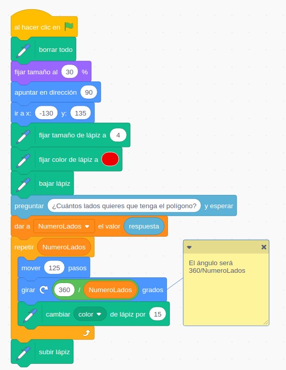
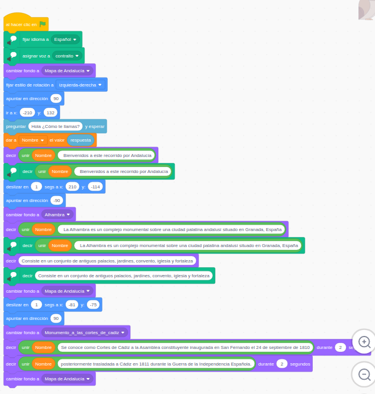

### Preguntar

Vamos a interaccionar con el usuario haciéndolo preguntas y utilizando sus respuestas. Para ello usaremos los bloques: **"Preguntar"** para pedir información al usuario con y para usar su respuesta el bloque **"Respuesta"** (fijaos que el bloque Preguntar tiene la forma rectangular de las acciones y Respuesta el ovalado de las variables/valores como corresponde)

Vamos a utilizarlos mejorando proyectos que ya hicimos.

#### Ejemplo: Dibujar polígonos

Adaptaremos el programa de dibujar polígonos para que nos pregunta qué número de lados queremos que se dibujen.

El cambio es sencillo:

[Programa](https://scratch.mit.edu/projects/397274159/)

#### Ejemplo: Ruta por Andalucia

Vamos a adaptar el programa de la ruta por Andalucía para preguntar que nos pregunte nuestro nombre y cada vez que nos cuente algo, se dirija a nosotros por el nombre.

[Programa]s(https://scratch.mit.edu/projects/397275339/)

[Vídeo: Haciendo preguntas al usuario](https://youtu.be/hkNtiibH9tw)

## Ideas/mejoras

* Por supuesto que podíamos añadir también la pregunta del  nombre del usuario al programa de los polígonos.
* Preguntar la longitud del lado del polígono.