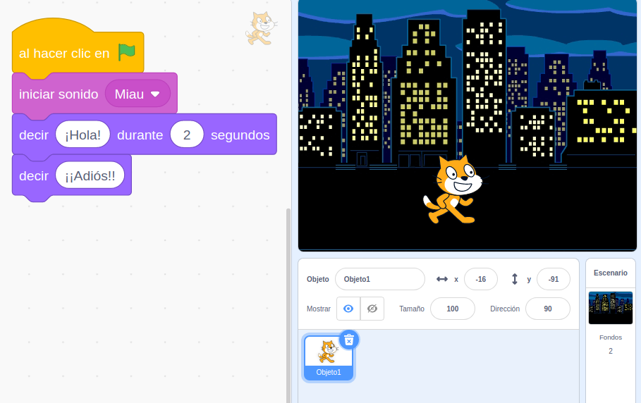

## Módulo 4: Primeros programas con Scratch 3.0

Vamos a reinventar un proyecto ya existente y despues crear uno sencillo.

## 4.1 Reinventado aplicaciones

Podemos reinventar(remix) cualquier proyecto que esté compartido.Esto nos va a permitir mejorarlo o adaptarlo a nuestras necesidades.

Una vez reinventemos un proyecto, se hará una copia en nuestra cuenta en el que podremos trabajar.

Vamos a empezar aprovechando la gran cantidad de proyectos existentes y adaptando (reinventando) uno de ellos.

Para ello vamos a ver algunas de las acciones que nos permite hacer nuestra cuenta de Scratch

- Buscar aplicaciones con el buscador
- Cuando encontremos algún proyecto que nos interese podemos probar cómo funciona pulsando la bandera verde
- Si queremos ver la programación pulsaremos "Ver dentro"
- Si nos interesa podemos reinventarlo y a partir de ahí trabajaremos con nuestra copia
- Podremos modificarla o adaptarla a lo que nos interesa.
- No olvidemos que debemos guardar el proyecto, aunque normalmente se guarda automáticamente, a veces puede fallar y debemos hacerlo manualmente
-  Una vez estemos contentos con el resultado podemos compartirla

[Vídeo: Buscar, reinventar y compartir proyectos en Scratch 3.0 Guardado como borrador](https://youtu.be/fvpRQRcwJ7o)

[Ejemplo: Pasapalabra remix STEAM](https://scratch.mit.edu/projects/391751565/)

Hemos creado un estudio llamado ["Proyectos CEP de Motril 2020 #SratchCEPMotril"](https://scratch.mit.edu/studios/26524823/) donde iremos añadiendo todos los proyectos en los que trabajemos.

## Tarea 2.2: Busca el proyecto de Pasapalabra que hemos usado en el vídeo, reinvéntalo y cambia algunas preguntas/respuestas a un tema que te interese.

## Ejemplo 4.1: Mi Gatito dice miau

Vamos a hacer ahora nuestro primer proyecto.

Veremos cómo crear, guardar y compartir un sencillo ejemplo de Scratch en el que un simpático gatito hace "miau", nos dice "Hola" en una bonita ciudad nocturna.

Aprenderemos:
* Cómo reproducir sonidos.
* La diferencia entre los bloques "iniciar sonido" y "reproducir sonido".
* Cómo hacer que un personaje diga un texto, y la opción de darle una duración al mensaje.
* Buscar y seleccionar un fondo atractivo de la galería de fondos.
* Guardaremos nuestro programa.
* Lo compartiremos.
* Añadiremos a un estudio (Colección de proyectos).

A nivel de bloques el programa es muy sencillo:

Podéis ver cómo me ha quedado nuestro [primer programa](https://scratch.mit.edu/projects/391761903/)

[Vídeo: Primer programa con un gatito](https://youtu.be/wNLJSCMyPUU)