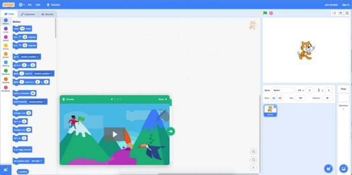

# Curso de Scratch, Makey-Makey y Pensamiento computacional Offline

## CEP de Motril

## Mayo 2020

## José Antonio Vacas @javacasm

## Justificación

En esta sociedad tan ligada a las tecnologías de la información, es importante introducir a los profesores y alumnos en la programación. Se trata de hacer que los ordenadores realicen las tareas que nosotros deseamos, además de usar las aplicaciones que otros crearon para nosotros.

Cada vez se introducen antes los conceptos relacionados con la programación y la robótica en los niveles educativos.

En los ciclos de educación primaria se puede realizar una acercamiento trabajando el pensamiento computacional con  herramientas que nos permite trabajar en proyectos robóticos desde esas edades, como son Scratch para la programación y Makey-Makey para la parte física

Con Scratch podemos programar nuestras propias historias interactivas, juegos y utilidades y compartir nuestras creaciones en una comunidad virtual. Scratch es una buena herramienta pedagógica, ya que ayuda a los jóvenes a pensar creativamente, a razonar sistemáticamente y a trabajar colaborativamente, habilidades esenciales para su desarrollo vital.

Makey-Makey es una placas electrónica que nos facilitan enormemente la interacción con el múndo físico pudiendo programarse fácilmente con [Scratch ](https://scratch.mit.edu/) es un software creado por el MIT (Massachusetts Institute Technology) con el fin de enseñar a programar de un modo visual especialmente a niños y jóvenes.

Los programas se realizan uniendo los diferentes bloques encajables en un entorno integrado que incluye a la vez todo lo necesario para completar el programa.

El uso de herramientas visuales permite a los alumnos asimilar fácilmente el paradigma de la programación y poner en práctica sus ideas.

Cada vez más utilizado en el entorno docente se ha mostrado como una excelente [herramienta pedagógica](./contexto.md), prueba de ello es la cantidad de experiencias disponibles en la [comunidad online](https://scratch.mit.edu/explore/projects/all).

## Objetivos  

El objetivo del curso es presentar estas herramientas sencillas y atractivas para los alumnos como [Code](http://Code.org) y Scratch  (según su edad y conocimientos)

* Entender la importancia de enseñar a programar
* Conocer herramientas de iniciación a la programación
* Realizar programas sencillos con Scratch
* Aprender a interacción con el mundo físico usando la placa Makey-makey
* Pensamiento computacional desconectado

## Contenidos

* [¿Por qué programar?](./contexto.md)
* Presentación de [herramientas de programación visual para los más pequeños: Code.org](./IniciacionProgramacion.md)
* Introducción a Scratch (y alternativas como [Snap](./snap.md) o [mBlock](./mBlock.md))
* [Programando con Scratch](./Scratch.md):
  * [Dibujando con Scratch](./Scratch/Scratch.md#vamos-a-dibujar)
  * [Personajes, disfraces, escenarios](./Scratch/Scratch.md#personaje)
  * [Sonidos y animaciones](./Scratch/Scratch.md#sonido)
* [Ejemplos de juegos con scratch](./Ejemplos.md)
* [Ejemplos de proyectos con Makey-makey](./MakeyMakey/README.md)
* Pensamiento computacional Offline

## [Recursos](./Recursos.md)

## [OpenSource](./opensource.md)

## [Calendario](./Calendario.md)

Proyectos con #ScratchCEPMotril