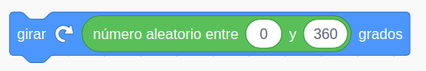
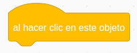
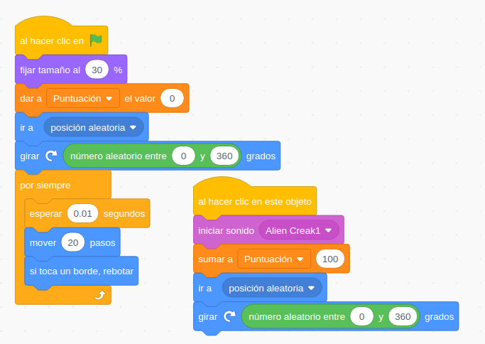

## Usando el ratón

### Ejemplo: Juego CazaCoranavirus

Vamos a hacer un sencillo juego en el que tenemos que tocar los coronavirus que se mueven aleatoriamente por pantalla para eliminarlos.

* Buscaremos una imagen de Coronavirus  que tenga fondo transparente y con licencia libre.
* Para el fondo buscaremos otra imagen con licencia libre. En este caso no necesitamos que tenga fondo transparente. Sí que tenga un tamaño de al menos 800x600 pixels.
* Ajustamos el tamaño para que la imagen ocupe todo el fondo.
* Vamos a hacer que al iniciar CoronaVirus se vaya a una posición aleatoria.

* Vamos a hacer también que apunte una dirección aleatoria. Para ello usaremos el operador **"número aleatorio entre ..."**. 

Para darle una dirección aleatoria entre 0 y 360º.

* Añadimos un bucle "Para siempre" para hacer el movimiento de Coronavirus.
* Dentro hacemos que de unos pasos (5-10) y ponemos una pequeña espera.
* Al moverse en una dirección continuamente llegará al borde y por eso añadimos el bloque **"Si toca un borde, rebotar"** 

* Usaremos el evento de ratón, que se activa cuando hacemos clic sobre el objeto.

* Bajo este evento añadiremos un nuevo cambio aleatorio de dirección  y reproduciremos un sonido.
* Usaremos una variable **"Puntuación"**, con su tic marcado para que se muestre en pantalla. 
* Incrementaremos el valor de la variable cada vez que se haga clic en el objeto.
* Añadimos un tic a la variable **"Nombre de usuario"** para que se muestre en pantalla y hacemos clic para que solo aparezca el valor, sin el nombre de la variable.

El proyecto queda así:

[Proyecto](https://scratch.mit.edu/projects/397306267/)

[Vídeo: Caza al coronaVirus con tu ratón](https://youtu.be/lLJg4R7GZy0)

