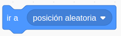

## Usando el ratón

### Ejemplo X.1 tenemos que tocar los coronavirus para eliminarlos

Evento 

Objeto desde imagen (Transparente y con licencia libre)

Fondo desde imagen (con licencia libre)
Ajustamos el tamaño

Pôsición aleatoria 

Operador aleatorio

direccionAleatoria

SiTocaBordeRebotar

Variable puntuación, tic para que se muestre

Sonido

Nombre del usuario, hacemos clic para que solo aparezca el valor

[Proyecto](https://scratch.mit.edu/projects/397306267/)

### Dibujando con el ratón

Editor gráfico

Mensajes de cambios de colores y de tipos de línea

Si estamos en la zona de dibujar, compiamos la coordenada del raton al personaje

Usamos la extensión

Cada herramienta manda un mensaje y hace que Gato cambie

[Proyecto](https://scratch.mit.edu/projects/397315506/)

Vamos a ampliarlo añadiendo un "botón" borrar, algunos colores más y algún grosor nuevo.

[Solución](https://scratch.mit.edu/projects/397334049/)
