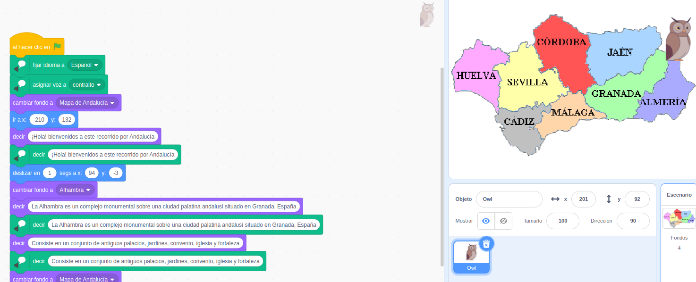

## Trabajando con recursos
 
Llamamos recursos a todos aquellos materiales que usamos

## Ejemplo 3.2: Cancion Pirata

 Añadir personajes/objetos
     Disfraces
 Editar Disfraces

Necesitamos un micro en  nuestro ordenaror o bien usar un móvil o tablet para grabarlo y luego pasarlo al ordenador

 Añadir audios
     Editar Sonidos

3.2.1 Texto

[Vídeo:  Programa Scratch que muestra el texto de la "Canción Pirata" de Espronceda](https://youtu.be/M1dhIRl6muI)

3.2.2 Musica

Añadimos música de fondo a nuestra "Canción Pirata"

[Vídeo: Añadimos música de fondo a nuestra "Canción Pirata"](https://youtu.be/WOX6ig3TkXI)

3.2.3 Animación de los personajes

[Animación de los personajes de Canción del Pirata. Editando los Disfraces](https://youtu.be/kfv99XMgIqI)

3.2.4 Grabamos nuestro audio

[Vídeo: Nos grabamos leyendo la Canción del Pirata y lo añadimos a nuestro programa](https://youtu.be/LR9n8gcgjYA)

## Ejemplo 3.3 

Ejemplo 3.3: Mostrar monumentos y enseñar nuestro patrimonio

Hablaremos de 
* Licencias de contenidos
* Movimiento d epersonajes
* Fondos: Añadir imágenes como fondos
* Extensiones: Texto a voz

Vamos a hacer una aplicación que nos permita mostrar un  recorrido por las provincias andaluzas, mostrando imágenes de diferentes monumentos y contándonos información sobre lo mostrado.

Es importante que recordemos la importancia de usar fuentes de información con la licencia adecuada y las citemos.

### Recorrido por Andalucía: el mapa

Comenzamos seleccionando el personaje y buscando el mapa de Andalucía:

* Buscamos una imagen de un mapa de Andalucía con buena resolución y la licencia adecuada.
* Cargamos la imagen como fondo.
* Adaptamos el tamaño de la imagen.
* Buscaremos un personaje de entre los disponibles en la galería.

[Vídeo: Recorrido por Andalucía: Mapa](https://youtu.be/1JZNGv_Eb0k)

### Recorrido por Andalucía: movimiento y textos

Vamos a hacer que nuestro personaje se mueva por el mapa y muestra la información sobre los monumentos

* Nuestro personaje se presenta
* Aprenderemos a situar al personaje en unas coordenadas adecuadas.
* Buscaremos imágenes con licencia libre sobre el monumento que  queremos mostrar.
* Crearemos fondos con las distintas imágenes.
* Buscaremos información y elaboraremos los textos que se mostrarán.

El personaje irá recorriendo las distintas provincias, moviéndose por sobre el mapa y deteniéndose sobre cada provincia.

* Aprenderemos a hacer que el personaje se desplace a una nueva posición 
* Al llegar cambiaremos el fondo al de monumento a mostrar
* El personaje nos mostrará los textos creados sobre el monumento en cuestión.

[Vídeo: Recorrido por Andalucía: movimiento y textos](https://youtu.be/XX4XMdLFpgI)

### 

Podíamos grabar los textos nosotros mismos, pero en esta caso vamos a explorar la posibilidad de usar una extensión que nos permite leer los textos, con diferentes voces, incluso en diferentes idiomas.

* Añadimos la extensión Text to Speech, que necesita conexión a Internet (no funciona en modo desconectado)
* Añadimos bloques de decir "texto"

[Vídeo: Recorrido por Andalucía: añadimos  Voz](https://youtu.be/C2iAbpmEHOE)

### Mejoras/Ampliaciones: 
* Añadir más textos
* Añadir más monumentos
* Completar todas las provincias

### Ideas/Otras Aplicaciones:
* Mapa e información del centro
* Explicación de las partes de un planta
* Partes de una máquina/motor