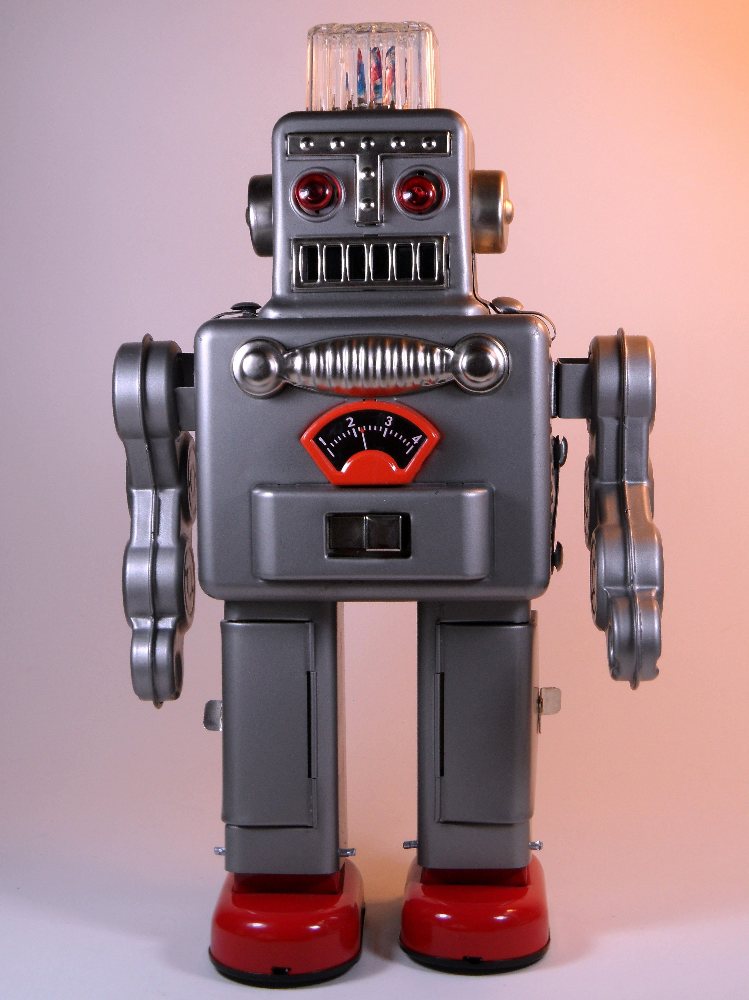

# Robótica

## Iniciación a la robótica

### Sobre los robots que tenemos en casa

### Dinámica: ¿Qué es la robótica? 

* Dinámica para hacer en clase.
* Explicación (5 - 10 minutos)
* Para trabajo en grupos (30 minutos) 
* Puesta en común (20 - 25  minutos)
* Duración 1 hora

Nos preguntamos...
* ¿Conoces algún robot?
* ¿Dónde lo has visto?
* ¿Tienes alguno en casa?
A quien responda
* ¿Qué hace?
* ¿Qué partes tiene?

Tips:
* Distinguir entre robot, autómata y herramienta
* Aprovechar las descripciones que hacen para ir dando conceptos.
* Conceptos a buscar:
    * Sensores: tipos y lo que miden
    * Actuadores: motores + mecánica
    * Cerebro: tipo de placas de control. Comparación de capacidades entre Arduino y un móvil
    * Alimentación: baterías, paneles solares, ...

Se puede hablar de:
* Robot de limpieza: 2 ruedas/motores, sensores de choque, de paredes, detectores de suelo, motor del aspirador ¿Saben buscar su casita?
* Robot de cocina: diferenciar de las "herramientas eléctricas de cocina". Motor/batidora, báscula, calentador,...
* Parking automático: barreras, cámaras lectoras de matrícula, sensores de ocupación, pantallas, cajeros, sensores de humos, ventilación...
* ¿Un coche es un robot? ¿y uno que conduce él solo? (Ejemplos de Tesla)

Definición de robot: "Máquina **automática** **programable** capaz de realizar determinadas operaciones de manera **autónoma** y sustituir a los seres humanos en algunas tareas, en especial las pesadas, repetitivas o peligrosas; puede estar dotada de **sensores**, que le permiten **adaptarse a nuevas situaciones**”

[6.0 Iniciación a la Robótica](https://docs.google.com/presentation/d/1B3eqx0K1gJYXXKqUbPve61isTMXq5ZVaaiyskVPWq_c/edit?usp=sharing)

