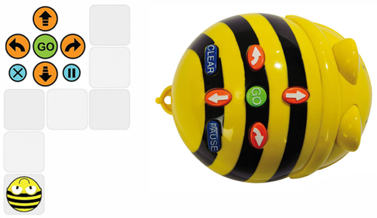
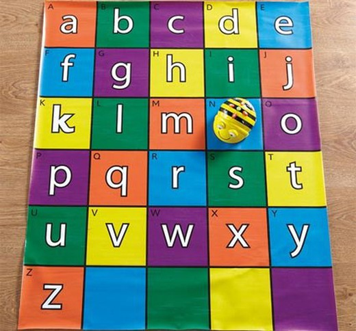
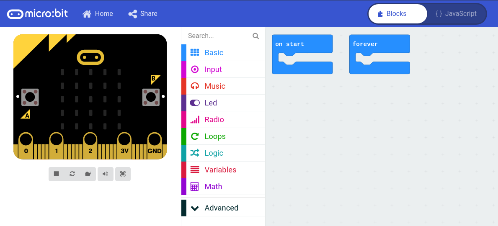
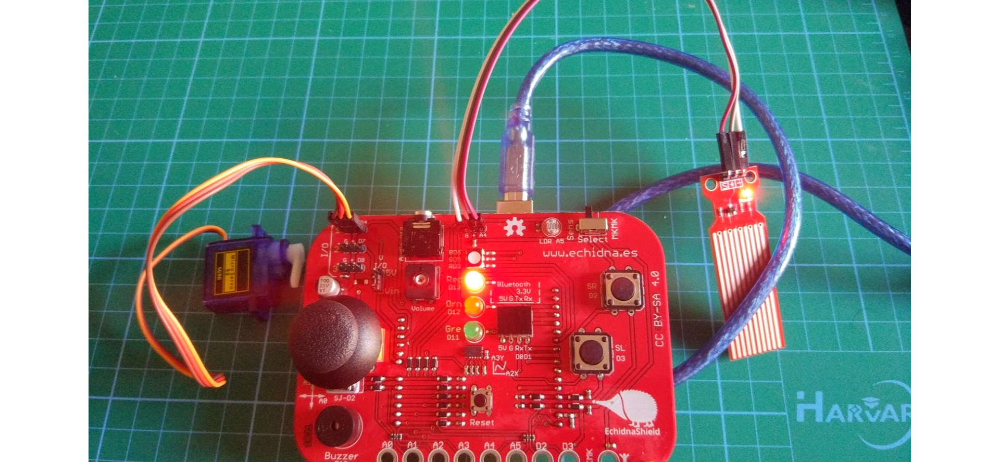
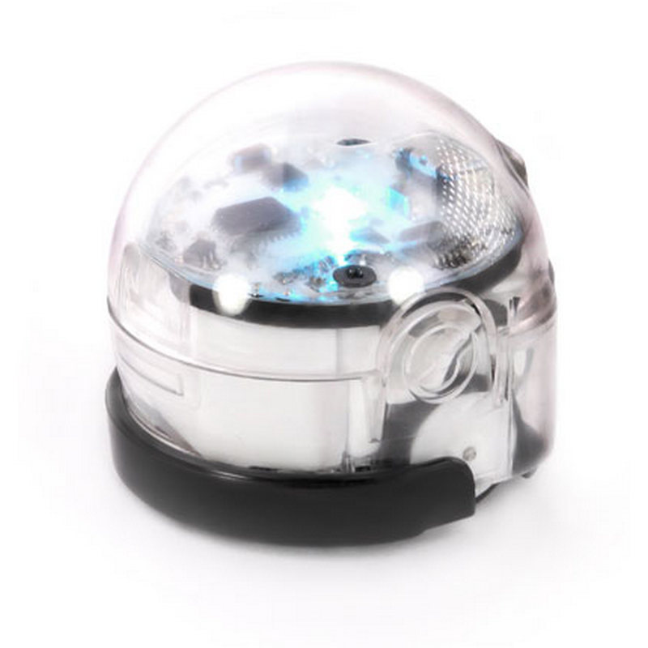
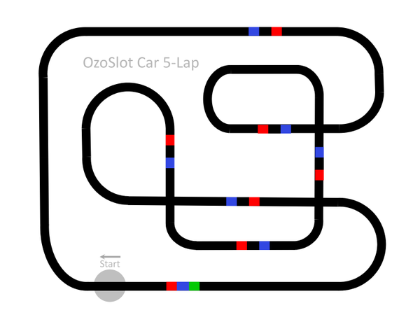

## Ejemplos de robótica en Primaria

Introducción a la robotica

## Beebot

Robot sencillos de usar pensados para primaria

El más utilizado pienso que es la famosa "Abejita" Beebot

La parte educativa va en los **tableros**/**tapetes**

## Escornabot

[Escornabot](https://escornabot.com/web/es) es la versión OpenSource, además desarrollada por profes...

Los de 5º-6º de primaria pueden montarlo y programarlo

## [Micro:bit](./Microbit.md)

* Incluye:
    * Muchos sensores
    * Bluetooth/Radio
* Programable con
    * Scratch lo que permite integrarlo en nuestros programas

    * Bloques/Javascript
    
    * Python
* No necesita drivers
* 18€
* Incluye simulador
* Se puede usar como MakeyMakey

## [MakeBlock](./mBlock.md)

* Programable con:
    * Scratch 3.0, lo que permite integrarlo en nuestros programas
    * mBlock
    * Arduino
* Robusto
* Trabajamos la mecánica
* Iniciación a la electrónica y Arduino

## [Echidna](./echidna.md)

* Incluye muchos sensores
* Desarrollado por profes
* Programable con:
    * Scratch 3.0, lo que permite integrarlo en nuestros programas
    * mBlock
    * Arduino
* Iniciación a la electrónica y Arduino

## [Ozobot](https://ozobot.com/)

## Arduino

## Lego WeDo

## Lego Ev3

