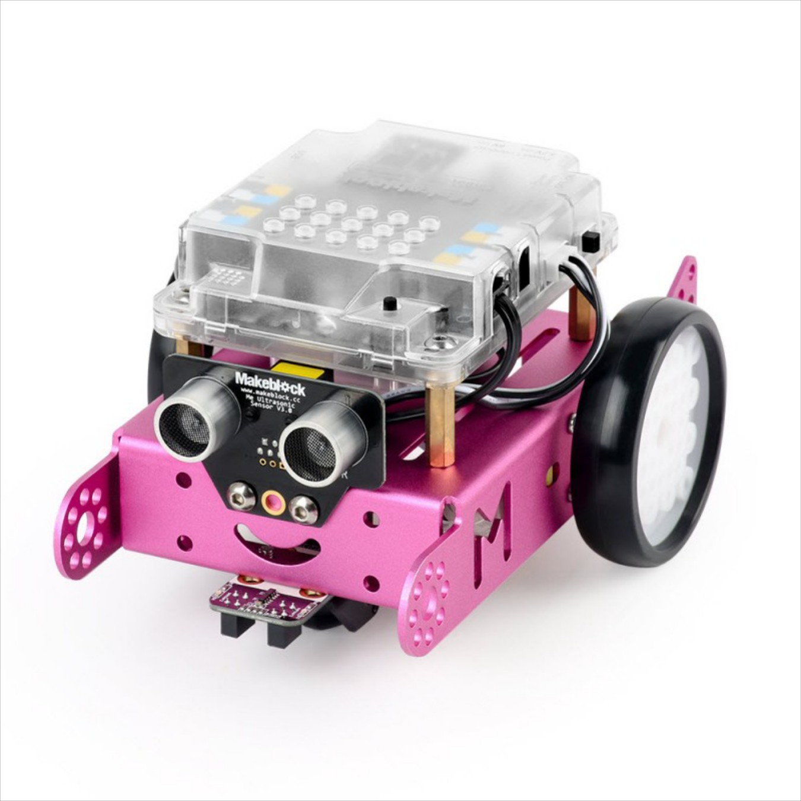
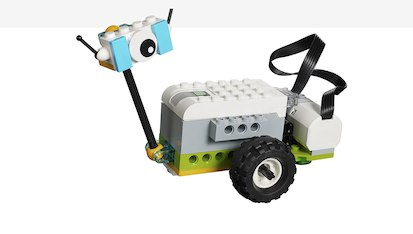

## Otros ejemplos de robótica en Primaria

Introducción a la robotica

## Beebot/Escornabot

Robot sencillos de usar pensados para primaria

## Tableros

La parte educativa va en los tableros

[Escornabot](https://escornabot.com/web/es) es la versión OpenSource, además desarrollada por profes...

Los de 5º-6º de primaria pueden montarlo y programarlo

## [Micro:bit](./Microbit.md)

* Programable con Scratch
* No necesita drivers
* 18eu

## [MakeBlock](./mBlock.md)

## [Echidna](./echidna.md)

Desarrollado por profes

## [Ozobot](https://ozobot.com/)

## Arduino

## Lego WeDo

## Lego Ev3

