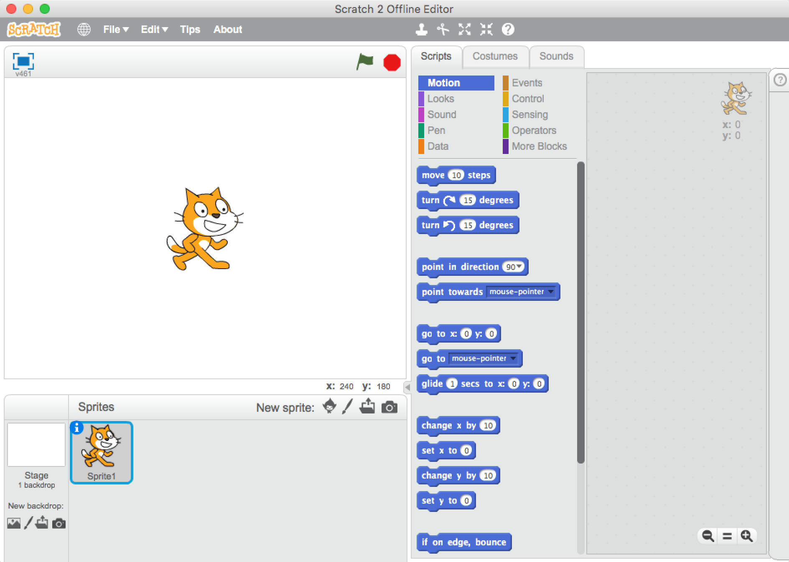
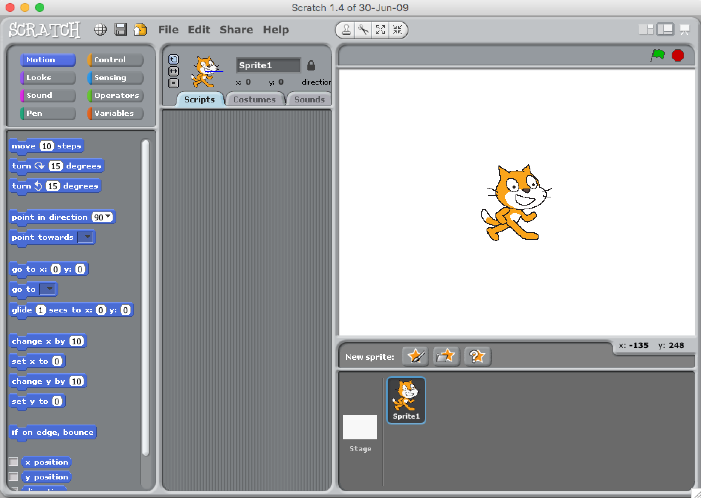

## Módulo 3: Introducción a Scratch 3.0

Scratch es un entorno de programación de bloques creado en el **MIT Media Lab** por [Mitchel Resnick](https://www.media.mit.edu/people/mres) en 2007.

Podemos entender su filosofía leyendo este artículo de su creador y de David Siegel [A Different Approach to Coding](https://medium.com/bright/a-different-approach-to-coding-d679b06d83a#.734u3gfm8 y en [su charla TED "Enseñemos a los niños a programar"](https://www.ted.com/talks/mitch_resnick_let_s_teach_kids_to_code?language=es)

Aunque puede parecer que Scratch está hecho sólo para niños, a poco que investiguemos podemos ver que es mucho más potente.

Para muestra este [Simulador de propagación de epidemias](https://www.media.mit.edu/posts/scratch-epidemic-simulator/) hecho por el propio Mitchel Resnick.

### Uso de Scratch 3.0

Podemos usarlo desde [acceso web](https://scratch.mit.edu/projects/editor) y como [aplicación de escritorio en Windows y MacOs](https://scratch.mit.edu/scratch2download/).

Personalmente recomiendo la primera opción, además de porque podemos compartir nuestros contenidos, porque podemos acceder directamente a toda la documentación y a todos los proyectos que los demás usuarios han compartido.

Además dispone de un sistema de **extensiones** que nos permite además de completar nuestros programas con nuevas opciones (como síntesis de voz o traducción automática entre idiomas) y conectar nuestros programas Scratch con hardware de otros fabricantes, como Lego, micro:bit o los robots de MakeBlock.

### Extensiones

Para trabajar con hardware externo a nuestro PC, necesitamos instalar **Scratch Link**. Éste nos va a permitir conectar Scratch 3.0 con hardware de otros fabricantes:

* Lego EV3
* Lego Bost
* Lego Wedo
* micro:bit
* Sensores Vernier

[Vídeo: ¿Qué es Scratch?](https://youtu.be/QYuLE1PCTlQ)

[Presentación: ¿Qué es Scratch?](https://docs.google.com/presentation/d/1ctR9NmMIATX9ujAJedJEsbBvJ2clGDwemtkO-OpbeyE/edit?usp=sharing)

### La comunidad de Scratch y la documentación

Scratch es mucho más que un entorno de programación. 

Por eso considero que es mucho mejor trabajar con su versión online [https://scratch.mit.edu/](https://scratch.mit.edu/)

Vamos a ver todo lo que rodea a la web de la versión 3.0 de Scratch:
* La [enorme comunidad](https://scratch.mit.edu/explore/projects/all) que comparte sus proyectos y nos facilita el aprendizaje
* La sección de [ideas](https://scratch.mit.edu/ideas) para ver qué podemos hacer
* Los [tutoriales](https://scratch.mit.edu/projects/editor/?tutorial=all) para saber cómo hacer cada cosa. 
* Las fichas de actividades para que los usuarios aprendan paso a paso.
* Las guías docentes para que los profesores planifiquen sus actividades

Veremos también las opciones que tenemos para trabajar desconectado con la aplicación de escritorio que podemos descargar de https://scratch.mit.edu/download. 

Ahora mismo la versión de escritorio 3.0 sólo está disponible para Windows y MacOs.

Sí que podemos descargar para todas las plataformas la [versión 2.0](https://scratch.mit.edu/download/scratch2)

y la [versión 1.4](https://scratch.mit.edu/scratch_1.4)

[Vídeo: IDE de scrach, ideas y tutoriales](https://youtu.be/iXC_ilF8o08)

## Crear una cuenta en Scratch 3.0

Crear una cuenta en Scratch 3.0 nos a permitir participar de la gran comunidad existente. 

Vamos a poder compartir nuestros proyectos y a reinventar los que otros usuarios han hecho y compartido.

Además Scratch 3.0 funciona como una especie de red social en la que podemos seguir proyectos, marcarlos como favoritos o decir que nos gustan, pudiendo seguir a usuarios cuyos proyectos sabemos que son interesantes.

Para crear une cuenta entraremos en el siguiente enlace https://scratch.mit.edu/join facilitando nuestros datos

Se nos enviará un email para que verifiquemos la cuenta. Hasta que no lo hayamos hecho nos aparecerá un aviso y no podremos compartir nuestros proyectos.

[Vídeo: Creación de una cuenta en Scratch 3.0 y su utilidad](https://youtu.be/Xzc31ESCreI)

### Tarea 2.1: Crea una cuenta en Scratch

Crea tu cuenta en scratch
Entra en la cuenta de la clase del curso

## Cuenta de profesores y su utilidad

En Scratch 3.0 existe la posibilidad de crear cuentas específicamente para docentes.

Para ello entramos en un enlace distinto del usual https://scratch.mit.edu/educators/register donde tendremos que incluir más datos de los habituales. Nuestros datos se validarán y en un par de días se autorizará la cuenta.

El hacerlo nos va a permitir gestionar nuestras clases, donde vamos a poder administrar los alumnos.

Para poder incluir a los alumnos en nuestras clases, éstos tienen que crear su cuenta desde 0. Ahora mismo no existe la opción de incorporar una cuenta ya existente a una clase.

Desde aquí los docentes pueden supervisar la actividad de sus alumnos.

[Vídeo: Ventajas de usar una cuenta de docente en Scratch 3.0](https://youtu.be/GL9kbEV3h5M)

Personalmente prefiero tener una cuenta personal y otra de docente, para separar los usos. Es muy fácil compartir proyectos entre ambas.