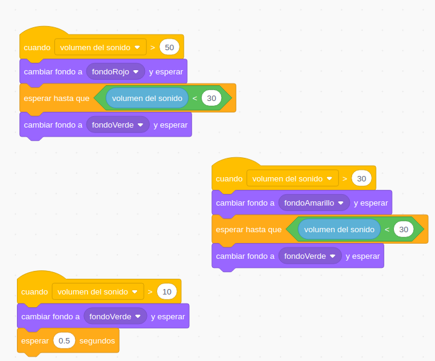
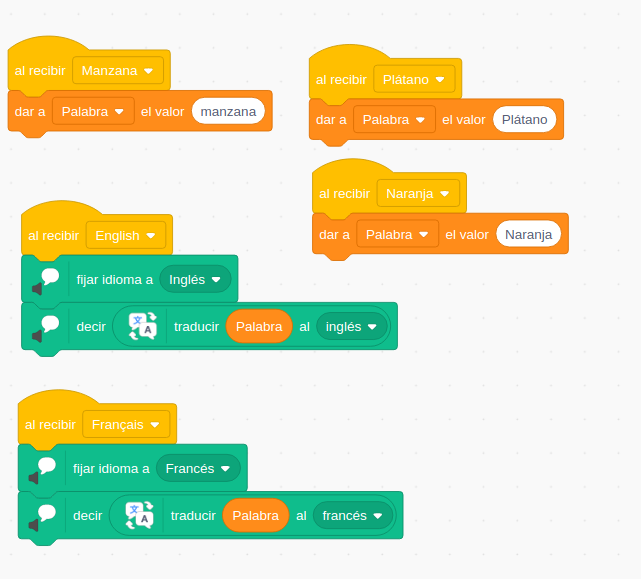

### Trabajando con el micrófono

Ejemplo: Semáforo sonoro

Vamos a hacer todo el programa en el escenario, sin usar personajes

Fondo sencillo formado por un círculo relleno de color, fácilmente duplicamos y cambiamos el color (usando la herramienta de selección)

[Programa](https://scratch.mit.edu/projects/397450004/)

También podemos trabajar los cambios en el volumen de sonido con eventos

[Programa](https://scratch.mit.edu/projects/397456360)

#### Mejoras/Ideas

* Usar imágenes de ellos mismos.
* Añadir sonidos, pero cuidado no sean más ruidosos que la propia clase.
* Poner textos en los fondos.
* Hacer que distintos personajes aparezcan/desaparezcan al cambiar de nivel.

### Música en serio

Con una partitura como la de "Cumpleaños feliz"

Al hacer clic en el instrumento suena

[Proyecto](https://scratch.mit.edu/projects/397459108/)

Vamos a darlo un valor más didáctico, mostrando la nota que está sonando

Añadimos un fondo con la partitura y vamos a crear un objeto Cursor que nos vaya marcando la nota que está sonando

Cada instrumento enviará un mensaje para cambiar el instrumento que suene.

Usamos el efecto "Desvanecer"

[Proyecto](https://scratch.mit.edu/projects/397468964)

### Mejoras/Ideas

* Añade distintas melodías.
* Incluir más intrumentos.
* Controla la velocidad de reproducción.

### Narrando...

Trabajar los idiomas

### Directions

Vemos como importar imágenes desde la librería de disfraces dentro de los disfraces de nuestro personaje

[Programa](https://scratch.mit.edu/projects/397474673/)

### Contador

[Programa](https://scratch.mit.edu/projects/397477702/)

## Traducción

Extensión Traducción (necesita conexión)

Usamos mensajes para comunicar los diferentes objetos entre si

[Programa](https://scratch.mit.edu/projects/397480564)