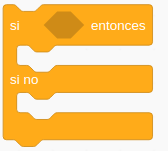
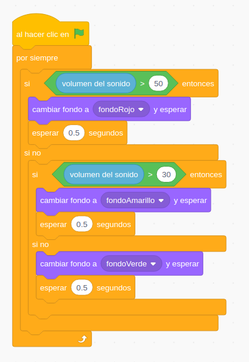
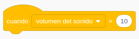
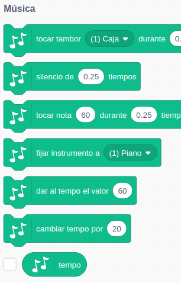
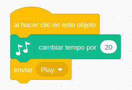
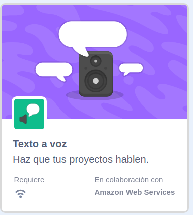
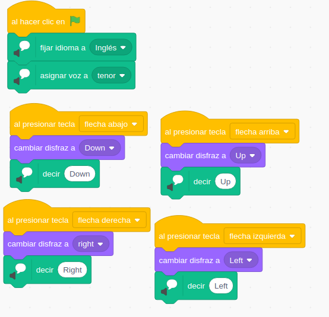
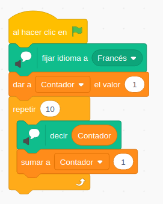
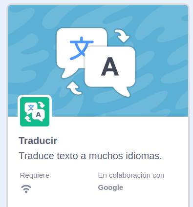
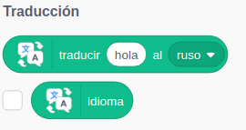

## Trabajando con el micrófono

Desde Scratch 3.0 podemos trabajar con cualquier micrófono que tengamos conectado al ordenadore. Podemos usarlo como ya hemos visto para grabar audios, y también para medir el volumen de ruido que tenemos alrededor.

Para ello usamos el bloque "Volumen del sonido", que está en la paleta de Sensores.

Como vemos, tiene forma de Variable/Valor y nos da una medida de la intensidad del sonido, con lo que se mostrará su valor en pantalla si marcamos el tic.

### Ejemplo: Semáforo sonoro

Vamos a hacer un semáfono sonoro, que mostrará 3 niveles de ruido: Bajo, Medio y Alto, indicándolo en pantalla con 3 díscos de colores Verde, Amarillo y Rojo.

Podemos usarlo en clase para regular el nivel de ruido, ajustando los niveles podemos adecuarlo a cada tarea.

* En esta caso vamos a hacer todo el programa en el escenario, sin usar personajes, para demostrar que es posible hacerlo así.
* Tras el evento de "Bandera Verde" un bucle "Por siempre" se encarga de hacer que se repita la medida del sonido.
* Usamos varias sentencias condicionales **"Si/si no"** para establecer el nivel de sonido:

* De entrada establecemos unos niveles de corte de 30 y 50: Rojo por encima de 50, Amarillo entre 30 y 50 y Verde por debajo de 30. Habrá que ajustar estos niveles según el ruido ambiente que tengamos y la sensibilidad de nuestro micrófono.
* Vamos a incluir 2 sentencias **"Si/si no"** y de manera anidada (una dentro de la otra), para saber en cual de los 3 niveles estamos:
    * Primero comparamos el máximo 50, si se cumple estamos en nivel Rojo.
    * El la parte "si no" de este bloque condicional volvemos a comparar el valor con 30. 
        * Si se cumple estamos en zona Amarilla
        * Si no, estamo en nivel Verde.
* Creamos fondos sencillos, formado por un círculo relleno de color.
* Los duplicamos fácilmente y cambiamos el color (usando la herramienta de selección).
* Si los cambios de nivel se producen demasiado rápido podemos añadir unas esperas.

El programa queda así:

[Programa](https://scratch.mit.edu/projects/397450004/)

[Vídeo: Semáforo Sonoro con Scratch](https://youtu.be/mLu6ZtLsHWE)

### Ejemplo: Semáforo sonoro con eventos

También podemos trabajar los cambios en el volumen de sonido con eventos, usando el siguiente evento:

Aprovechamos los mismos fondos creado, o bien creando una copia del programa anterior o exportándolos y recuperándolos desde el nuevo programa.

Hacemos 3 eventos, uno por cada nivel y para asegurar que se mantienen añadimos un elmento "Esperar hasta que ..." con un operador que compara el nivel medido con el valor.

El programa queda así:

[Programa](https://scratch.mit.edu/projects/397456360)

#### Mejoras/Ideas

* Usar imágenes de ellos mismos.
* Añadir sonidos, pero cuidado no sean más ruidosos que la propia clase.
* Poner textos en los fondos.
* Hacer que distintos personajes aparezcan/desaparezcan al cambiar de nivel.

### Música en serio

Ya hemos visto que podemos reproducir sonidos y música, grabada o desde fciheros. Vamos a hacer ahora un programa que toca fielmente una partitura.

Para ello vamos a utilizar la extensión **"Música"**

Que nos proporciona bloques para seleccionar distintos instrumentos, reproducir notas concretas, tocar percusiones, ajustar el tempo, etc...

A partir de una partitura como la de "Cumpleaños feliz"

Podemos hacer un programa que la reproduzca, por 2 instrumentos distintos.
* Seleccionamos un fondo teatral adecuado.
* Añadimos 2 objetos que correspondan con los instrumentos elegidos.
* Cada instrumento reproducirá la melodía tras el evento de "Al hacer clic en el objeto"
* Fijamos el instrumento adecuado
* Añadimos las correspondientes notas con su duración

Al hacer clic en el instrumento suena

[Proyecto](https://scratch.mit.edu/projects/397459108/)

[Vídeo: Cumpleaños Feliz nota a nota. Música con Scratch](https://youtu.be/MGgHTgvm1y4)

## Reproductor con seguimiento de partituras

Vamos a darlo un valor más didáctico, mostrando la nota que está sonando

Añadimos un fondo con la partitura y vamos a crear un objeto Cursor que nos vaya marcando la nota que está sonando

Cada instrumento enviará un mensaje para cambiar el instrumento que suene.

Usamos el efecto "Desvanecer"

[Proyecto](https://scratch.mit.edu/projects/397468964)

### Mejoras/Ideas

* Añade distintas melodías.
* Incluir más intrumentos.
* Controla la velocidad de reproducción.

### Narrando...   

Ya hemos utilizado la extensión "Texto a Voz" anteriormente, para hacer que los personajes nos narren historias.

Ahora vamos a utilizar sus bloques para trabajar los idiomas:

Cambiando el idioma o el tipo de voz, vamos a poder trabajar el oido escuchando diferentes acentos.

### Ejemplo: Directions

Nuestro programa va a pronunciar en Inglés la dirección en la que apunta cada una de las teclas del cursor que hemos pulsado.

Para ello:
* Añadimos eventos de pulsación de cada tecla del cursor.
* En el evento "Bandera Verde" seleccionamos el idioma y la voz que usaremos.
* Vemos como importar imágenes desde la librería de disfraces dentro de los disfraces de nuestro personaje, que ya tiene los bloques del programa

[Programa](https://scratch.mit.edu/projects/397474673/)

[Vídeo:  Directions: Escuchando qué son los objetos en otro idioma](https://youtu.be/vklQf9VQpS8)

### Ideas/Mejoras

* Un programa que muestre personajes que digan su nombre al pulsarlos.

### Contador

Aprovechando que la extensión "Texto a Voz" es capaz de leer los números vamos a hacer un sencillo programa que cuente en voz alta desde 1 hasta 10.

Para ello:
* Cargamos la extensión "Texto a Voz"
* Tras el evento "Bandera Verde", seleccionamos el idioma y el tipo de voz a usar
* Hacemos un bucle "Repetir 10 veces"
* Creamos una variable "Contador"
* Fuera del bucle le damos el valor 1
* Dentro del bucle 
    * Hacemos que se diga su valor con el bloque "Decir"
    * Cambiamos el valor de la variable en 1

El resultado es este programa

[Programa](https://scratch.mit.edu/projects/397477702/)

[Vídeo: Contando en otros idiomas con Scratch](https://youtu.be/k5e1yORqtOA)

## Traducción

Extensión Traducción (necesita conexión)

Usamos mensajes para comunicar los diferentes objetos entre si

[Programa](https://scratch.mit.edu/projects/397480564)