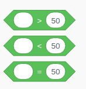
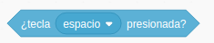

 ## Interacción con teclado

Vamos ver cómo podemos controlar el movimiento de nuestros personajes con las teclas.

En este primer ejemplo usaremos **"Eventos"** asociados **"Al presionar tecla ..."**

### Movimientos relativos

[Proyecto](https://scratch.mit.edu/projects/397285215/)

### Movimientos absolutos

[Proyecto](https://scratch.mit.edu/projects/397287255/)

[Vídeo: Movimiento de personaje usando las teclas del cursor](https://youtu.be/xgbzayW91hc)

### Movimientos relativos angulares

[Proyecto](https://scratch.mit.edu/projects/397289607/)

###  Limitación del movimiento. Sentencias condicionales

[Proyecto](https://scratch.mit.edu/projects/397292446)

