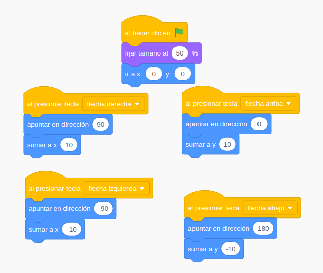

## Interacción con teclado

Eventos

### Movimientos relativos

[Proyecto](https://scratch.mit.edu/projects/397285215/)

### Movimientos absolutos

[Proyecto](https://scratch.mit.edu/projects/397287255/)

### Movimientos relativos angulares

[Proyecto](https://scratch.mit.edu/projects/397289607/)

###  Limitación del movimiento. Sentencias condicionales

[Proyecto](https://scratch.mit.edu/projects/397292446)

