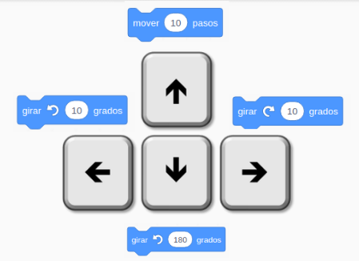
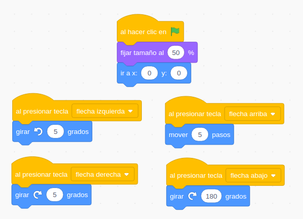
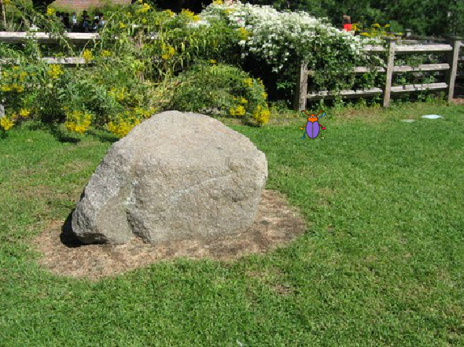
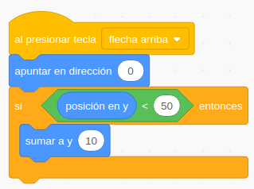
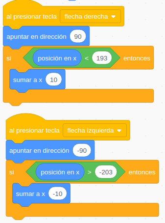

 ## Interacción con teclado

Vamos ver cómo podemos controlar el movimiento de nuestros personajes con las teclas.

En estos ejemplos usaremos **"Eventos"** asociados al teclado como **"Al presionar tecla ..."**

Usaremos un evento para detectar la pulsación de cada tecla y añadiremos los bloques correspondientes a las acciones que queremos que se hagan con cada una.

### Movimientos relativos

Empezamos haciendo movimientos relativos: cada tecla pondrá al personaje en su dirección y lo moverá 10 pasos.

[Proyecto](https://scratch.mit.edu/projects/397285215/)

### Movimientos absolutos

Si queremos hacer movimientos absolutos sólo tenemos que cambiar el movimiento para usar los cambios en coordenadas X e Y.

[Proyecto](https://scratch.mit.edu/projects/397287255/)

En un proyecto posterior veremos que el trabajar con movimientos absolutos nos va a facilitar algunas cosas.

### Movimientos relativos angulares

Ahora vamos a modificar el programa para usar otro tipo de movimiento, de manera que nos podamos mover en cualquier dirección. Para ello vamos a hacer que las teclas izquierda y dereche hagan girarlo unos grados en un sentido o en el otro, la tecla arriba lo mueva hacia adelante y la tecla abajo haga que gire 180º.

Este movimiento es muy típico de juegos donde nuestro personaje se mueva por todo el escenario.

El cambio es muy sencillo, y el resultado bastante divertido.

[Proyecto](https://scratch.mit.edu/projects/397289607/)

[Vídeo: Movimientos de personajes usando las teclas del cursor](https://youtu.be/xgbzayW91hc)

###  Limitación del movimiento. Sentencias condicionales

Al utilizar algunos fondos nos interesa poner limitaciones al movimiento de los personajes para dar más realismo al programa.

Por ejemplo, con este fondo podríamos querer limitar el movimiento de "Escarabajo" hasta la valla, pero no queremos que "suba" más en la pantalla.

Si utilizamos movimientos absolutos sería bastante sencillo limitar el movimiento sin más que ir comprobando el valor de **Y** no dejar que pase de un cierto valor (50 en nuestro ejemplo)

En todo momento podemos ver el valor de las coordenadas **X** e **Y** de un objeto con las variables **"Posición en x"** y **"Posición en y"**, en la paleta de movimientos.

Ahora necesitamos un bloque que nos permita decidir si ejecutamos o no un grupo de bloques, en función de que se cumpla una condición (que Y "Sea menor que" 50). 

Llamamos bloques condicionales a los que nos permiten hacer ésto. Pondremos arriba, en el hueco hexagonal la condición y en la parte central colocaremos los bloques que queremos ejecutar cuando se cumpla la condición.

En la condición usaremos operadores lógicos (en la paleta operadores), con forma hexagonal. Todos los operadores lógicos sólo pueden ser **"Verdadero"** o **"Falso"**. Estos son los más tipicos, que nos permiten comparar dos valores.

A lo largo de estas Sesiones de Interacción veremos muchos más ejemplos de bloques que devuelven valores lógicos, todos tienen la forma hexagonal. Por ejemplo **"Tocando el ratón"** **"Tecla ... presionada"**, ...

Con todo esto podemos limitar fácilmente el movimiento en el eje vertical, haciendo que sólo se cambie la coordenada Y si su valor está por debajo de cierto valor.

Del mismo modo podemos limitar los movimientos en el eje X para hacer que nuestro personaje no desaparezca por los lados.

Por último, vamos a intentar dar cierta apariencia de perspectiva, haciendo que a medida que suba en el fondo (sería alejarse en la realidad) nuestro personaje se haga más pequeño y se agrande al bajar. Para ello usaremos el bloque **"cambiar tamaño por -3"**  y **"cambiar tamaño por 3"**.

Todo junto queda así:

[Proyecto](https://scratch.mit.edu/projects/397292446)

[Vídeo: Limitando los movimientos del personaje por el escenario](https://youtu.be/HuCNtLwp3_0)
