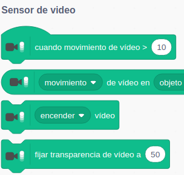
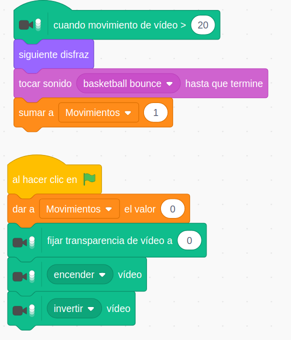

## Interacción con Vídeo

Necesitamos una cámara 
Damos permisos
Configuramos la transparencia

Para trabajar con el sensor de Vídeo necesitamos tener conectada una cámara a nuestro ordenador. 

Usaremos la extensión **"Sensor de Vídeo"**

Que tiene los siguientes bloques

La transparencia nos permite graduar la mezcla entre el fondo nuestro escenario y lo que ve la cámara

Ejemplo: MolestandoAGatoVideo

[Proyecto](https://scratch.mit.edu/projects/398099229/)

Vamos a hacer ahora el mismo proyecto pero trabajando con eventos

[Proyecto](https://scratch.mit.edu/projects/398105055/)

### Ejercicio

Tendremos que ajustar el enfoque 

Añadimos una variable para que cuente nuestros movimientos

Podemos evitar el efecto selfie de la cámara con el bloque Invertir cámara

[Proyecto](https://scratch.mit.edu/projects/398111067/)

### VídeoCursor

[Proyecto](https://scratch.mit.edu/projects/398113301/)

## Proyectos más avanzados

[Realidad aumentada y mover objetos](https://www.youtube.com/watch?v=qF34toGCU2c&list=PLzqyAKVt4MgOV6brvY33MkhIFqxtatr81&index=11&t=0s)

[Tocar objetos antes de que se caigan](https://www.youtube.com/watch?v=uyIoFcCq6_A&list=PLzqyAKVt4MgOV6brvY33MkhIFqxtatr81&index=12&t=0s)

Fuente: Francisco Javier Panadero

[Manual de Scratch. Especial para Profes y Principiantes.](https://lacienciaparatodos.wordpress.com/2018/04/02/manual-de-scratch-especial-para-profes-y-principiantes/)

En general todos los [materiales que comparte](https://lacienciaparatodos.wordpress.com/para-profes/)