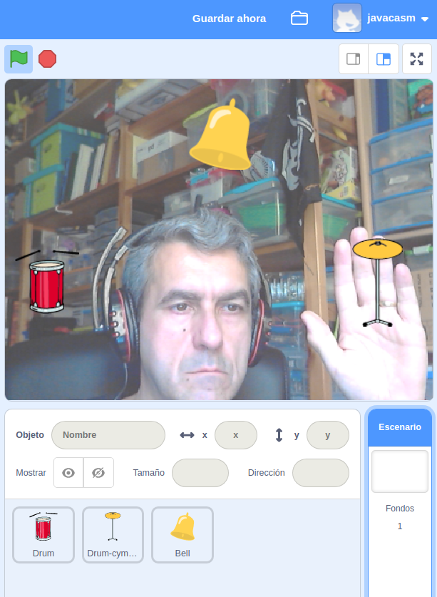
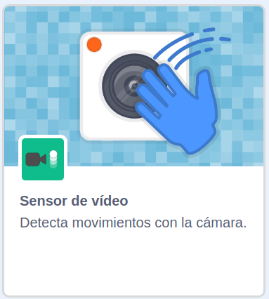
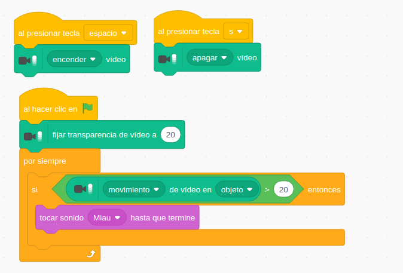
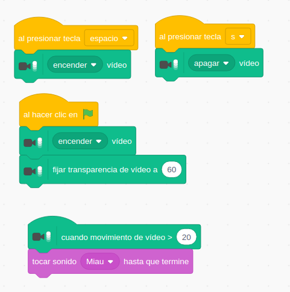
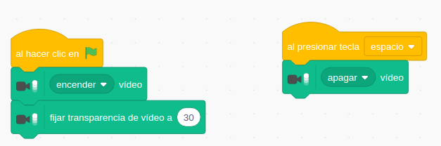
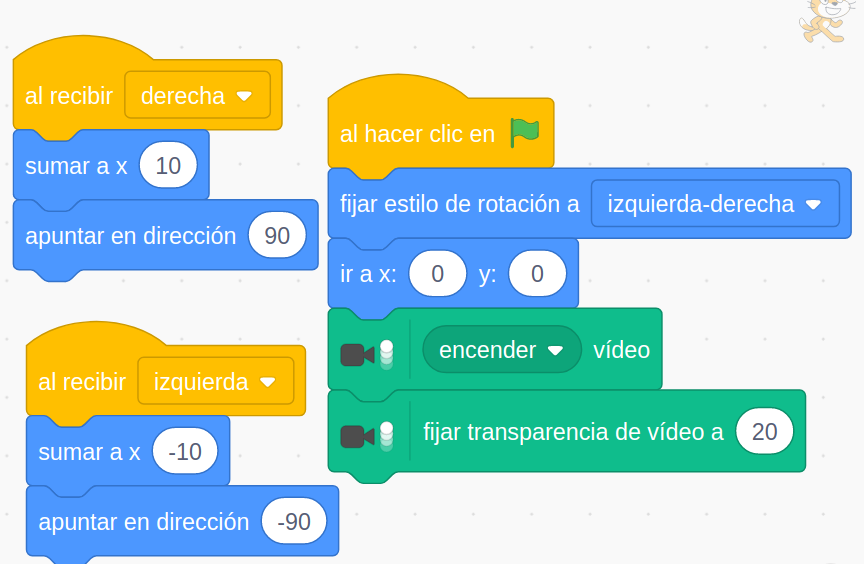
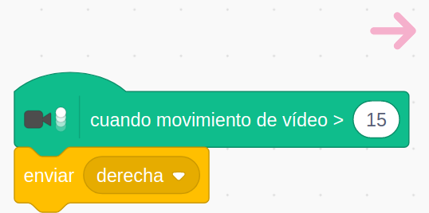

## Interacción con Vídeo

Vamos a trabajar ahora la interacción con Scratch usando  vídeo, que nos va a permitir mezclar nuestros personajes con la realidad que nos rodea al más puro estilo de la Realidad Aumentada

Para usar vídeo en nuestros programas con Scratch 3.0 necesitamos:

* Una cámara, puede ser la cámara del portátil o una cámara USB conectada a nuestro ordenador.
* La primera vez que la usemos tendremos que dar permiso para usar el vídeo.
* La extensión **"Sensor de Vídeo"**

Esta extensión tiene los siguientes bloques:

* Bloque para encender, apagar o invertir (el efecto espejo).
* Hay bloques que miden el movimiento que detecta la cámara.
* Podemos elegir entre detectar el movimiento en todo el escenario o sólo en la zona de un objeto.
* Podemos ajustar la transparencia lo que nos permite graduar la mezcla entre el fondo de nuestro escenario y lo que ve la cámara

También podemos trabajar la detección de colores usando lo que ve la cámara.

## Ejemplo: Molestando a Gato usando el sensor de Vídeo

Vamos a hacer un proyecto sencillo, en el que Gato maúlle cuando detecte vía vídeo que lo tocamos.

* Usamos eventos de pulsación de teclas para encender y apagar el vídeo.
* Después del evento "Bandera Verde" activamos el vídeo 
* Fijamos el nivel de transparencia.
* Dado que tenemos que medir todo el tiempo usamos un bucle "Para siempre".
* Una sentencia condicional para ver si hay movimiento
    * Usamos un operador lógico comparación para ver si hay movimiento sobre Gato mayor de un valor dado (20).
    * Si es así Gato maúlla.

[Proyecto](https://scratch.mit.edu/projects/398099229/)

## Ejemplo: Molestando a Gato usando el sensor de Vídeo, ahora con eventos

Vamos a repetir el programa anterior pero ahora usando el evento de "cuando movimiento de vídeo > ..."

El cambio es muy sencillo y el programa queda así:

[Proyecto](https://scratch.mit.edu/projects/398105055/)

[Vídeo: Molestando a Gato usando el sensor de vídeo de Scratch](https://youtu.be/9THbOj7Fhns)

### Ejemplo: VideoPercusión

Vamos a usar ahora el sensor de vídeo para hacer sonar instrumentos de percusión.

Colocamos los objetos distribuidos por el fondo:

Y asociamos a cada uno un evento de movimiento que haga que suene el instrumento:

Y en el escenario añadimos lo necesario para encender el vídeo y configurar la transparencia

[Proyecto](https://scratch.mit.edu/projects/398107421/)

Podemos mejorarlo usando más instrumentos y la extensión "Música".

[VideoPercusión: usando el sensor de vídeo para tocar instrumentos de percusión en Scratch](https://youtu.be/CH9YgQCocF4)

### Ejemplo: Medidor de Ejercicio

Vamos a darle un nuevo uso al programar anterior: Si añadimos una variable que cuente nuestros movimientos podemos tener un programar "Medidor de Ejercicio"

Tendremos que ajustar el enfoque de la cámara para que se nos movernos, quizás a más distancia.

Añadimos un personaje para que se mueva con nosotros y aporte algo de sonido.

Podemos evitar el efecto espejo de la cámara con el bloque "Invertir cámara"

[Proyecto](https://scratch.mit.edu/projects/398111067/)

[Vídeo: Medidor de Ejercicio](https://youtu.be/AGp6eJnY6ug)

### Mejoras/Ideas

Podemos hacer que al llegar a cierto número de movimientos se cambie el fondo o nos aplauda para animarnos.

### Ejemplo: VídeoCursor

Vamos a controlar ahora el movimiento de un personaje con el vídeo. Para ello añadiremos varios personajes que actuarán como si fueran las teclas del cursor. Cuando nos movamos sobre ellas nuestro personaje se moverá por la pantalla

Al detectar movimiento cada uno de los objetos que actúan como cursor enviarán un mensaje indicando el tipo de movimiento que tiene que hacer Gato

[Proyecto](https://scratch.mit.edu/projects/398113301/)

[Videocursor: Controlando el movimiento de un personaje con vídeo](https://youtu.be/M_Tyb_JUK0A)

### Ideas/mejoras

* Puedes encender/apagar objetos de tu casa domótica con Scratch.
* CazaCoronavirus con vídeo.
* Juego de memoria Simon.

## Proyectos más avanzados

[Realidad aumentada y mover objetos](https://www.youtube.com/watch?v=qF34toGCU2c&list=PLzqyAKVt4MgOV6brvY33MkhIFqxtatr81&index=11&t=0s)

[Tocar objetos antes de que se caigan](https://www.youtube.com/watch?v=uyIoFcCq6_A&list=PLzqyAKVt4MgOV6brvY33MkhIFqxtatr81&index=12&t=0s)

Fuente: Francisco Javier Panadero

[Manual de Scratch. Especial para Profes y Principiantes.](https://lacienciaparatodos.wordpress.com/2018/04/02/manual-de-scratch-especial-para-profes-y-principiantes/)

En general todos los [materiales que comparte](https://lacienciaparatodos.wordpress.com/para-profes/)