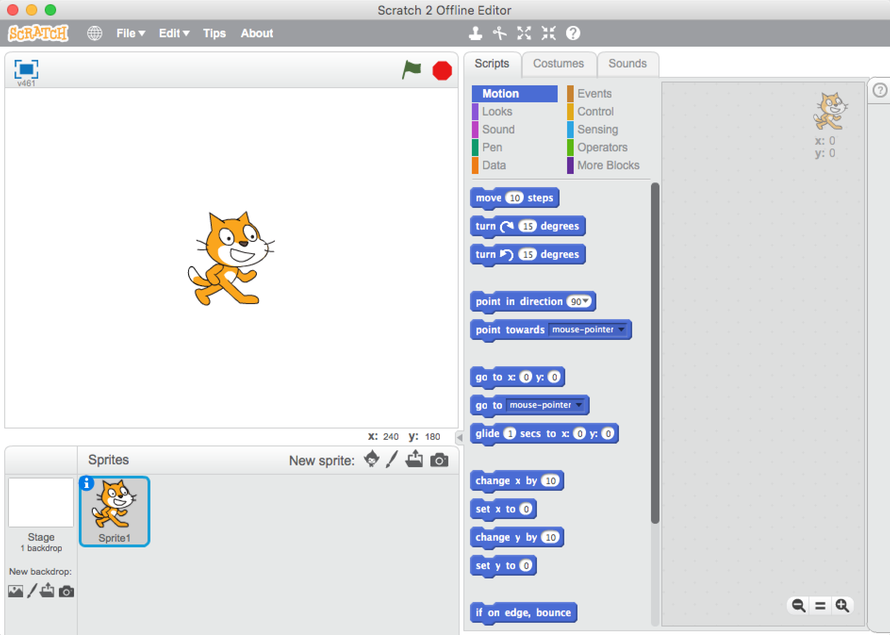
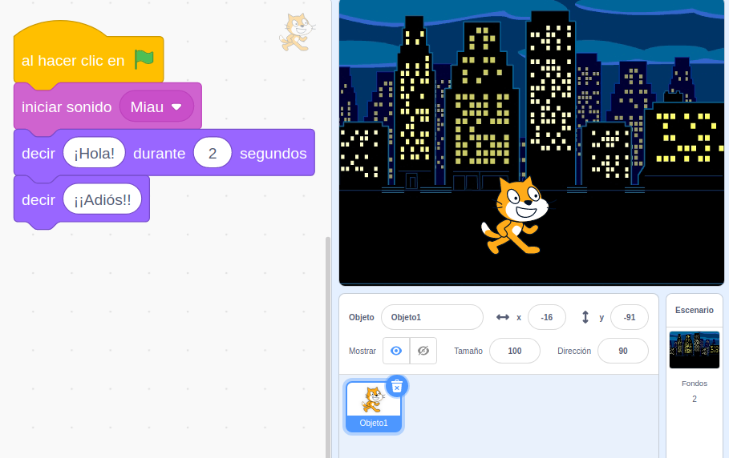

# Vídeos

## https://bit.ly/ProgMotril

## Sesión 0: Bienvenida

[Vídeo: Presentación del curso](https://youtu.be/PeQsRkHcUOM)

El curso, en principio, está planificado para 2 sesiones por semana de 1.5 horas de revisión de documentación, más unas horas de trabajo personal

[Vídeo: Planificación (más o menos) del curso](https://youtu.be/Mwzw9LCAkWA)

### Tarea 0: preséntate en el foro y cuéntanos porqué te has apuntado al curso ¿tienes experiencia programando?

## Sesión 1: Programación en la educación

¿Qué es programar?

[Vídeo: ¿Qué es programar?](https://youtu.be/-b_Dh9OJLNs) 

[Presentación](https://docs.google.com/presentation/d/1Z5axL6tafdCVyEQI2-lb4uVM0MCo-F7UdVm77_4cUsM/edit?usp=sharing)

¿Por qué programar?
¿Por qué enseñar a programar?
¿Sabré hacerlo?

Aunque no soy pedagogo ni experto en el tema, os doy mi opinión sobre cómo incluir la programación como una actividad transversal, ayudando en el aprendizaje de las restantes asignaturas

A primera vista vemos que podemo utilizar Scratch para enseñar matemáticas o geometría, pero ...
¿Podemos usar Scratch para aprender historia? ¿o arte? 

¿Y si lo empleamos como un sustituo del PowerPoint?

¿Tiene sentido utilizar la programación en la educación?
Personalmente creo que sí y en este vídeo os explico mis motivos. Entiendo un uso transversal de la programación (y la robótica) en las aulas, fomentando el pensamiento STEAM y utilizando la tecnología en todo tipo de asignaturas

¿Podemos explicar la historia con un programa hecho en Scratch?
¿y el Arte?

[Vídeo: La programación como una herramienta transversal en la educación](https://youtu.be/4x4QIk8TYog)

[Presentación: La programación como actividad transversal](https://docs.google.com/presentation/d/1NSo8zgZebFYp2paKrupxYQnJI55FqqyEsgVzG4dK_3Q/edit?usp=sharing)

## Trabajar en proyectos

Elaborar contenidos:
    * buscar informacion en libros y en internet
    * redactar textos
    * leer 
    * grabar audios y vídeos (TIC)
    * Escribir documentación
    * Traducir
    * Pedir información: correspondencia

Hacer distintas versiones
    * Varios niveles de complejidad
    * Nunca quedarnos cortos
    * Dejarles que usen su imaginación

## Entornos y aplicaciones para aprender a programar utilizando bloques

Existen multitud de entornos y aplicaciones que nos permiten aprender a programar utilizando bloques. En este vídeo vamos a ver algunos de ellos.

La ventaja de que los primeros (Blockly y Scratch) fueran OpenSource han  permitido que desarrolladores y empresas generen otros más específicos, unos para distintas plataformas (App Inventor para programar Apps para dispositivos Android), otros para sus propios equipos (como el entorno mBlock para los robots de MakeBlock).

En este vídeo vamos a ver algunos y lo que podemos hacer con ellos.

[Vídeo: Entornos y aplicaciones para aprender a programar utilizando bloques](https://youtu.be/YpARH-1AqmY)

[Presentación: Apps y webs de programación y bloques](https://docs.google.com/presentation/d/1VPjpZB5izt89QtBiWuQEy7NU_Boi-tGnfXmLtRP2AA4/edit?usp=sharing)

### Code.org

Vamos a ver uno de los entornos de bloques de los que hemos hablado anteriormente: [Code.org](https://Code.org).

Podemos decir que Code.org es la mejor herramienta para empezar a aprender a programar, sobre todo para los más pequeños.

[Vídeo:  Code.org: la herramienta para empezar a aprender a programar](https://youtu.be/7HmUL28cxTw)

#### Code.org y sus herramientas para docentes

Además de ser una de las herramientas más usadas para enseñar a los más pequeños a progrmar, Code.org incluye herramientas para que los docentes:

* Para gestionar de forma eficaz nuestras clases
* Crear y administrar las cuentas de los alumnos (incluso de forma masiva)
* Personalizar los cursos que ve cada clases
* Hacer seguimiento de los avances de cada alumno

[Vídeo: Code.org y sus herramientas para docentes](https://youtu.be/atmbbAqsEQU)

### Tarea 1
¿hasta donde has llegado en code.org?
¿Quieres mostrarnos alguna App?

## Sesión 2: Scratch

Scratch es un entorno de programación creado en el **MIT** por [Mitchel Resnick](https://www.media.mit.edu/people/mres)

Podemos entender su filosofía leyendo este artículo de su creador y de David Siegel [A Different Approach to Coding](https://medium.com/bright/a-different-approach-to-coding-d679b06d83a#.734u3gfm8 y en [su mágnifica charla TED](https://www.ted.com/talks/mitch_resnick_let_s_teach_kids_to_code?language=es)

Podemos usarlo desde [acceso web](https://scratch.mit.edu/projects/editor) y como [aplicación de escritorio en Windows y MacOs](https://scratch.mit.edu/scratch2download/).
Personalmente recomiendo la primera opción, además de porque podemos compartir nuestros contenidos, porque podemos acceder directamente a toda la documentación y a todos los proyectos que los demás usuarios han compartido.

Además dispone de un sistema de **extensiones** que nos permite además de complentar nuestros porgramas con nuevas opciones (como síntesis de voz o traducción automática entre idiomas) y conectar nuestros programas Scratch con hardware de otros fabricantes, como Lego, micro:bit o los robots de MakeBlock.

### Extensiones

Para trabajar con hardware externo a nuestro PC, necesitamos instalar **Scratch Link**. Éste nos va a permitir conectar Scratch 3.0 con hardware de otros fabricantes:

* Lego EV3
* Lego Bost
* Lego Wedo
* micro:bit
* Sensores Vernier

[Vídeo: ¿Qué es Scratch?](https://youtu.be/QYuLE1PCTlQ)

[Presentación: ¿Qué es Scratch?](https://docs.google.com/presentation/d/1ctR9NmMIATX9ujAJedJEsbBvJ2clGDwemtkO-OpbeyE/edit?usp=sharing)

### La comunidad de Scratch y la documentación

cratch es mucho más que un entorno de programación. 

Por eso considero que es mucho mejor trabajar con su versión online [https://scratch.mit.edu/](https://scratch.mit.edu/)

Vamos a ver todo lo que rodea a la web de la versión 3.0 de Scratch:
* La enorme comunidad que comparte sus proyectos y nos facilita el aprendizaje
*  La sección de ideas para ver qué podemos hacer
* Los tutoriales para saber cómo hacer cada cosa. 
* Las fichas de actividades para que los usuarios aprendan paso a paso
* Las guías docentes para que los profesores planifiquen sus actividades

Veremos también las opciones que tenemos para trabajar desconectado con la aplicación de escritorio que podemos descargar de https://scratch.mit.edu download . 

Ahora mismo la versión de escritorio 3.0 sólo está disponible para Windows y MacOs.

Sí que podemos descargar para todas las plataformas la [versión 2.0](https://scratch.mit.edu/download/scratch2)

y la [versión 1.4](https://scratch.mit.edu/scratch_1.4)

[Vídeo: IDE de scrach, ideas y tutoriales](https://youtu.be/iXC_ilF8o08)

## Crear una cuenta en Scratch 3.0

Crear una cuenta en Scratch 3.0 nos a permitir participar de la gran comunidad existente. 

Vamos a poder compartir nuestros proyectos y a reinventar los que otros usuarios han hecho y compartido.

Además Scratch 3.0 funciona como una especie de red social en la que podemos seguir proyectos, marcarlos como favoritos o decir que nos gustan, pudiendo seguir a usuarios cuyos proyectos sabemos que son interesantes.

Para crear une cuenta entraremos en el siguiente enlace https://scratch.mit.edu/join facilitando nuestros datos

Se nos enviará un email para que verifiquemos la cuenta. Hasta que no lo hayamos hecho nos aparecerá un aviso y no podremos compartir nuestros proyectos.

[Vídeo: Creación de una cuenta en Scratch 3.0 y su utilidad](https://youtu.be/Xzc31ESCreI)

### Tarea 2.1: Crea una cuenta en Scratch

Crea tu cuenta en scratch
Entra en la cuenta de la clase del curso

## Cuenta de profesores y su utilidad

En Scratch 3.0 existe la posibilidad de crear cuentas específicamente para docentes.

Para ello entramos en un enlace distinto del usual https://scratch.mit.edu/educators/register donde tendremos que incluir más datos de los habituales. Nuestros datos se validarán y en un par de días se autorizará la cuenta.

El hacerlo nos va a permitir gestionar nuestras clases, donde vamos a poder administrar los alumnos.

Para poder incluir a los alumnos en nuestras clases, éstos tienen que crear su cuenta desde 0. Ahora mismo no existe la opción de incorporar una cuenta ya existente a una clase.

Desde aquí los docentes pueden supervisar la actividad de sus alumnos.

[Vídeo: Ventajas de usar una cuenta de docente en Scratch 3.0 Guardado como borrador](https://youtu.be/GL9kbEV3h5M)

## Reinventado aplicaciones
- Buscar aplicaciones

- Podemos hacer un remix y 

-  Modificarla
-  Compartirla

- Guardar proyecto

[Vídeo: Buscar, reinventar y compartir proyectos en Scratch 3.0 Guardado como borrador](https://youtu.be/fvpRQRcwJ7o)

[Ejemplo 0: Pasapalabra remix STEAM](https://scratch.mit.edu/projects/391751565/)

Hemos creado un estudio llamado ["Proyectos CEP de Motril 2020 #SratchCEPMotril"](https://scratch.mit.edu/studios/26524823/) donde iremos añadiendo todos los proyectos en los que trabajemos.

## Tarea 2.2: Busca el proyecto de  Pasapalabra que he usado en el vídoe, reinvéntalo y cambia algunas preguntas/respuestas a un tema que te interese.

## Sesion 3: Primeros ejemplos

## Ejemplo 3.1: Mi Gatito dice miau

Vamos a ver como crear, guardar y compartir un sencillo ejemplo de Scratch en el que un simpático gatito hace "miau", nos dice "Hola" en una bonita noche de ciudad

Aprenderemos como añadir sonidos, textos y mostrar un fondo atractivo.

Todo esto en nuestro [primer programa](https://scratch.mit.edu/projects/391761903/)

[Vídeo: Primer programa con un gatito](https://youtu.be/wNLJSCMyPUU)

## Trabajando con recursos
 
Llamamos recursos a todos aquellos materiales que usamos

 Ejemplo 3.2: Cancion Pirata

 Añadir personajes/objetos
     Disfraces
 Editar Disfraces

Necesitamos un micro en  nuestro ordenaror o bien usar un móvil o tablet para grabarlo y luego pasarlo al ordenador

 Añadir audios
     Editar Sonidos

Ejemplo 3.3: mostrar monumentos y enseñar nuestro patrimonio
Nos puede servir para recrear momentos históricos

Licencias

Extensiones

Texto a voz

Fondos: 
  Añadir imágenes

## Sesión 3

Ejemplo 3: Conversacion entre personajes

eventos

Ejemplo conversacion entre personajes

Traductor

## Sesión 4

movimiento
dibujando

## Sesión 5

Ejemplo X: coronavirus estelar

moviento teclas

Ejemplo X.1 tenemos que

Interacción

Semáforo sonoro

batería

instrumentos

## Sesión 6

## Proyecto final