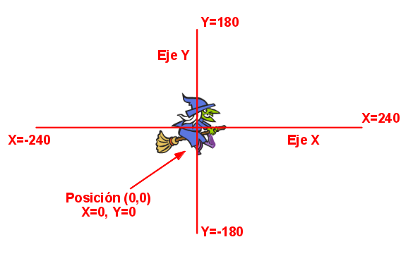

# Vídeos y cambios pendientes
mezclar los contenidos antiguos

## Creación de cuentas

Explicar que mejor usar una cuenta para cada cosa

## Módulo 1: Trabajando con proyectos

Arreglar el lio de Piratas del Caribe

Añadir a los proyectos "Posibles mejoras/ampliaciones"

Vídeo 2.8.1 corte final y miniatura con mapa

## Sesión 3

movimiento

Extensión: Dibujar
dibujando

## Sesión 4

Ejemplo 3: Conversacion entre personajes

eventos

Ejemplo conversacion entre personajes

Traductor

## Sesión 5

Ejemplo X: coronavirus estelar

moviento teclas

Ejemplo X.1 tenemos que

Interacción

Semáforo sonoro

batería

instrumentos

Ejemplo de Quiz 1 pregunta

Ejemplo Unir preguntas y respuestas

## Sesión 6

## Proyecto final

