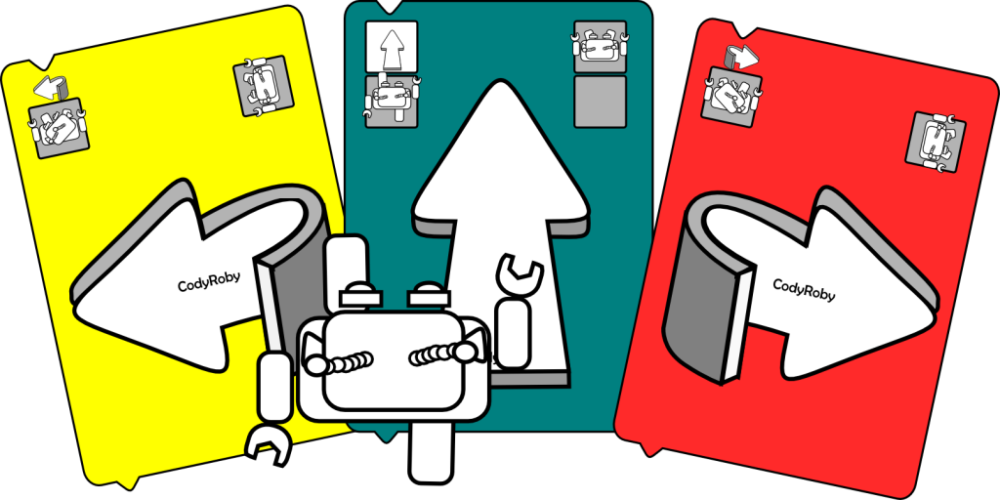
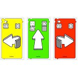
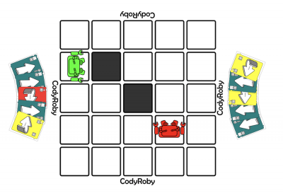

## Pensamiento computacional desconectado

A lo largo de estas semanas hemos visto que por un lado tenemos que interiorizar una serie de conceptos como algoritmo, bucle, etc y por otro lado necesitamos una serie de habilidades informáticas para trabajar con el ordenador, como saber encontrar un fichero, cómo capturar una imagen, etc. 

Ante esta cantidad de conocimiento que necesitamos para trabajar el tema de la programación han surgido muchas iniciativas en las que pretenden separar estas dos partes: 
* Por un lado lo que sería el pensamiento computacional, es decir la parte más abstracta, qué son los algoritmos, que es que necesario para programar independientemente de la informática.
* Por otro lado, trabajar las habilidades más prácticas de trabajo con el ordenador 

Aquí tienen cabida una gran colección de juegos que es lo que se suele llamar **"Pensamiento computacional desconectado"** 

La idea es que los chavales sean capaces de aprender todo estos conceptos jugando, pero sin usar el ordenador.

Esta forma de trabajar tiene varias ventajas: 

* Potenciamos el trabajo mental en el sentido de abstracción.  
* No necesitamos un equipamiento complejo ya que la mayoría estos juegos están pensados para hacerlo con unas cartas y un tablero que imprimimos.
* Al trabajar sin ordenador, también vencemos una serie de reticencias de algunos de los usuarios. De una forma divertida van cogiendo conceptos y les estamos acercando a la programación más real

## Un ejemplo: [Codi-Roby](http://www.codeweek.it/cody-roby-en/)

Un ejemplo típico de este tipo de actividades sería el juego [Cody-Roby](http://codeweek.it/cody-roby-en/) en el que lo que tenemos es una serie te cartas y unos robots que movemos por un tablero de 5x5 según las cartas que tengamos.

Hay una carta que te permite avanzar y otra que te obliga a girar a la izquierda o a la derecha la idea es que se reparten las cartas entre los jugadores y se va moviendo dentro del tablero con objetivo y aquí podemos definir distintos distintas dinámicas de juego puede ser el ejemplo más sencillo 
* **"Sígueme"** en el que lo que un robot tiene que hacer es seguir los movimientos del otro 
* **"Píllame"**  en el que lo que se hace el duelo en el que tiene que capturarlos Uno huye y otro lo captura 

La forma de funcionar es muy sencilla pues repartimos unas cartas impresas previamente o es una mano no lo antes suele sersi veis las cartas recordara lo que hablábamos del cole de la forma de jugar de Code.org y veis que se parece bastante y se aparte sencillas aparte muy clásica de movimiento en el que es todo muy simple definido una regla definimos un tablero imaginario y jugamos un poco .

Imágenes tomadas de la excelente página [programamos.es](https://programamos.es) donde podemos encontrar [más detalles sobre Cody-Roby](http://programamos.es/hack/unplugged/).

Esta dinámica la podemos encontrar en muchísimos más juegos. 

### [CS Unplugged](https://csunplugged.org/)

La página por excelencia de todo este esta forma de trabajar y dónde vamos a encontrar muchísima documentación es [CS Unplugged](https://csunplugged.org/) (**C**omputer **S**cience unplugged) 

Es una página creada por grandes de la informática como son Google, Microsoft y la Universidad de ciencias de la computación 

Esta página está pensada para trabajar la informática sin ordenador y tenemos un montón de recursos para docentes y también para estudiantes. El único problema es que no todo está traducido al castellano. 

Vamos a encontrar recursos que debemos ir estudiando los docentes poco a poco y también muchas actividades para realizar en clase.

Como por ejemplo del primer tipo es la definición de qué es la informática para nosotros,no es simplemente el ordenador, es mucho más. Por ejemplo cuando buscamos en una página como Google, ¿estoy haciendo uso de una cosa muy sencilla como parece, una caja donde escribimos un texto y ya está? ¿qué hay detrás? 

La idea es que los chavales enciendan esa complejidad y vayan entendiendo un poco todo lo que hay detrás de lo que usamos día a día, introduciendo todos los conceptos que y para que los docentes vayamos leyendo poco a poco.

Vamos a ver un ejemplo de actividad: [colour by numbers](https://csunplugged.org/en/topics/image-representation/unit-plan/colour-by-numbers/)

Si entramos en la sección de "[Para Imprimir](https://csunplugged.org/es/resources/)", encontramos distintos temas para trabajar: el alfabeto binario, cómo se ordena, vamos a trabajar música, o a pintar.

Si seleccionamos que lo que quiero aprender nos encontramos un montón de material que yo puedo imprimir con el que con el que vamos a  trabajar.

Vemos estos pequeños dibujos equivalentes a nuestros objetos en Scratch, la parte del  aspecto de los distintos disfraces.

Debajo tenemos las lecciones que están disponibles, cada una asociada a la edad recomendada. En este caso no está traducida al castellano. 

Vamos a ver cómo sería: 
* Vemos las imágenes
* Coloreadas por números
* Vamos a enseñar a los chavales cómo se representan la imagen.
* Qué es un píxel 
* Cómo se construyen a partir los pixel
* La rejilla de los puntos
* Van trabajando los números y su representación.

Hay una parte que nosotros deberíamos de hacer antes de empezar a trabajar con los chavales, y nos lo dicen cláramente en las [primeras instrucciones](https://csunplugged.org/es/how-do-i-teach-cs-unplugged/)

En esta imagen se ve bastante clara la mecánica habitual:
* Tenemos un juego en el que tanto los chavales como el profesor están todos trabajando en un dibujo que hay en el suelo.
* Van haciendo una dinámica con una serie de reglas
* Como herramientas usan unos papeles impresos

A partir de aquí vamos a encontrar [los distintos temas que tenemos disponibles](https://csunplugged.org/es/topics/).

Entre las que están traducidas al castellano, encontramos lecciones sobre "Números binarios" y [dentro](https://csunplugged.org/es/topics/binary-numbers/) hay dinámicas con música, dibujo, relacionadas con su Área Curricular. Si por ejemplo seleccionamos la de ["Collares binarios"](https://csunplugged.org/es/topics/binary-numbers/integrations/binary-name-necklaces/)

Vemos que tenemos que crear un collar para escribir la inicial de nuestro nombre con números binarios. Asociada tenemos la lección, que está en inglés, para ir trabajando los número binarios.

Hay lecciones más cortas de no más de 3 páginas y otras más largas, como por ejemplo en la que explican [cómo se hace cómo se traducen las letras en código binario](https://csunplugged.org/en/topics/binary-numbers/unit-plan/codes-for-letters-using-binary-representation/) 

## ¿Qué es el pensamiento computacional?

Para entenderlo bien yo recomiendo, el lugar de escucharme a mí que tengo bastante poca experiencia en esta parte más teoria, que leáis [esta página](https://csunplugged.org/es/computational-thinking/) donde tenéis ejemplos bastantes interesantes:
* Donde podéis trabajarlo
* Dispositivos
* Cómo pasamos de la realidad al funcionamiento que tienen los distintos equipos
* ¿Qué es un programa? con el típico de la receta de la tarta
* Cómo se hace la instrucción 

Todo lo tenéis aquí bastante bien explicado y con muchas actividades para trabajarlo.

## [Principios de CS Unplugged](https://csunplugged.org/es/principles/)

Parte de los [principios muy básicos](https://csunplugged.org/es/principles/):
* No se necesitan ordenadores 
* Tratamos temas de informática de verdad no estamos haciendo juegos sino que lo que estamos haciendo son conceptos informáticos 
* Es muy práctico, intenta que los chavales estén la mayor parte del tiempo haciendo cosas 
* Hay retos, desafíos, completar puzzles
* Todo se hace con materiales baratos y que ya están presentes en el aula, como papel, tiza, cuerda, lápices de colores
*Intenta fomentar el que se trabajé la la creatividad, viendo formas diferentes de hacerlo 
* Está pensado quitando un poco estereotipo 
* Ttrabajar la la cohesión del equipo trabajando de una forma cooperativa.
* Trabajar muy bien los roles, para fomentar ese reticencia que tiene a veces las alumnas a trabajar estos temas.

## También en formato libro

Todo esta documentación está escrita también en forma de libro: [Computer Science Unplugged](https://classic.csunplugged.org/wp-content/uploads/2014/12/unpluggedTeachersDec2008-Spanish-master-ar-12182008.pdf) de Tim Bell, Ian H. Witten y Mike Fellows y [traducido al castellano por el Intef](http://code.intef.es/computer-science-unplugged/). 

Es un libro de 200 y muchas páginas donde tenéis todo lo que sería esta forma de trabajar la tenéis muy bien explicada y detallada.

También os recomiendo [otra página de programamos.es](http://programamos.es/hack/unplugged/) donde nos explican algunas actividades como por ejemplo sería este Cody-Roby para entenderlo en todo detalle.

[Vídeo: Pensamiento computacional desconectado](https://youtu.be/zE_8EhmpoYE)

## Referencias

[¿Se puede desarrollar el pensamiento computacional sin ordenador? Evidencia científica](https://intef.es/Noticias/se-puede-desarrollar-el-pensamiento-computacional-sin-ordenador-evidencia-cientifica/)

[Reconocimiento de imágenes desenchufado](http://code.intef.es/crea-tu-actividad-desenchufada-para-reconocimiento-de-imagenes-utilizando-la-inteligencia-artificial/)
