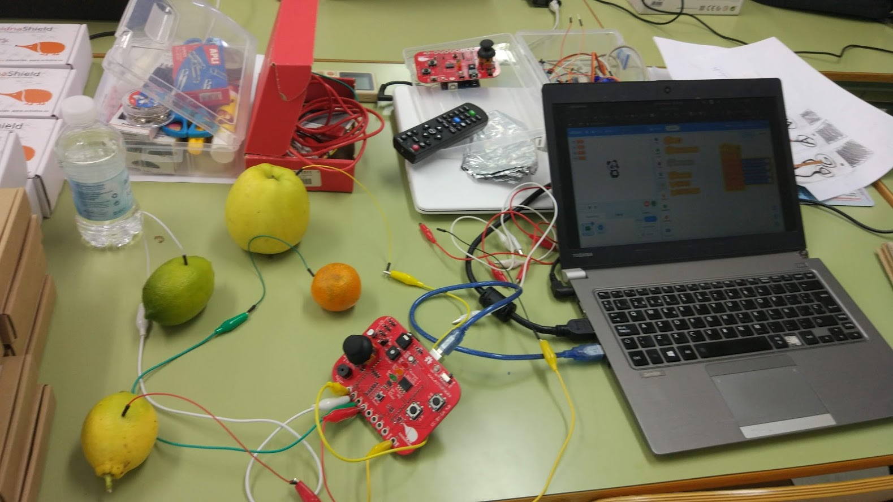

# EchidnaShield

## Semáforo sonoro

Conectamos un sensor de sonido (un micrófoco premplificado) a la entrada IN de la echidna que utiliza el pin analógico A4. En función del valor leído encendemos los leds Verde, Amarillo o Rojo

[Proyecto](https://planet.mblock.cc/project/projectshare/103651)

## Medida de humedad del suelo y sistema de riego

Vamos a medir la humedad del suelo para crear un sistema automático de riego
* Conectamos un sensor de humedad de suelo a la entrada IN de echidna (A4)
* Conectamos un servomotor para simular a la válvula/grifo que enciende el riego. Alternativamente podemos usarlo para mover un cartel/indicador que nos diga que la planta tiene sed

En función del nivel de humedad enviamos 3 mensajes distintos: Húmedo, Seco y Muy Seco

Se han creado varios fondos y varios personajes que cambian al recibir los mensajes

[Proyecto](https://planet.mblock.cc/project/103662)

## Reconocedor de frutas

Medimos la conductividad de varias frutas y en función del valor medido reconocemos una u otra. Para ello ponemos la echidna en modo MKMK y vamos conectando los 2 cables (A0 y Tierra MKMK) a cada fruta.

Utilizamos la extensión Text to Speech para oir los resultados

Programa para Arduino

Programa para que Osito reconozca las frutas

[Proyecto](https://planet.mblock.cc/project/projectshare/103635)

## Medida de humedad del suelo y sistema de riego

Vamos a medir la humedad del suelo para crear un sistema automático de riego
* Conectamos un sensor de humedad de suelo a la entrada IN de echidna (A4)
* Conectamos un servomotor para simular a la válvula/grifo que enciende el riego. Alternativamente podemos usarlo para mover un cartel/indicador que nos diga que la planta tiene sed

En función del nivel de humedad enviamos 3 mensajes distintos: Húmedo, Seco y Muy Seco

Se han creado varios fondos y varios personajes que cambian al recibir los mensajes

